Power
===

- Power is the probability of rejecting the null hypothesis when it is false, which is **good** and proper.
- Power comes into play when you're **designing an experiment**, and in particular, if you're trying to determine if a null result (failing to reject a null hypothesis) is meaningful. For instance, you might have to determine if your sample size was big enough to yield a meaningful, rather than random, result.
- Power gives you the opportunity to detect if your ALTERNATIVE hypothesis is true.
- **Beta** is the probability of a Type II error, <u>accepting a false null hypothesis</u>; the complement of this is obviously $(1 - \beta)$ which represents the probability of rejecting a false null hypothesis. This is good and this is **POWER**!

------

**Example:**

Consider our previous example involving RDI:

- $H_0: \mu = 30$ 
- $H_a: \mu > 30$

Suppose we're testing a null hypothesis $H_0$ with an alpha level of $.05$, Since $H_a$ proposes that $\mu > 30$ (the mean hypothesized by $H_0$), power is the probability that the true mean $\mu$ is greater than the $(1-\alpha)$ quantile or **qnorm(.95)**.

- Then power is $$P\left(\frac{\bar X - 30}{s /\sqrt{n}} > t_{1-\alpha,n-1} ~~;~~ \mu = \mu_a \right)$$

- Notice as $\mu_a$ approaches $30$ the power approaches $\alpha$

---

## Calculating power for Gaussian data

We reject if $\frac{\bar X - 30}{\sigma /\sqrt{n}} > z_{1-\alpha}$

- Equivalently if $\bar X > 30 + Z_{1-\alpha} \frac{\sigma}{\sqrt{n}}$


As you know, the shaded portion represents 5% of the area under the curve. If a test statistic fell in this shaded portion we would reject $H_0$ **because the sample mean is too far from the mean** (center) of the distribution hypothesized by $H_0$. Instead we would favor $H_a$, that $\mu > 30$. This happens with probability .05.

You might well ask, "What does this have to do with POWER?"

First we have to emphasize a key point. The two hypotheses, $H_0$ and $H_a$, actually represent two distributions since they're talking about means or centers of distributions. $H_0$ says that the mean is $\mu_0$ (30 in our example) and $H_a$ says that the mean is $\mu_a$.

We're assuming normality and equal variance, say $\sigma^2/n$, for both hypotheses:

- Under $H_0 : \bar X \sim N(\mu_0, \sigma^2 / n)$
- Under $H_a : \bar X \sim N(\mu_a, \sigma^2 / n)$

Here's a picture with the two distributions. We've drawn a vertical line at our favorite spot, at the 95th percentile of the red distribution (represents $H_0$). To the right of the line lies 5% of the red distribution.

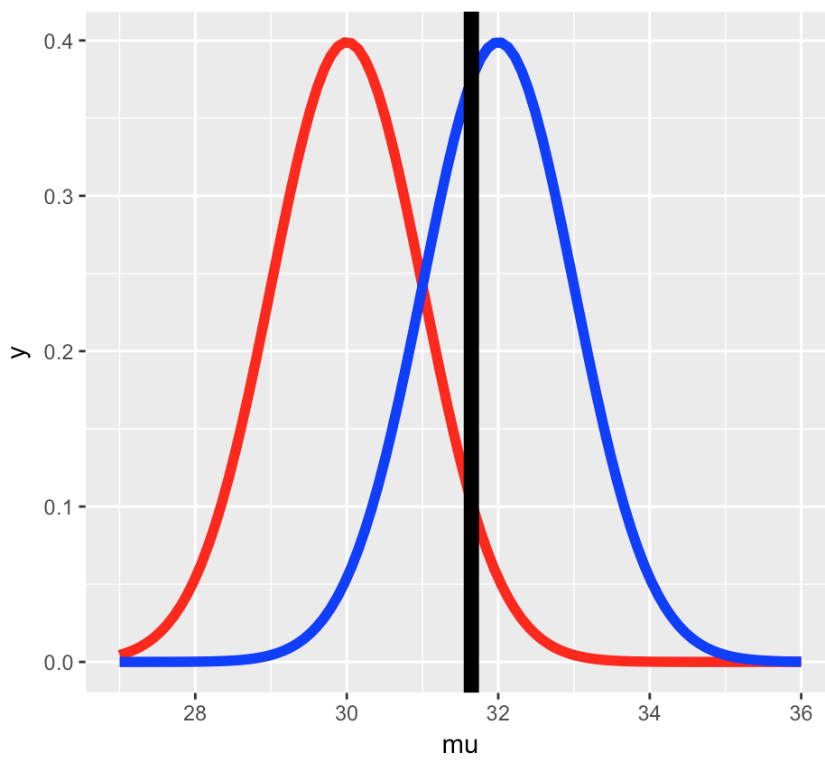

See how much of the blue distribution(represents $H_a$) lies to the right of that big vertical line? **That is actually POWER**!

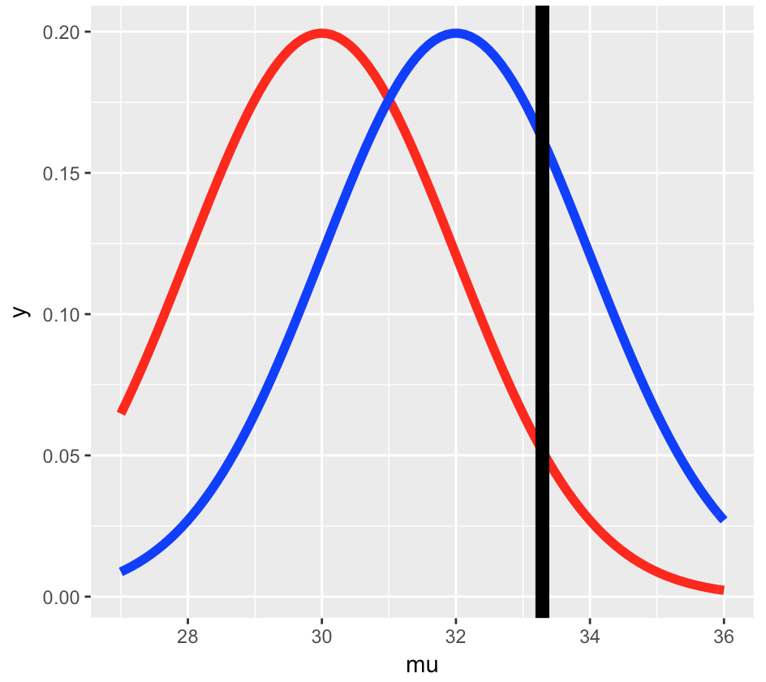

Note that the placement of the vertical line depends on the null distribution. Here's another picture with fatter distributions. The vertical line is still at the 95th percentile of the null (red) distribution and 5% of the distribution still lies to its right. The line is calibrated to $\mu_0$ and the variance.

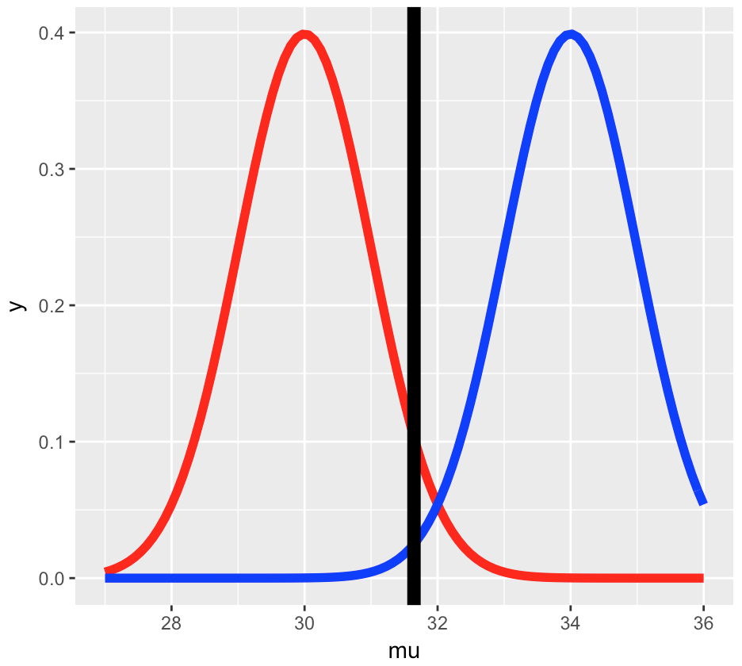

 By changing the $\mu_a$ to 34 we can see that he distribution represented by $H_a$ moved to the right, so almost all (100%) of the blue curve is to the right of the vertical line, indicating that with $mu_a=34$, the **test is more powerful**, i.e., there's a higher probability that it's correct to reject the null hypothesis since it appears false.

As conclusion:

1. Power is a function that depends on a specific value of an alternative mean, $\mu_a$, which is any value greater than $\mu_0$, the mean hypothesized by $H_0$.
2. If $\mu_a$ is much bigger than $\mu_0=30$ then the power (probability) is bigger than if $\mu_a$ is close to 30. As $\mu_a$ approaches 30 (the mean under $H_0$), the power approaches alpha.

Just in terms of seeing calculation in action:

```R
alpha = 0.05
z = qnorm(1 - alpha)
mu0 = 30 
mua = 32 
sigma = 4 
n = 16
z = qnorm(1 - alpha)

## That's not surprising, With the mean set to mu_0 the two distributions, null and alternative, are the same and power=alpha.
pnorm(mu0 + z * sigma / sqrt(n), mean = mu0, sd = sigma / sqrt(n), 
      lower.tail = FALSE)
## [1] 0.05

## The following pnorm acurately calculates the power
pnorm(mu0 + z * sigma / sqrt(n), mean = mua, sd = sigma / sqrt(n), 
      lower.tail = FALSE)
## [1] 0.63876
## See how this is much more powerful? 64% as opposed to 5%. When the sample mean is quite different from (many standard errors greater than) the mean hypothesized by the null hypothesis, the probability of rejecting H_0 when it is false isw much higher. That is power!
```

Here is a picture of the power curves for different sample sizes:

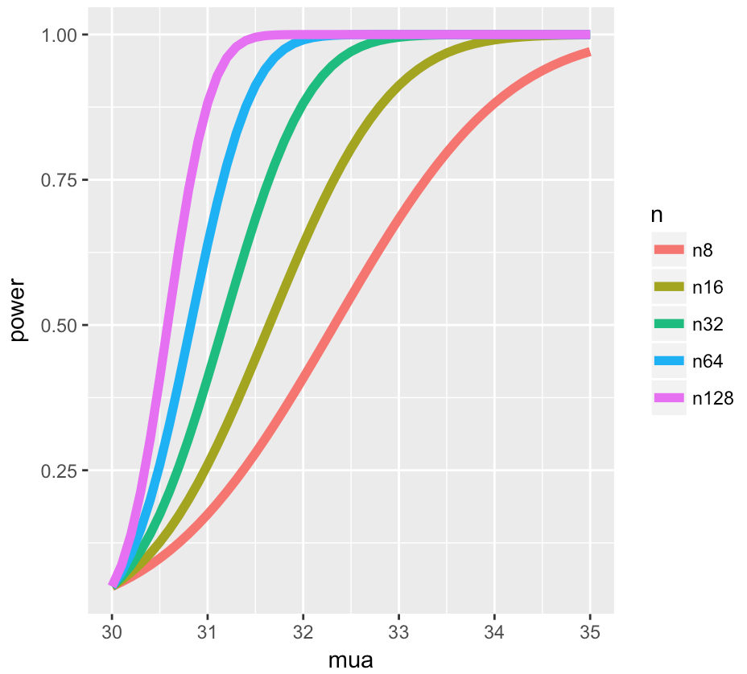

What the graph shows us about $\mu_a$, as it gets bigger, it gets more powerful, Also,  as the sample size gets bigger, it gets more powerful. Moreover, as variance increases, power gets more powerful and as alpha increases, power gets more powerful too. As practice all mentioned facts, we can easily use the following manipulate graph in R:

```R
library(manipulate)
mu0 = 30
myplot <- function(sigma, mua, n, alpha){
    g = ggplot(data.frame(mu = c(27, 36)), aes(x = mu))
    g = g + stat_function(fun=dnorm, geom = "line", 
                          args = list(mean = mu0, sd = sigma / sqrt(n)), 
                          size = 2, col = "red")
    g = g + stat_function(fun=dnorm, geom = "line", 
                          args = list(mean = mua, sd = sigma / sqrt(n)), 
                          size = 2, col = "blue")
    xitc = mu0 + qnorm(1 - alpha) * sigma / sqrt(n)
    g = g + geom_vline(xintercept=xitc, size = 3)
    g
}
manipulate(
    myplot(sigma, mua, n, alpha),
    sigma = slider(1, 10, step = 1, initial = 4),
    mua = slider(30, 35, step = 1, initial = 32),
    n = slider(1, 50, step = 1, initial = 16),
    alpha = slider(0.01, 0.1, step = 0.01, initial = 0.05)
    )
```

------

**Question**:

Suppose $H_a$ says that $\mu > \mu_0$. Then $power = 1 - \beta = Prob ( \bar X > \mu_0 + z_(1-\alpha) * \sigma/\sqrt(n))$ assuming that
 $\bar X \sim N(\mu_a,\sigma^2/n)$. Which quantities do we know in this statement, given the context of the problem? 

Let's work through this:

- What does the null hypothesis $H_0$ tell us that the population mean equals $\mu_0$
- After the null mean $\mu_0$ is proposed what does the designer of the hypothesis test specify in order to reject or fail-to-reject $H_0$? In other words, what is the level size of the test? $\alpha$

So we know that the quantities mu_0 and alpha are specified by the test designer. In the statement $1 - \beta = Prob( \bar X >| \mu_0 + z_(1-\alpha) * \sigma/\sqrt(n))$ given $\mu_a > \mu_0$, $\mu_0$ and $\alpha$ are **specified**, and $\bar X$ depends on the data. The other four quantities, ($\beta$, $\sigma$, n, and $\mu_a$), are all unknown.

It should be obvious that specifying any three of these unknowns will allow us to solve for the missing fourth. Usually, you only try to solve for **power** $(1-\beta)$ or the **sample size n**.

**NOTE**: An interesting point is that power doesn't need $\mu_a$, $\sigma$ and n individually.  Instead only $\frac{\sqrt{n}(\mu_a - \mu_0)}{\sigma}$ is needed. The quantity  $\frac{\mu_a - \mu_0}{\sigma}$ is called the **EFFECT SIZE**. This is the difference in the means in standard deviation units. It is unit free so it can be interpreted in different settings.

------

t-test power
---

We'll work through some examples of this now. However, instead of assuming that we're working with normal distributions let's work with t distributions. Remember, they're pretty close to normal with large enough sample sizes.

Power is still a probability, namely $P( \frac{\bar X - \mu_0}{S /\sqrt(n)} > t_{1-\alpha, n-1}$ given $H_a$ that $\mu > \mu_a$. 

Notice we use the **t** quantile instead of the **z**. Also, since the proposed distribution is not centered at $\mu_0$, we have to use the **non-central t distribution**.

R comes to the rescue again with the function **power.t.test**. We can omit one of the arguments and the function solves for it. Let's first use it to solve for power.

---

**Example:**

We'll run it three times with the same values for n (16) and alpha (.05) but different delta and standard deviation values. We'll show that if delta (difference in means) divided by the standard deviation is the same, the power returned will also be the same. In other words, the effect size is constant for all three of our tests:

```R
## specify a positive delta; this tells power.t.test that H_a proposes that mu > mu_0
power.t.test(n = 16, delta = 2 / 4, sd=1, type = "one.sample",  alt = "one.sided")$power
## [1] 0.604

power.t.test(n = 16, delta = 2, sd=4, type = "one.sample",  alt = "one.sided")$power
## [1] 0.604

power.t.test(n = 16, delta = 100, sd=200, type = "one.sample", alt = "one.sided")$power
## [1] 0.604
```

---

Let's try a similar experiment except now we'll specify a power we want and solve for the sample size n:

```R
power.t.test(power = .8, delta = 2 / 4, sd=1, type = "one.sample",  alt = "one.sided")$n
## [1] 26.14

power.t.test(power = .8, delta = 2, sd=4, type = "one.sample",  alt = "one.sided")$n
## [1] 26.14

power.t.test(power = .8, delta = 100, sd=200, type = "one.sample", alt = "one.sided")$n
## [1] 26.14
```

---


Multiple Testing
===

multiple testing. You might ask, "What's that?"

Given that data is valuable and we'd like to get the most out of it, we might use it to test several hypotheses. If we have an alpha level of .05 and we test 20 hypotheses, then on average, we expect one error, just by chance.

Another potential problem is that after running several tests, only the lowest p-value might be reported OR all p-values under some threshold might be considered significant. Undoubtedly, some of these would be false.

Luckily, we have clever ways of minimizing errors in this situation. That's what we'll address.  We'll define specific error measures and then statistical ways of correcting or limiting them.

Multiple testing is particularly relevant now in this age of BIG data. Statisticians are tasked with questions such as: 

- "Which variables matter among the thousands measured?"
- "How do you relate unrelated information?"

---

**Three eras of statistics:**

- **The age of Quetelet and his successors, in which huge census-level data sets were brought to bear on simple but important questions**: Are there more male than female births? Is the rate of insanity rising?


- The classical period of Pearson, Fisher, Neyman, Hotelling, and their successors, intellectual giants who **developed a theory of optimal inference capable of wringing every drop of information out of a scientific experiment**. The questions dealt with still tended to be simple Is treatment A better than treatment B?


- **The era of scientific mass production**, in which new technologies typified by the microarray allow a single team of scientists to produce data sets of a size Quetelet would envy. But now the flood of data is accompanied by a deluge of questions, perhaps thousands of estimates or hypothesis tests that the statistician is charged with answering together; not at all what the classical masters had in mind. Which variables matter among the thousands measured? How do you relate unrelated information?


---

The p-value is "the probability under the null hypothesis of obtaining evidence as or more extreme than your test statistic (obtained from your observed data) in the direction of the alternative hypothesis." Of course p-values are related to significance or alpha levels, which are set before the test is conducted (often at 0.05).

If a p-value is found to be less than alpha (say 0.05), then the test result is considered statistically significant, i.e., surprising and unusual, and the null hypothesis (the status quo) is rejected.

Now consider this chart. Suppose we've tested **m** null hypotheses, $m_0$ of which are actually true, and $m-m_0$ are actually false. Out of the m tests R have been declared significant, that is, the associated p-values were less than alpha, and m-R were nonsignificant, or boring results.

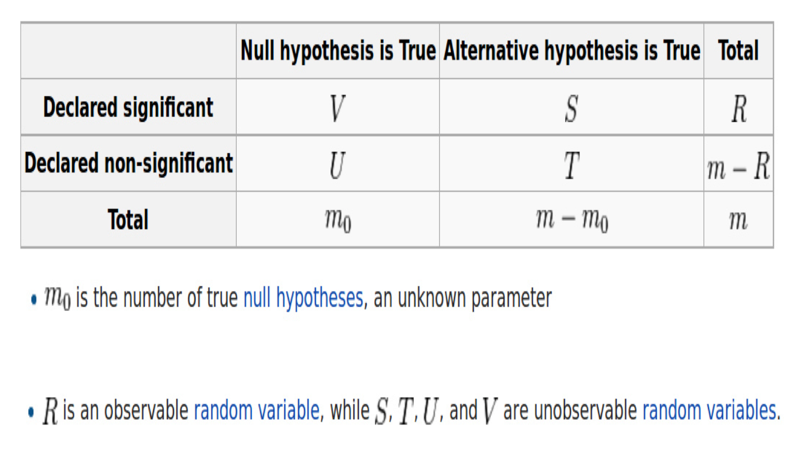

- By looking at chart we can see, R and m and known variables.
- In testing the $m_0$ true null hypotheses, **V** results were declared significant, that is, these tests favored the alternative hypothesis. That represent the Type I error, Another name for a Type I error is **False Positive**, since it is <u>falsely claiming a significant (positive) result</u>.
- Of the $m-m_0$ false null hypotheses, **T** were declared nonsignificant. This means that these T null hypotheses were accepted (failed to be rejected). That represent the Type II error, Another name for a Type II error is **False Negative**, <u>since it is falsely claiming a nonsignificant (negative) result</u>.

---

Error rates
---

- The observed R represents the number of test results declared significant. These are 'discoveries', something different from the status quo. V is the number of those falsely declared significant, so V/R is the ratio of FALSE discoveries. Since V is a random variable (i.e., unknown until we do an experiment) we call the expected value of the ratio, $E\left[\frac{V}{R}\right]$, the **False Discovery Rate (FDR)**.


- How about the fraction $V/m_0$? From the chart, $m_0$ represents the number of true $H_0$'s and $m_0$ is unknown. V is the number of those falsely declared significant, so $V/m_0$ is the ratio of FALSE positives. Since V is a random variable (i.e., unknown until we do an experiment) we call the expected value of the ratio, $E\left[\frac{V}{m_0}\right]$, the **False Positive Rate**. Another good name for the false positive rate would be **false alarm rate**, The false positive rate is closely related to the type I error rate.


- We call the probability of at least one false positive, ${\rm Pr}(V \geq 1)$ the **Family Wise Error Rate (FWER)**.

So how do we control the False Positive Rate?

------

#### Controlling the false positive rate

Suppose we're really smart, calculate our p-values correctly, and declare all tests with **p < alpha** as **significant**. This means that our false positive rate is at most alpha, on average.

**Q**: Suppose we perform 10,000 tests and $\alpha = .05$. How many false positives do we expect on average?

**A**: The expected number of false positives is: $10,000 \times 0.05 = 500$ false positives.

How do we avoid so many false positives?

------

#### Controlling family-wise error rate (FWER)

We can try to control the family-wise error rate (FWER), the probability of at least one false positive, with the **Bonferroni correction**, the oldest multiple testing correction.

It's very straightforward. We do **m** tests and want to control the FWER at level alpha so that **Pr(V >= 1) < alpha**. We simply reduce alpha dramatically. Set **alpha_fwer** to be **alpha/m**. We'll only call a test result significant if its **p-value < alpha_fwer**.

**Bonferroni correction**:

- Suppose you do $m$ tests
- You want to control FWER at level $\alpha$ so $Pr(V \geq 1) < \alpha$
- Calculate P-values normally
- Set $\alpha_{fwer} = \alpha/m$
- Call all $P$-values less than $\alpha_{fwer}$ significant

**Pros**: 

- Easy to calculate 
- Conservative 

**Cons**: 

- May be very conservative

------

#### Controlling false discovery rate (FDR)

Another way to limit the false positive rate is to control the false discovery rate (FDR). Recall this is E(V/R). This is the most popular correction when <u>performing lots of tests</u>. It's used in lots of areas such as genomics, imaging, astronomy, and other signal-processing disciplines.

we'll do **m** tests but now we'll set the FDR, or E(V/R) at level alpha. We'll calculate the p-values as usual and **order** them from **smallest to largest**, p_1, p_2,...p_m. We'll call significant any result with **p_i <= (alpha*i)/m**. This is the **Benjamini-Hochberg method (BH)**. A p-value is compared to a value that depends on its ranking. This is equivalent to finding the largest k such that p_k <= (k * alpha)/m, (for a given alpha) and then rejecting all the null hypotheses for i=1,...,k.

**Benjamini-Hochberg method (BH)**:

- Suppose you do $m$ tests
- You want to control FDR at level $\alpha$ so $E\left[\frac{V}{R}\right]$
- Calculate P-values normally
- Order the P-values from smallest to largest $P_{(1)},...,P_{(m)}$
- Call any $P_{(i)} \leq \alpha \times \frac{i}{m}$ significant

**Pros**: 

- Still pretty easy to calculate, 
- Less conservative (maybe much less)

**Cons**: 

- Allows for more false positives, 
- May behave strangely under dependence

------

**Example with 10 P-values**:

This chart shows the p-values for 10 tests performed at the alpha=.2 level and three cutoff lines. The p-values are shown in order from left to right along the x-axis. The red line is the threshold for No Corrections (p-values are compared to alpha=.2), the blue line is the Bonferroni threshold, alpha=.2/10 = .02, and the gray line shows the BH correction. Note that it is not horizontal but has a positive slope as we expect.

[](https://github.com/bcaffo/courses/blob/master/06_StatisticalInference/12_MultipleTesting/fig/example10pvals.png)

------

Adjusted P-values
---

So far we used both Bonferroni and BH methods to **adjust the threshold** (alpha) level of rejecting the null hypotheses. Another equivalent corrective approach is to **adjust the p-values**, so they're not classical p-values anymore, but they can be compared **directly to the original alpha**.

---

**Example:**

- Suppose P-values are $P_1,\ldots,P_m$
- You could adjust them by taking $P_i^{fwer} = \max(m \times P_i,1)$ for each P-value.
- Then if you call all $P_i^{fwer} < \alpha$ significant you will control the FWER.


**Case study I: no true positives**

```R
set.seed(1010093)
pValues <- rep(NA, 1000)
for (i in 1:1000) {
    y <- rnorm(20)
    x <- rnorm(20)
    pValues[i] <- summary(lm(y ~ x))$coeff[2, 4]
}

# Controls false positive rate
## This is kind of predictible based on 0.05 x 1000 = 50
sum(pValues < 0.05)
## [1] 51

# Controls FWER
sum(p.adjust(pValues, method = "bonferroni") < 0.05)
## [1] 0

# Controls FDR
sum(p.adjust(pValues, method = "BH") < 0.05)
## [1] 0
```

------

**Case study II: 50% true positives**

```R
set.seed(1010093)
pValues <- rep(NA, 1000)
for (i in 1:1000) {
    x <- rnorm(20)
    # First 500 beta=0, last 500 beta=2
    if (i <= 500) {
        y <- rnorm(20)
    } else {
        y <- rnorm(20, mean = 2 * x)
    }
    pValues[i] <- summary(lm(y ~ x))$coeff[2, 4]
}
trueStatus <- rep(c("zero", "not zero"), each = 500)
table(pValues < 0.05, trueStatus)
##        trueStatus
##         not zero zero
##   FALSE        0  476
##   TRUE       500   24

# Controls FWER
table(p.adjust(pValues, method = "bonferroni") < 0.05, trueStatus)

##        trueStatus
##         not zero zero
##   FALSE       23  500
##   TRUE       477    0

# Controls FDR
table(p.adjust(pValues, method = "BH") < 0.05, trueStatus)
##        trueStatus
##         not zero zero
##   FALSE        0  487
##   TRUE       500   13

par(mfrow = c(1, 2))
plot(pValues, p.adjust(pValues, method = "bonferroni"), pch = 19)
plot(pValues, p.adjust(pValues, method = "BH"), pch = 19)
```

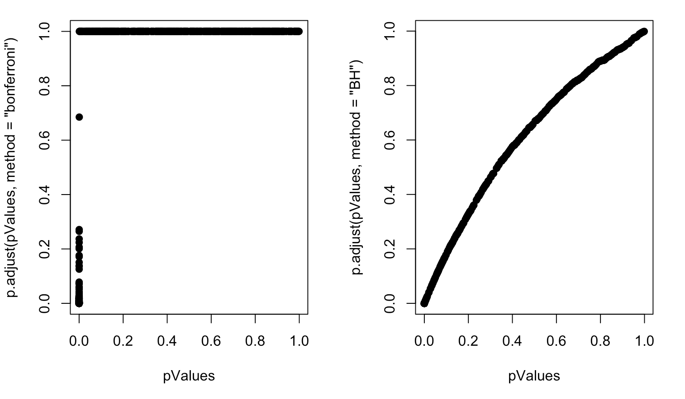

---

**Notes**:

- Multiple testing is an entire subfield
- A basic Bonferroni/BH correction is usually enough
- If there is strong dependence between tests there may be problems
  - Consider method="BY"

---


Resampling
===

The bootstrap
---

 The bootstrap is a handy tool for making statistical inferences. It is used in constructing confidence intervals and calculating standard errors for statistics that might be difficult for some reason (e.g., lack of data or no closed form). Wikipedia tells us that bootstrapping is a technique which "allows estimation of the sampling distribution of almost any statistic using very simple methods."

The beauty of bootstrapping is that it avoids complicated mathematics and instead uses simulation and computation to infer distributional properties you might not otherwise be able to determine.

The basic bootstrap principle uses **OBSERVED** data to construct an **ESTIMATED** population distribution using <u>random sampling with replacement</u>. From this distribution (constructed from the observed data) we can estimate the distribution of the statistic we're interested in.

In effect, the original observed sample substitutes for the population. Our samplings become observations from which we estimate a statistic and get an idea about its distribution. This lets us better understand the underlying population (from which we didn't have enough data).

------

**Example, Sample of 50 die rolls:**

The motivating example, computing the average of 50 rolls of a die. Of course we can do this theoretically when we know that the die is fair. Remember, E(x) = Sum(x*p(x)) for x=1,2,...6, and p(x)=1/6 for all values of x.

Theoretically, the average is 3.5. Here, we've run code and plotted a histogram after we took 1000 such averages, each of 50 dice rolls. Note the unusual y-axis scale. We're displaying this as a density function so the area of the salmon-colored region is theoretically 1.

```R
library(ggplot2)
library(gridExtra)
nosim <- 1000

cfunc <- function(x, n) mean(x)
g1 = ggplot(data.frame(y = rep(1/6, 6), x = 1 : 6), aes(y = y, x = x))
g1 = g1 + geom_bar(stat = "identity", fill = "lightblue", colour = "black")

dat <- data.frame(x = apply(matrix(sample(1 : 6, nosim * 50, replace = TRUE), 
                     nosim), 1, mean))
g2 <- ggplot(dat, aes(x = x)) + geom_histogram(binwidth=.2, colour = "black", fill = "salmon", aes(y = ..density..)) 

grid.arrange(g1, g2, ncol = 2)

```

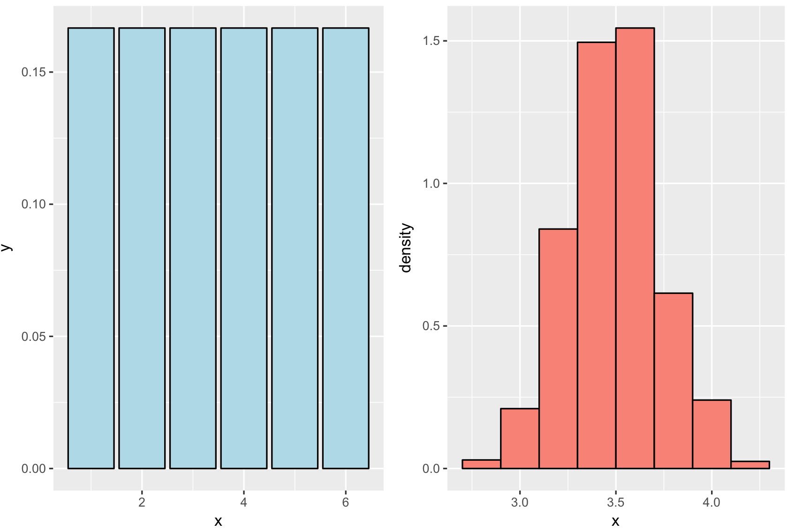

The point is, the empirical matches the theoretical. Yay! The highest bin is centered at 3.5 just as the math predicted. So what?

What if some joker wanted you to run the same experiment with a die he gave you and he warned you that the dice was loaded? In other words, it wasn't fair. It has some random distribution like this.

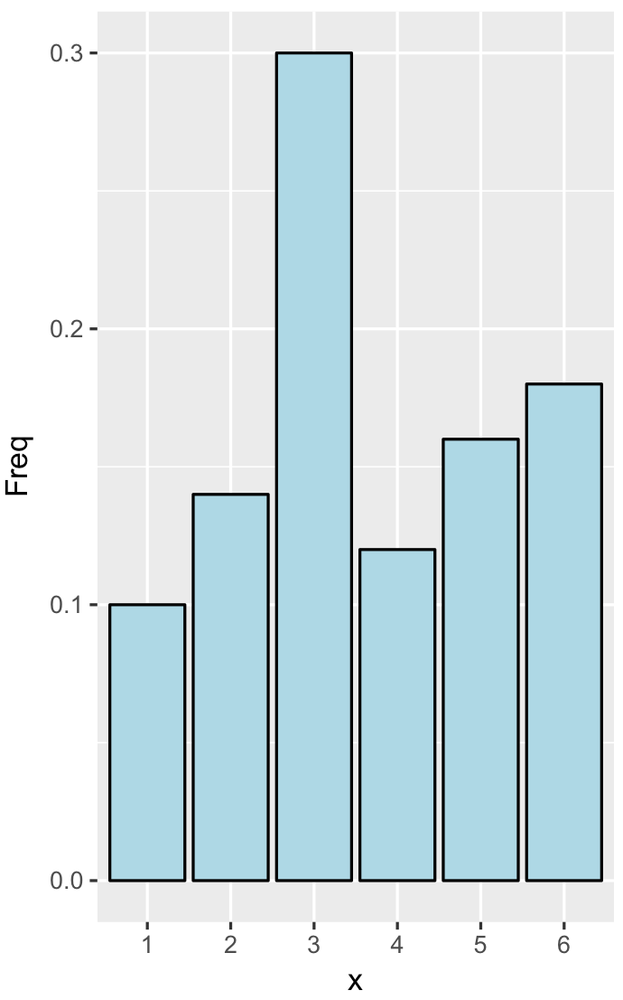

```R
n = 50
B = 1000
## our data
x = sample(1 : 6, n, replace = TRUE)
## bootstrap resamples
resamples = matrix(sample(x,
                           n * B,
                           replace = TRUE),
                    B, n)
resampledMeans = apply(resamples, 1, mean)
g1 <- ggplot(as.data.frame(prop.table(table(x))), aes(x = x, y = Freq)) + geom_bar(colour = "black", fill = "lightblue", stat = "identity") 
g2 <- ggplot(data.frame(x = resampledMeans), aes(x = x)) + geom_histogram(binwidth=.2, colour = "black", fill = "salmon", aes(y = ..density..)) 
grid.arrange(g1, g2, ncol = 2)
```

The outcomes aren't equally likely, are they? So when you do your 1000 runs of 50 rolls each, the density of the means
looks different.

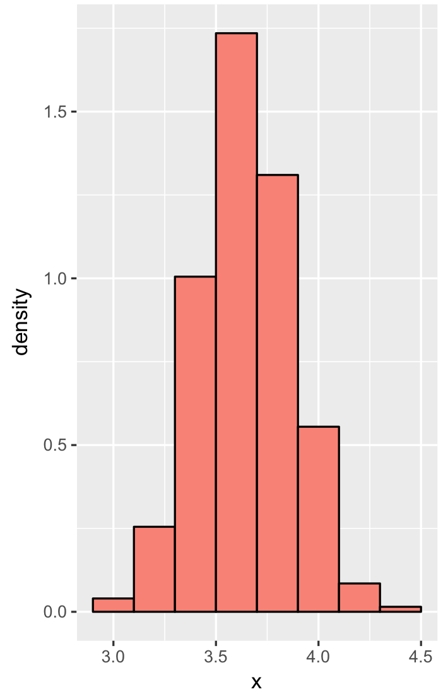

Picture's a little different, right? Although this example is a bit contrived, it illustrates an important concept. We really want a distribution of means and we have only one set of observations. (In this case it was the empirical distribution associated with the unfair die - the big blue picture.) We used that one distribution, to "create" many (1000) distributions by sampling with replacement from the given one. We sampled 50000 times so we created 1000 distributions of 50 rolls each.

We then calculated the mean of each of our created distributions and got a distribution of means. Sampling the one distribution many times gives us some variability in the resulting statistics we calculate. We can then calculate the standard error and confidence intervals associated with the statistic.

------

#### What if we only had one sample?

Recall the father and son height data. We've placed the height of the sons in the vector x and the length of this vector is stored in the variable n.
Now we'll create 1000 distributions of the same length as the original x. We'll do this by sampling x with replacement 1000*n times and store the results in an array with 1000 rows, each with n entries. Then we'll take the median of each row and plot the result.

```R
library(UsingR)
data(father.son)
x <- father.son$sheight
n <- length(x)
B <- 10000
resamples <- matrix(sample(x, n * B, replace = TRUE), B, n)
resampledMedians <- apply(resamples, 1, median)
```

Note that every time we draw from the empirical distribution x, each of its n data points is equally likely to be pulled, therefore the probability of drawing any one is 1/n. The 1000 samples we create will vary from the original.

Here's the resulting density curve. This estimates the distribution of medians. The thick vertical line shows where the median of the original, observed data sh lies.

```
g = ggplot(data.frame(x = resampledMedians), aes(x = x)) 
g = g + geom_density(size = 2, fill = "red")
g = g + geom_vline(xintercept = median(x), size = 2)
g
```

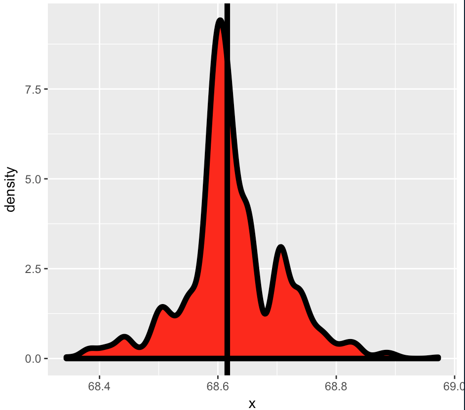

------

#### The bootstrap principle

Let's see the actual and resample medians by  using R:

```R
median(resampledMedians)
[1] 68.61273

median(x)
[1] 68.61582
```

Pretty close, right? Now back to theory. 

- Suppose you have a statistic that estimates some population parameter, but you don't know its sampling distribution.
- The bootstrap principle uses the distribution defined by the observed data to approximate the sampling distribution of that statistic.

------

#### The bootstrap in practice

- The nice thing about bootstrapping is that you can always do it with simulation. The general procedure follows by first **simulating B complete data sets** from the observed data by sampling with replacement. Make sure **B is large** and that you're sampling **WITH replacement** to create data sets the **same size as the original**.


- This approximates drawing from the sampling distribution of that statistic, at least as well as the data approximates the true population distribution. By calculating the statistic for each simulated data set and using these simulated statistics we can either **define a confidence interval** (e.g. find the 2.5 and the 97.5 percentiles) or **take the standard deviation** to estimate a standard error of that statistic.
- Notice that this process doesn't use any fancy math or asymptotics. The only assumption behind it is that the **observed sample is representative of the underlying population**.

------

#### Nonparametric bootstrap algorithm example

- Bootstrap procedure for calculating confidence interval for the median from a data set of $n$ observations

  i. Sample $n$ observations **with replacement** from the observed data resulting in one simulated complete data set

  ii. Take the median of the simulated data set

  iii. Repeat these two steps $B$ times, resulting in $B$ simulated medians

  iv. These medians are approximately drawn from the sampling distribution of the median of $n$ observations; therefore we can

  - Draw a histogram of them
  - Calculate their standard deviation to estimate the standard error of the median
  - Take the $2.5^{th}$ and $97.5^{th}$ percentiles as a confidence interval for the median

------

**Example code:**

```R
B <- 10000

resamples <- matrix(sample(x,n * B, replace = TRUE), B, n)
medians <- apply(resamples, 1, median)

sd(medians)
## [1] 0.08424

quantile(medians, c(.025, .975))
##  2.5% 97.5% 
## 68.43 68.81
```

Histogram of bootstrap resamples

```R
g = ggplot(data.frame(medians = medians), aes(x = medians))
g = g + geom_histogram(color = "black", fill = "lightblue", binwidth = 0.05)
g
```

[](https://github.com/bcaffo/courses/blob/master/06_StatisticalInference/13_Resampling/assets/fig/unnamed-chunk-6.png)

------

**Notes on the bootstrap**:

Bootstrapping is a very diverse and complicated topic and we just skimmed the surface here. The technique we showed you is **non-parametric**, that is, it's not based on any parameterized family of probability distributions. We used only one set of observations that we assumed to be representative of the population.

Finally, the confidence intervals we calculated might not perform very well because of biases but the R package bootstrap provides an easy fix for this problem.

------

Permutation testing
---

Permutation testing, another handy tool used in **group comparisons**. As bootstrapping did, permutation testing samples a single dataset a **zillion times** and calculates a statistic based on these samplings.

Permutation testing, however, is based on the idea of **exchangability of group labels**. It measures whether or not outcomes are independent of group identity. Our zillion samples simply permute group labels associated with outcomes. We'll see an example of this.

---

Here's a picture from the dataset InsectSprays which contains counts of the number of bugs killed by six different
spray:

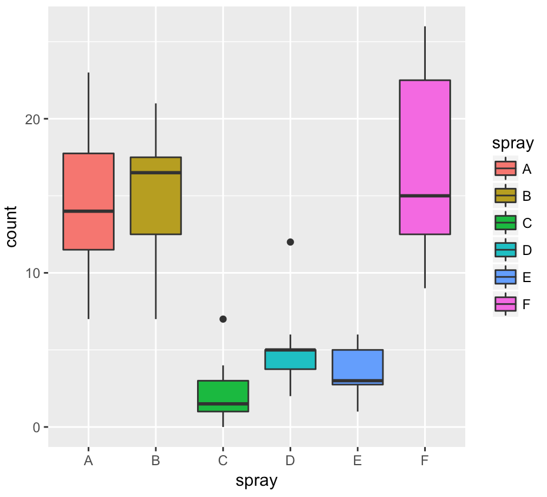

We'll use permutation testing to compare Spray B with Spray C.

------

**Permutation test B v C**:

We'll use permutation testing to compare Spray B with Spray C. We subsetted data for these two sprays into a data frame subdata. Moreover, the two data frames Bdata and Cdata contain the data for their respective sprays.

```R
subdata <- InsectSprays[InsectSprays$spray %in% c("B", "C"),]
y <- subdata$count
group <- as.character(subdata$spray)
testStat <- function(w, g) mean(w[g == "B"]) - mean(w[g == "C"])
observedStat <- testStat(y, group)
permutations <- sapply(1 : 10000, function(i) testStat(y, sample(group)))

observedStat
## [1] 13.25

mean(permutations > observedStat)
## [1] 0               
```

So on average 0 of the permutations had a difference greater than the observed. That means we would reject the null
hypothesis that the means of the two sprays were equal.

------

**Histogram of permutations B v C**

Here's a histogram of the difference of the means. Looks pretty normal, right? We can see that the distribution runs roughly between -10 and +10 and it's centered around 0. The vertical line shows where the observed difference of means was and we see that it's pretty far away from the distribution of the resampled permutations. This means that group identification did matter and sprays B and C were quite different.

[](https://github.com/bcaffo/courses/blob/master/06_StatisticalInference/13_Resampling/assets/fig/unnamed-chunk-9.png)

---

**Permutation test D v E:**

Suppose we run the same experiment, this time comparing sprays D and E, which look more alike. We've redefined testStat to look at these sprays and subtract the mean of spray E from the mean of spray D.

```R
subdata <- InsectSprays[InsectSprays$spray %in% c("D", "E"),]
y <- subdata$count
group <- as.character(subdata$spray)
testStat <- function(w, g) mean(w[g == "D"]) - mean(w[g == "E"])
observedStat <- testStat(y, group)
permutations <- sapply(1 : 10000, function(i) testStat(y, sample(group)))

observedStat
[1] 1.416667


mean(permutations > observedStat)
[1] 0.0442

```

 Finally, we can plot the histogram of the distribution of the difference of the means. We see that with these sprays the observed difference of means (the vertical line) is closer to the mean of the permuted labels. This indicates that sprays D and E are quite similar and we fail to reject the null hypothesis that the means were equal.

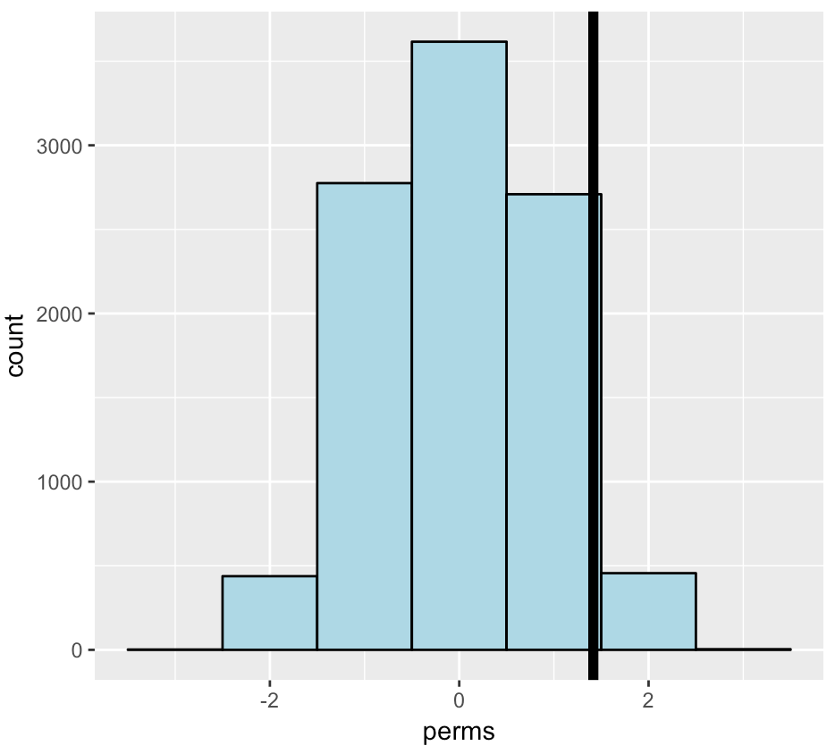

