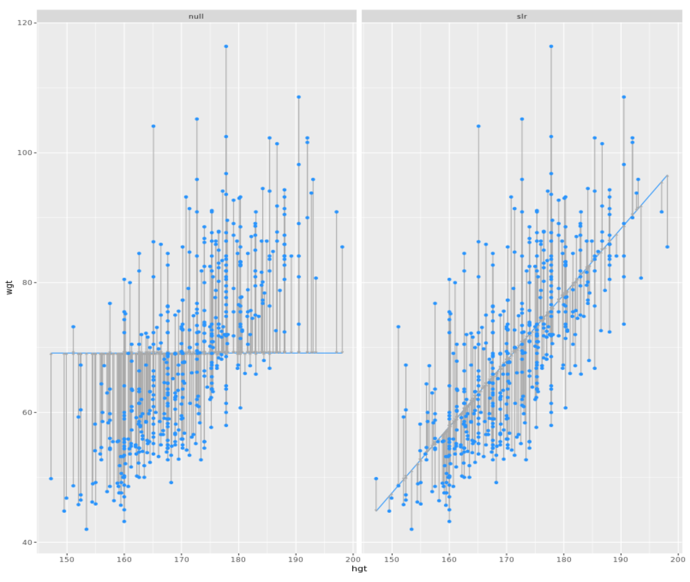

Fitting a linear model "by hand"
===

Recall the simple linear regression model:
$$
Y=b_0+b_1⋅X
$$
Two facts enable you to compute the slope $b_1$ and intercept $b_0$ of a simple linear regression model from some basic summary statistics.

First, the slope can be defined as:
$$
b_1=r_{X,Y}⋅\frac{s_Y}{s_X}
$$
where $r_X,Y$ represents the correlation (`cor()`) of X and Y and $s_X$ and $s_Y$ represent the standard deviation (`sd()`) of X and Y, respectively.

Second, the point $(\bar x, \bar y)$ is *always* on the least squares regression line, where $\bar x$ and $\bar y$ denote the average of x and y, respectively.

The `bdims_summary` data frame contains all of the information you need to compute the slope and intercept of the least squares regression line for body weight (Y) as a function of height (X). You might need to do some algebra to solve for $b_0$!

Code:

```R
# Add slope and intercept
bdims_summary %>%
  mutate(slope = r*(sd_wgt/sd_hgt), 
         intercept = mean_wgt - slope * mean_hgt)
```

Regression to the mean
===

*Regression to the mean* is a concept attributed to Sir Francis Galton. The basic idea is that extreme random observations will tend to be less extreme upon a second trial. This is simply due to chance alone. While "regression to the mean" and "linear regression" are not the same thing, we will examine them together in this exercise.

One way to see the effects of regression to the mean is to compare the heights of parents to their children's heights. While it is true that tall mothers and fathers tend to have tall children, those children tend to be less tall than their parents, relative to average. That is, fathers who are 3 inches taller than the average father tend to have children who may be taller than average, but by less than 3 inches.

Code:

```R
# Height of children vs. height of father
ggplot(data = Galton_men, aes(x = father, y = height)) +
  geom_point() + 
  geom_abline(slope = 1, intercept = 0) + 
  geom_smooth(method = "lm", se = FALSE)

# Height of children vs. height of mother
ggplot(data = Galton_women, aes(x = mother, y = height)) +
  geom_point() +
  geom_abline(slope = 1, intercept = 0) +
  geom_smooth(method = "lm", se = FALSE)
```

Because the slope of the regression line is smaller than 1 (the slope of the diagonal line) for both males and females, we can verify Sir Francis Galton's *regression to the mean* concept!

Fitting simple linear models
===

While the `geom_smooth(method = "lm")` function is useful for drawing linear models on a scatterplot, it doesn't actually return the characteristics of the model. As suggested by that syntax, however, the function that creates linear models is `lm()`. This function generally takes two arguments:

- A `formula` that specifies the model
- A `data` argument for the data frame that contains the data you want to use to fit the model

The `lm()` function return a model object having class `"lm"`. This object contains lots of information about your regression model, including the data used to fit the model, the specification of the model, the fitted values and residuals, etc.

Code:

```R
# Linear model for weight as a function of height
lm(wgt ~ hgt, data = bdims)

# Linear model for SLG as a function of OBP
lm(SLG ~ OBP, data = mlbBat10)

# Log-linear model for body weight as a function of brain weight
lm(log(BodyWt) ~ log(BrainWt), data = mammals)
```

The lm summary output
===

An `"lm"` object contains a host of information about the regression model that you fit. There are various ways of extracting different pieces of information.

The `coef()` function displays only the values of the coefficients. Conversely, the `summary()` function displays not only that information, but a bunch of other information, including the associated standard error and p-value for each coefficient, the R2R2, adjusted R2R2, and the residual standard error.

Code:

```R
# Show the coefficients
coef(mod)

# Show the full output
summary(mod)
```

Fitted values and residuals
===

Once you have fit a regression model, you are often interested in the fitted values ($\hat y_i$) and the residuals ($e_i$), where i indexes the observations. Recall that:

$e_i=y_i−\hat y_i$

The least squares fitting procedure guarantees that the mean of the residuals is zero (n.b., numerical instability may result in the computed values not being *exactly* zero). At the same time, the mean of the fitted values must equal the mean of the response variable.

In this exercise, we will confirm these two mathematical facts by accessing the fitted values and residuals with the `fitted.values()`and `residuals()` functions, respectively, for the following model:

```R
mod <- lm(wgt ~ hgt, data = bdims)
```

Code:

```R
# Mean of weights equal to mean of fitted values?
mean(bdims$wgt) == mean(fitted.values(mod))

# Mean of the residuals
mean(resid(mod))
```

Tidying your linear model
===

As you fit a regression model, there are some quantities (e.g. $R ^ 2$) that apply to the model as a whole, while others apply to each observation (e.g. $\hat y_i$). If there are several of these per-observation quantities, it is sometimes convenient to attach them to the original data as new variables.

The `augment()` function from the `broom` package does exactly this. It takes a model object as an argument and returns a data frame that contains the data on which the model was fit, along with several quantities specific to the regression model, including the fitted values, residuals, leverage scores, and standardized residuals.

Code:

```R
# Load broom
library(broom)

# Create bdims_tidy
bdims_tidy <- augment(mod)

# Glimpse the resulting data frame
glimpse(bdims_tidy)
```

Making predictions
===

The `fitted.values()` function or the `augment()`-ed data frame provides us with the fitted values for the observations that were in the original data. However, once we have fit the model, we may want to compute expected values for observations that were **not** present in the data on which the model was fit. These types of predictions are called *out-of-sample*.

The `ben` data frame contains a height and weight observation for one person. The `mod` object contains the fitted model for weight as a function of height for the observations in the `bdims` dataset. We can use the `predict()` function to generate expected values for the weight of new individuals. We must pass the data frame of new observations through the `newdata` argument.

```R
# Print ben
print(ben)

# Predict the weight of ben
predict(mod, newdata = ben)
```

Adding a regression line to a plot manually
===

The `geom_smooth()` function makes it easy to add a simple linear regression line to a scatterplot of the corresponding variables. And in fact, there are more complicated regression models that can be visualized in the data space with `geom_smooth()`. However, there may still be times when we will want to add regression lines to our scatterplot manually. To do this, we will use the `geom_abline()`function, which takes `slope` and `intercept` arguments. Naturally, we have to compute those values ahead of time, but we already saw how to do this (e.g. using `coef()`).

The `coefs` data frame contains the model estimates retrieved from `coef()`. Passing this to `geom_abline()` as the `data` argument will enable you to draw a straight line on your scatterplot.

```R
# Add the line to the scatterplot
ggplot(data = bdims, aes(x = hgt, y = wgt)) + 
  geom_point() + 
  geom_abline(data = coefs, 
              aes(intercept = `(Intercept)`, slope = hgt),  
              color = "dodgerblue")
```

Standard error of residuals
===

One way to assess strength of fit is to consider how far off the model is for a typical case. That is, for some observations, the fitted value will be very close to the actual value, while for others it will not. The magnitude of a typical residual can give us a sense of generally how close our estimates are.

However, recall that some of the residuals are positive, while others are negative. In fact, it is guaranteed by the least squares fitting procedure that the mean of the residuals is zero. Thus, it makes more sense to compute the square root of the mean squared residual, or *root mean squared error* (**RMSE**). R calls this quantity the **residual standard error**.

To make this estimate unbiased, you have to divide the sum of the squared residuals by the degrees of freedom in the model. Thus,
$$
RMSE = \sqrt \frac{\sum (e_i)^2}{d.f} = \sqrt \frac {SSE}{d.f}
$$
You can recover the residuals from `mod` with `residuals()`, and the degrees of freedom with `df.residual()`.

```R
# View summary of model
summary(mod)

# Compute the mean of the residuals
mean(residuals(mod))

# Compute RMSE
sqrt(sum(resid(mod)^2) / df.residual(mod))
```

Assessing simple linear model fit
===

Recall that the coefficient of determination ($R^2$), can be computed as:
$$
R^2 = 1 - \frac{SSE}{SST} = 1 - \frac{Var(e)}{Var(y)}
$$
where **e** is the vector of residuals and **y** is the response variable. This gives us the interpretation of $R^2$ as the percentage of the variability in the response that is explained by the model, since the residuals are the part of that variability that remains unexplained by the model.

```R
# View model summary
summary(mod)

# Compute R-squared
bdims_tidy %>%
  summarize(var_y = var(bdims_tidy$wgt), var_e = var(residuals(mod))) %>%
  mutate(R_squared = 1 - (var_e/var_y))
```

Interpretation of $R^2$
===

The $R^2$ reported for the regression model for poverty rate of U.S. counties in terms of high school graduation rate is 0.464.

```R
lm(formula = poverty ~ hs_grad, data = countyComplete) %>%
  summary()
```

How should this result be interpreted?

- 46.4% of the variability in poverty rate among U.S. counties can be explained by high school graduation rate.

Linear vs. average
===

The $R^2$ gives us a **numerical measurement of the strength of fit relative to a null model based on the average of the response variable**:
$$
\hat y_{null} = \bar y
$$
This model has an $R^2$ of zero because $SSE=SST$. That is, since the fitted values ($\hat y_{null}$) are all equal to the average ($\bar y$), the residual for each observation is the distance between that observation and the mean of the response. Since we can always fit the null model, it serves as a baseline against which all other models will be compared.

In the graphic, we visualize the residuals for the null model (`mod_null`at left) vs. the simple linear regression model (`mod_hgt` at right) with height as a single explanatory variable. Try to convince yourself that, if you squared the lengths of the grey arrows on the left and summed them up, you would get a larger value than if you performed the same operation on the grey arrows on the right.



```R
# Compute SSE for null model
mod_null %>%
  summarize(SSE = var(mod_null$.resid))

       SSE
1 178.1094

# Compute SSE for regression model
mod_hgt %>%
  summarize(SSE = var(mod_hgt$.resid))
       SSE
1 86.46839
```

Leverage
===

The *leverage* of an observation in a regression model is defined entirely in terms of the distance of that observation from the mean of the explanatory variable. That is, observations close to the mean of the explanatory variable have low leverage, while observations far from the mean of the explanatory variable have high leverage. Points of high leverage may or may not be influential.

The `augment()` function from the `broom` package will add the leverage scores (`.hat`) to a model data frame.

```R
# Rank points of high leverage
mod %>%
  augment() %>%
  arrange(desc(.hat)) %>%
  head(6)
```

Influence
===

As noted previously, observations of high leverage may or may not be *influential*. The influence of an observation depends not only on its leverage, but also on the magnitude of its residual. Recall that while leverage only takes into account the explanatory variable (x), the residual depends on the response variable (y) and the fitted value ($\hat y$).

Influential points are likely to have high leverage and deviate from the general relationship between the two variables. We measure influence using Cook's distance, which incorporates both the leverage and residual of each observation.

```R
# Rank influential points
mod %>%
  augment() %>%
  arrange(desc(.cooksd)) %>%
  head(6)
```

Removing outliers
===

Observations can be outliers for a number of different reasons. Statisticians must always be careful—and more importantly, transparent—when dealing with outliers. Sometimes, a better model fit can be achieved by simply removing outliers and re-fitting the model. However, one must have strong justification for doing this. A desire to have a higher $R^2$ is not a good enough reason!

In the `mlbBat10` data, the outlier with an OBP of 0.550 is [Bobby Scales](https://en.wikipedia.org/wiki/Bobby_Scales), an infielder who had four hits in 13 at-bats for the Chicago Cubs. Scales also walked seven times, resulting in his unusually high OBP. The justification for removing Scales here is weak. While his performance was unusual, there is nothing to suggest that it is not a valid data point, nor is there a good reason to think that somehow we will learn more about Major League Baseball players by excluding him.

Nevertheless, we can demonstrate how removing him will affect our model.

```R
# Create nontrivial_players
nontrivial_players <- mlbBat10 %>%
  filter(AB >= 10, OBP < 0.5)

# Fit model to new data
mod_cleaner <- lm(SLG ~ OBP, data = nontrivial_players)

# View model summary
summary(mod_cleaner)

# Visualize new model
ggplot(data = nontrivial_players, aes(OBP, SLG)) +
geom_point() +
geom_smooth(method = "lm")
```

High leverage points
===

Not all points of high leverage are influential. While the high leverage observation corresponding to Bobby Scales in the previous exercise is influential, the three observations for players with OBP and SLG values of 0 are not influential.

This is because they happen to lie right near the regression anyway. Thus, while their extremely low OBP gives them the power to exert influence over the slope of the regression line, their low SLG prevents them from using it.

```R
# Rank high leverage points
mod %>%
augment() %>%
arrange(desc(.hat)) %>%
head(6)
```

