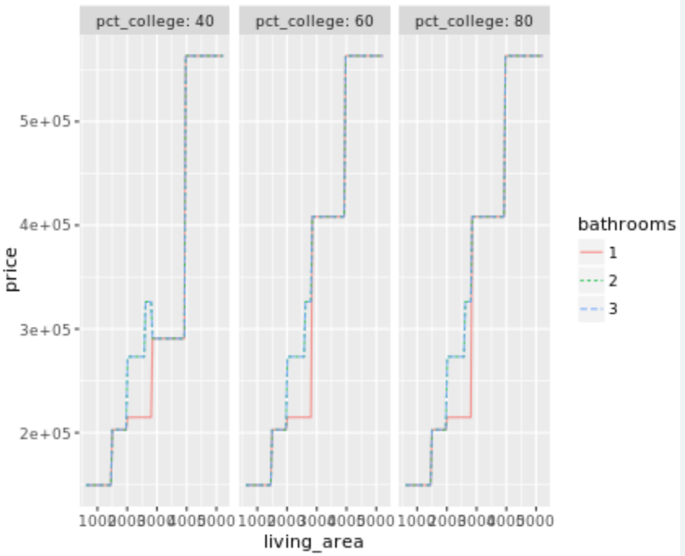
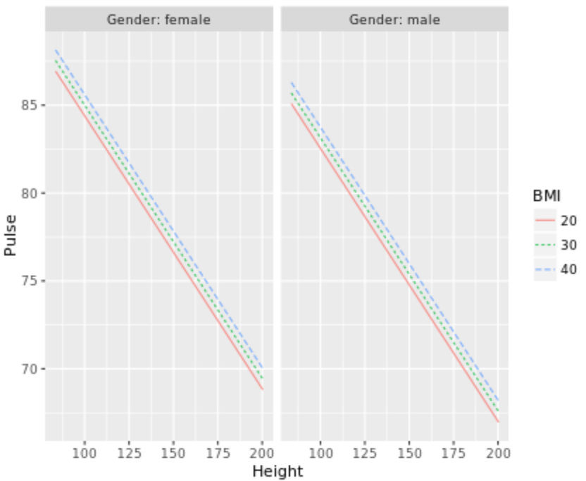
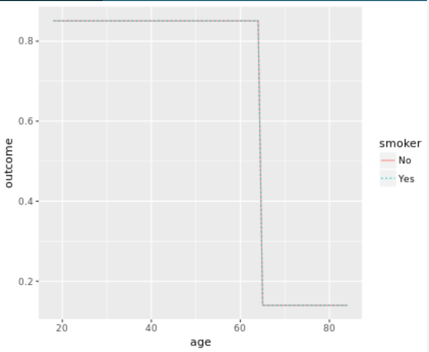
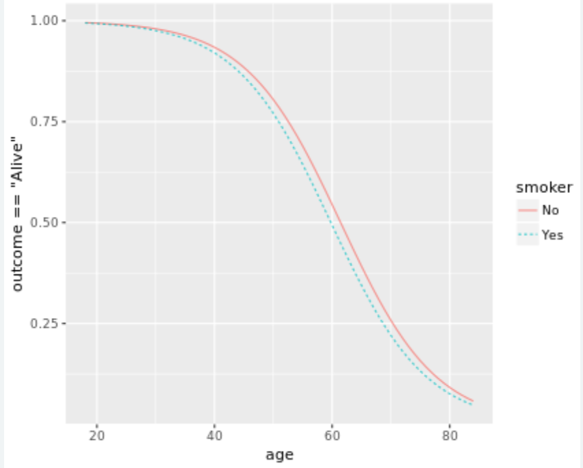

Graphing a model of house prices
===

In this exercise, you'll use the `Houses_for_sale` data to build a model that corresponds to the graphic shown. You'll have to figure out what are the response and explanatory variables from the axis and facet labels shown in the plot.

You can try both the linear architecture and the recursive partitioning architecture to see which one was used.

Recall the syntax for `fmodel()` is:

```R
fmodel(model_object, ~ x_var + color_var + facet_var)
```

```R
# Build your model
my_model <- rpart(price ~ living_area  + bathrooms + pct_college,
                data = Houses_for_sale)

# Graph the model
fmodel(my_model, ~ living_area  + bathrooms + pct_college)
```



Body-mass index (BMI)
===

This exercise will challenge you to reconstruct another model based on its visual representation. The model displayed here is based on the `NHANES` data.

```R
 # Build the model
mod <- lm(Pulse ~ Height + BMI + Gender, data = NHANES)

# Confirm by reconstructing the graphic provided
fmodel(mod, ~ Height + BMI + Gender) + ggplot2::ylab("Pulse")

# Find effect size
effect_size(mod, ~ BMI)
       slope   BMI   to:BMI Height Gender
1 0.06025728 25.98 33.35658    166 female

# Replot the model
fmodel(mod, ~ BMI + Height + Gender) + ggplot2::ylab("Pulse")
```



Eager runners
===

In this exercise, you're going to build a model of the starting position of a runner in the Cherry Blossom race as a function of `age`, `sex`, and `nruns`.

```R
model_1 <- rpart(start_position ~ age + sex + nruns, 
                 data = Runners, cp = 0.001)
```

Then, you'll evaluate the model in two different ways:

```R
as_class <- evaluate_model(model_1, type = "class")
   age sex nruns model_output
1   20   M     0        eager
2   40   M     0       mellow
3   60   M     0       mellow
4   20   F     0       mellow
5   40   F     0       mellow
6   60   F     0       mellow
7   20   M     5       mellow
8   40   M     5        eager
9   60   M     5       mellow
10  20   F     5       mellow
11  40   F     5       mellow
12  60   F     5       mellow
13  20   M    10        eager
14  40   M    10        eager
15  60   M    10        eager
16  20   F    10       mellow
17  40   F    10       mellow
18  60   F    10       mellow

as_prob  <- evaluate_model(model_1)
   age sex nruns model_output.calm model_output.eager model_output.mellow
1   20   M     0         0.2487047          0.4300518           0.3212435
2   40   M     0         0.2943962          0.3393844           0.3662194
3   60   M     0         0.3390294          0.2515379           0.4094327
4   20   F     0         0.2978723          0.1750172           0.5271105
5   40   F     0         0.2978723          0.1750172           0.5271105
6   60   F     0         0.2978723          0.1750172           0.5271105
7   20   M     5         0.2233010          0.3203883           0.4563107
8   40   M     5         0.3041030          0.4006436           0.2952534
9   60   M     5         0.2987616          0.3219814           0.3792570
10  20   F     5         0.2978723          0.1750172           0.5271105
11  40   F     5         0.2978723          0.1750172           0.5271105
12  60   F     5         0.2978723          0.1750172           0.5271105
13  20   M    10         0.2556008          0.4877800           0.2566191
14  40   M    10         0.2556008          0.4877800           0.2566191
15  60   M    10         0.2556008          0.4877800           0.2566191
16  20   F    10         0.2978723          0.1750172           0.5271105
17  40   F    10         0.2978723          0.1750172           0.5271105
18  60   F    10         0.2978723          0.1750172           0.5271105
```

The second evaluation (`as_prob`) gives the probability assigned by the model to each class. Note that for each set of inputs, the probabilities add to 1.

We can say always The class assigned is the one with larger probability than the others.

Who are the mellow runners?
===

When the response variable is categorical, effect sizes are calculated using the probability of each possible output class. Since an effect size compares the model outputs for two different levels of the explanatory variables, each effect size is a *difference* in probability. Positive numbers mean that the probability increases from the base level to the `to:`level; negative numbers mean the the probability decreases.

Note that across all the response levels, the effect sizes add to zero. That's because probability is being shifted from one level to another.

```R
# Train this model of start_position
model_1 <- rpart(start_position ~ age + sex + nruns, 
                 data = Runners, cp = 0.001)

# Calculate effect size with respect to sex
effect_size(model_1, ~ sex)
  change.calm change.eager change.mellow sex to:sex age nruns
1  0.01281487   -0.2192357     0.2064208   M      F  40     4

# Calculate effect size with respect to age
effect_size(model_1, ~ age)
  slope.calm slope.eager slope.mellow age   to:age sex nruns
1 0.00497811 -0.01316334  0.008185229  40 50.84185   M     4

# Calculate effect size with respect to nruns
effect_size(model_1, ~ nruns)
   slope.calm slope.eager slope.mellow nruns to:nruns age sex
1 0.004900487  0.02725955  -0.03216004     4 5.734239  40   M
```

Smoking and survival
===

There's a very important special case for classification: when the response variable has only two levels. Of course, you can use the recursive partitioning architecture, but it's much more common in the two-level situation to use a technique known as *logistic regression*. This course features `lm()` and `rpart()`, but it would be remiss not to mention logistic regression.

In this exercise, you'll look at the effect size of smoking on survival. The data used for modeling are in the `Whickham` dataset, which gives a small part of the data collected in the early 1970's. Participants were asked their age and whether they smoke. A follow-up twenty years later found whether the participant was still alive.

We're interested to find the effect size of smoking on survival.

```R
# An rpart model
mod1 <- rpart(outcome ~ age + smoker, data = Whickham)

# Logistic regression
mod2 <- glm(outcome == "Alive" ~ age + smoker, 
            data = Whickham, family = "binomial")

# Visualize the models with fmodel()
fmodel(mod1)
fmodel(mod2)

# Find the effect size of smoker
effect_size(mod1, ~ smoker)
  change.Alive change.Dead smoker to:smoker age
1            0           0     No       Yes  46
effect_size(mod2, ~ smoker)
       change smoker to:smoker age
1 -0.02479699     No       Yes  46
```

Common sense suggests that survival changes continuously with age. Recursive partitioning works best for sharp, discontinuous changes. Logistic regression can capture smooth changes, and works better here.





