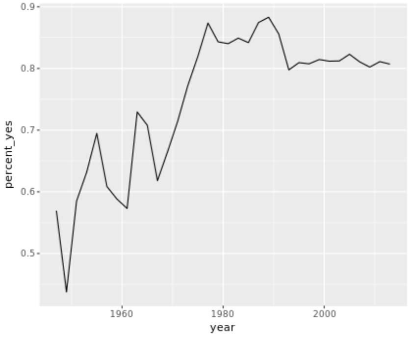
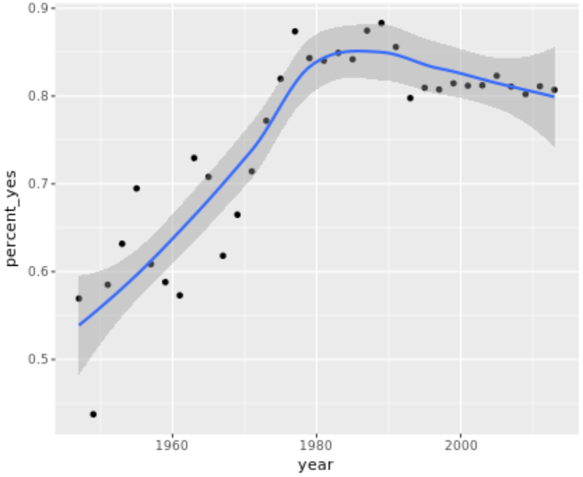
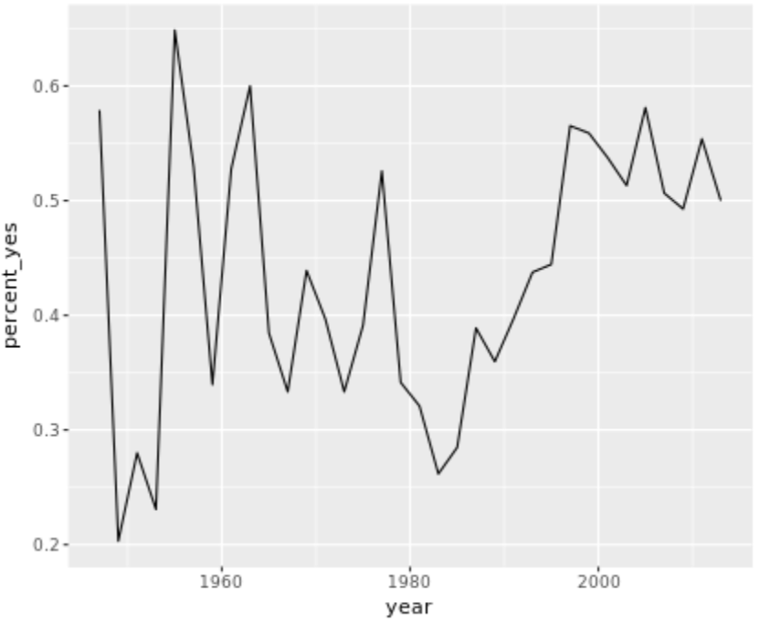
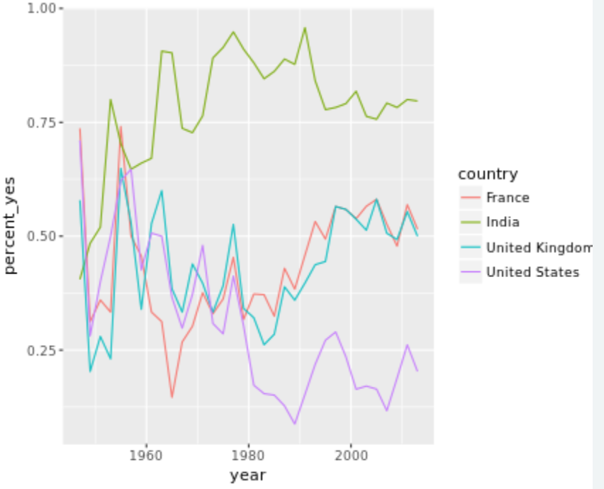
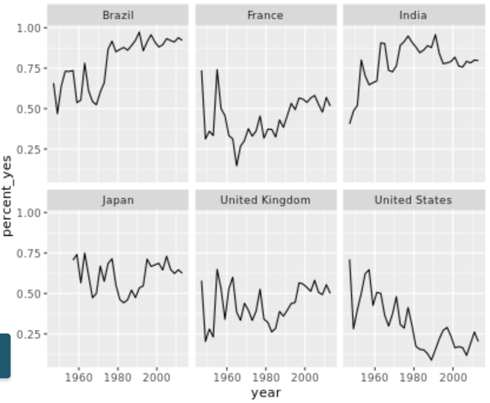
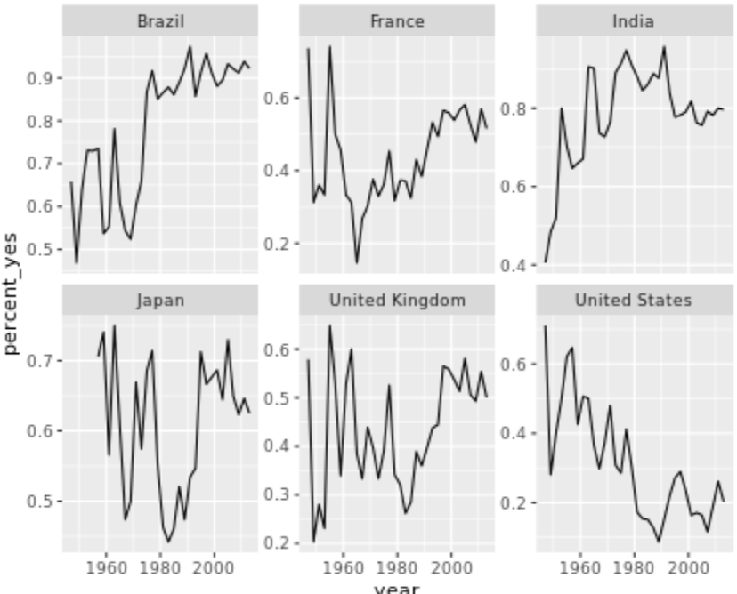
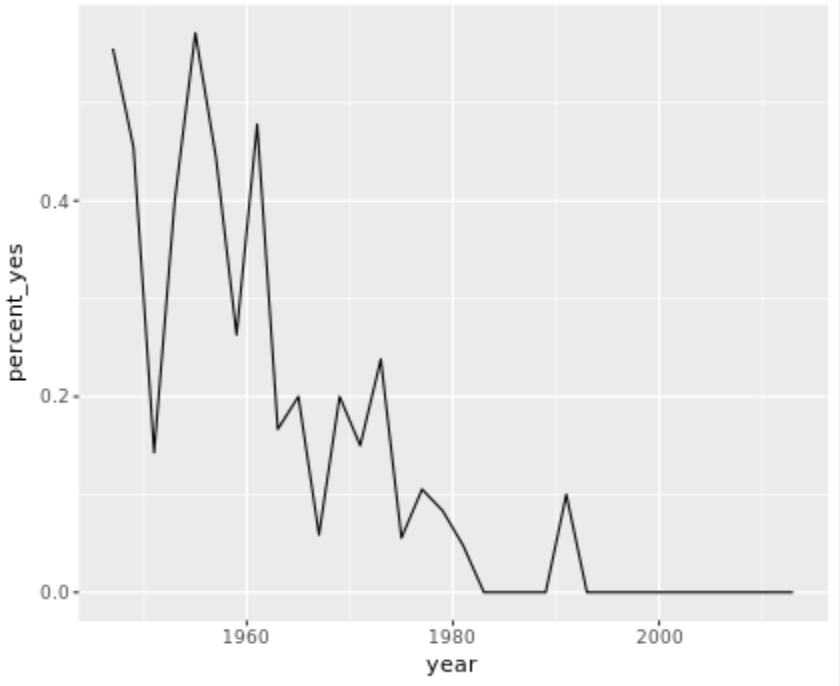
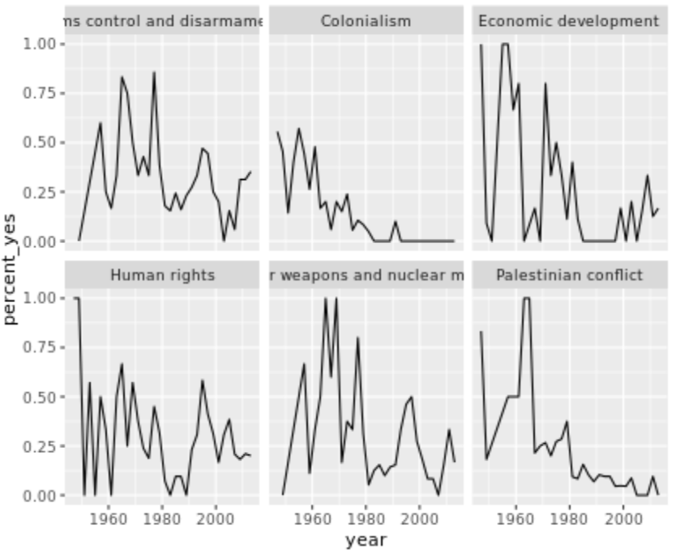
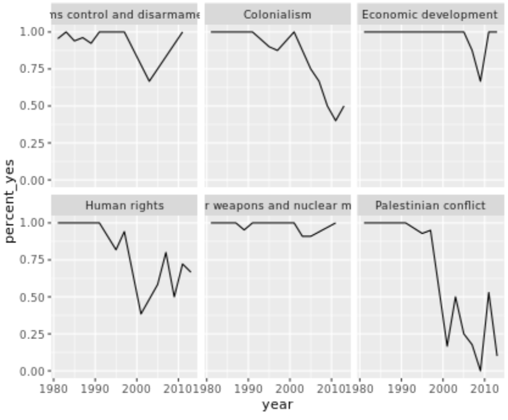

Filtering rows
===

The `vote` column in the dataset has a number that represents that country's vote:

- **1** = Yes
- **2** = Abstain
- **3** = No
- **8** = Not present
- **9** = Not a member

One step of data cleaning is removing observations (rows) that you're not interested in. In this case, you want to remove "Not present" and "Not a member".

```R
# Load the dplyr package
library(dplyr)

# Print the votes dataset
print(votes)
# A tibble: 508,929 x 4
    rcid session  vote ccode
   <dbl>   <dbl> <dbl> <int>
 1    46       2     1     2
 2    46       2     1    20
 3    46       2     9    31
 4    46       2     1    40
 5    46       2     1    41
 6    46       2     1    42
 7    46       2     9    51
 8    46       2     9    52
 9    46       2     9    53
10    46       2     9    54
# ... with 508,919 more rows

# Filter for votes that are "yes", "abstain", or "no"
votes %>%
  filter(vote <= 3)
# A tibble: 353,547 x 4
    rcid session  vote ccode
   <dbl>   <dbl> <dbl> <int>
 1    46       2     1     2
 2    46       2     1    20
 3    46       2     1    40
 4    46       2     1    41
 5    46       2     1    42
 6    46       2     1    70
 7    46       2     1    90
 8    46       2     1    91
 9    46       2     1    92
10    46       2     1    93
# ... with 353,537 more rows
```

Adding a year column
===

The next step of data cleaning is manipulating your variables (columns) to make them more informative.

In this case, you have a `session` column that is hard to interpret intuitively. But since the UN started voting in 1946, and holds one session per year, you can get the year of a UN resolution by adding 1945 to the `session` number.

```R
# Add another %>% step to add a year column
votes %>%
  filter(vote <= 3) %>%
  mutate(year = session + 1945)
# A tibble: 353,547 x 5
    rcid session  vote ccode  year
   <dbl>   <dbl> <dbl> <int> <dbl>
 1    46       2     1     2  1947
 2    46       2     1    20  1947
 3    46       2     1    40  1947
 4    46       2     1    41  1947
 5    46       2     1    42  1947
 6    46       2     1    70  1947
 7    46       2     1    90  1947
 8    46       2     1    91  1947
 9    46       2     1    92  1947
10    46       2     1    93  1947
# ... with 353,537 more rows
```

Adding a country column
===

The country codes in the `ccode` column are what's called [Correlates of War codes](http://cow.dss.ucdavis.edu/data-sets/cow-country-codes). This isn't ideal for an analysis, since you'd like to work with recognizable country names.

You can use the `countrycode` package to translate. For example:

```R
library(countrycode)

# Translate the country code 2
> countrycode(2, "cown", "country.name")
[1] "United States"

# Translate multiple country codes
> countrycode(c(2, 20, 40), "cown", "country.name")
[1] "United States" "Canada"        "Cuba"
```

Add a new `country` column in your `mutate()` statement containing country names, using the `countrycode()` function to translate from the `ccode` column. Save the result to `votes_processed`.

```R
# Load the countrycode package
library(countrycode)

# Convert country code 100
countrycode(100, "cown", "country.name")

# Add a country column within the mutate: votes_processed
votes_processed <- votes %>%
  filter(vote <= 3) %>%
  mutate(year = session + 1945) %>%
  mutate(country = countrycode(ccode, "cown", "country.name"))
```

Summarizing the full dataset
===

In this analysis, you're going to focus on "% of votes that are yes" as a metric for the "agreeableness" of countries.

You'll start by finding this summary for the entire dataset: the fraction of all votes in their history that were "yes". Note that within your call to `summarize()`, you can use `n()` to find the total number of votes and `mean(vote == 1)` to find the fraction of "yes" votes.

```R
# Print votes_processed
print(votes_processed)
# A tibble: 353,547 x 6
    rcid session  vote ccode  year            country
   <dbl>   <dbl> <dbl> <int> <dbl>              <chr>
 1    46       2     1     2  1947      United States
 2    46       2     1    20  1947             Canada
 3    46       2     1    40  1947               Cuba
 4    46       2     1    41  1947              Haiti
 5    46       2     1    42  1947 Dominican Republic
 6    46       2     1    70  1947             Mexico
 7    46       2     1    90  1947          Guatemala
 8    46       2     1    91  1947           Honduras
 9    46       2     1    92  1947        El Salvador
10    46       2     1    93  1947          Nicaragua
# ... with 353,537 more rows

# Find total and fraction of "yes" votes
votes_processed %>%
  summarize(total = n(),
            percent_yes = mean(vote == 1))
# A tibble: 1 x 2
   total percent_yes
   <int>       <dbl>
1 353547   0.7999248
```

Summarizing by year
===

The `summarize()` function is especially useful because it can be used within *groups*.

For example, you might like to know how much the average "agreeableness" of countries changed from year to year. To examine this, you can use `group_by()` to perform your summary not for the entire dataset, but within each year.

```R
# Change this code to summarize by year
votes_processed %>%
  group_by(year) %>%
  summarize(total = n(),
            percent_yes = mean(vote == 1))
# A tibble: 34 x 3
    year total percent_yes
   <dbl> <int>       <dbl>
 1  1947  2039   0.5693968
 2  1949  3469   0.4375901
 3  1951  1434   0.5850767
 4  1953  1537   0.6317502
 5  1955  2169   0.6947902
 6  1957  2708   0.6085672
 7  1959  4326   0.5880721
 8  1961  7482   0.5729751
 9  1963  3308   0.7294438
10  1965  4382   0.7078959
# ... with 24 more rows
```

Summarizing by country
===

In the last exercise, you performed a summary of the votes within each year. You could instead `summarize()` within each country, which would let you compare voting patterns between countries.

```R
# Summarize by country: by_country
by_country <- votes_processed %>%
                group_by(country) %>%
                summarize(total = n(),
                percent_yes = mean(vote == 1))
# A tibble: 200 x 3
               country total percent_yes
                 <chr> <int>       <dbl>
 1         Afghanistan  2373   0.8592499
 2             Albania  1695   0.7174041
 3             Algeria  2213   0.8992318
 4             Andorra   719   0.6383866
 5              Angola  1431   0.9238295
 6 Antigua and Barbuda  1302   0.9124424
 7           Argentina  2553   0.7677242
 8             Armenia   758   0.7467018
 9           Australia  2575   0.5565049
10             Austria  2389   0.6224362
# ... with 190 more rows
```

Sorting by percentage of "yes" votes
===

Now that you've summarized the dataset by country, you can start examining it and answering interesting questions.

For example, you might be especially interested in the countries that voted "yes" least often, or the ones that voted "yes" most often.

```R
# You have the votes summarized by country
by_country <- votes_processed %>%
  group_by(country) %>%
  summarize(total = n(),
            percent_yes = mean(vote == 1))

# Print the by_country dataset
print(by_country)

# Sort in ascending order of percent_yes
by_country %>%
  arrange(percent_yes)
# A tibble: 200 x 3
                           country total percent_yes
                             <chr> <int>       <dbl>
 1                        Zanzibar     2   0.0000000
 2                   United States  2568   0.2694704
 3                           Palau   369   0.3387534
 4                          Israel  2380   0.3407563
 5     Federal Republic of Germany  1075   0.3972093
 6                  United Kingdom  2558   0.4167318
 7                          France  2527   0.4265928
 8 Micronesia, Federated States of   724   0.4419890
 9                Marshall Islands   757   0.4914135
10                         Belgium  2568   0.4922118
# ... with 190 more rows

# Now sort in descending order
by_country %>%
  arrange(desc(percent_yes))
# A tibble: 200 x 3
                 country total percent_yes
                   <chr> <int>       <dbl>
 1 Sao Tome and Principe  1091   0.9761687
 2            Seychelles   881   0.9750284
 3              Djibouti  1598   0.9612015
 4         Guinea-Bissau  1538   0.9603381
 5           Timor-Leste   326   0.9570552
 6             Mauritius  1831   0.9497542
 7              Zimbabwe  1361   0.9493020
 8               Comoros  1133   0.9470432
 9  United Arab Emirates  1934   0.9467425
10            Mozambique  1701   0.9465021
# ... with 190 more rows
```

Filtering summarized output
===

In the last exercise, you may have noticed that the country that voted least frequently, Zanzibar, had only 2 votes in the entire dataset. You certainly can't make any substantial conclusions based on that data!

Typically in a progressive analysis, when you find that a few of your observations have very little data while others have plenty, you set some threshold to filter them out.

```R
# Filter out countries with fewer than 100 votes
by_country %>%
  filter(total >= 100) %>%
  arrange(percent_yes)
# A tibble: 197 x 3
                           country total percent_yes
                             <chr> <int>       <dbl>
 1                   United States  2568   0.2694704
 2                           Palau   369   0.3387534
 3                          Israel  2380   0.3407563
 4     Federal Republic of Germany  1075   0.3972093
 5                  United Kingdom  2558   0.4167318
 6                          France  2527   0.4265928
 7 Micronesia, Federated States of   724   0.4419890
 8                Marshall Islands   757   0.4914135
 9                         Belgium  2568   0.4922118
10                          Canada  2576   0.5081522  
```

---

Visualization with ggplot2
===

Plotting a line over time
===

In the last chapter, you learned how to `summarize()` the votes dataset by year, particularly the percentage of votes in each year that were "yes".

You'll now use the `ggplot2` package to turn your results into a visualization of the percentage of "yes" votes over time.

```R
# Define by_year
by_year <- votes_processed %>%
  group_by(year) %>%
  summarize(total = n(),
            percent_yes = mean(vote == 1))

# Load the ggplot2 package
library(ggplot2)

# Create line plot
ggplot(by_year, aes(x = year, y = percent_yes)) +
  geom_line()
```



Other ggplot2 layers
===

A line plot is one way to display this data. You could also choose to display it as a scatter plot, with each year represented as a single point. This requires changing the *layer* (i.e. `geom_line()` to `geom_point()`).

You can also add additional layers to your graph, such as a smoothing curve with `geom_smooth()`.

```R
# Change to scatter plot and add smoothing curve
ggplot(by_year, aes(year, percent_yes)) +
  geom_point() + 
  geom_smooth()
```



Summarizing by year and country
===

You're more interested in trends of voting within specific countries than you are in the overall trend. So instead of summarizing just by year, summarize by both year *and* country, constructing a dataset that shows what fraction of the time each country votes "yes" in each year.

```R
# Group by year and country: by_year_country
by_year_country <- votes_processed %>%
                    group_by(year, country) %>%
                    summarize(total = n(),
                              percent_yes = mean(vote == 1))
```

Plotting just the UK over time
===

Now that you have the percentage of time that each country voted "yes" within each year, you can plot the trend for a particular country. In this case, you'll look at the trend for just the United Kingdom.

This will involve using `filter()` on your data before giving it to `ggplot2`.

```R
# Start with by_year_country dataset
by_year_country <- votes_processed %>%
  group_by(year, country) %>%
  summarize(total = n(),
            percent_yes = mean(vote == 1))

# Print by_year_country
print(by_year_country)

# Create a filtered version: UK_by_year
UK_by_year <- by_year_country %>%
                filter(country == "United Kingdom")

# Line plot of percent_yes over time for UK only
ggplot(UK_by_year, aes(x = year, y = percent_yes)) +
  geom_line()
```



Plotting multiple countries
===

Plotting just one country at a time is interesting, but you really want to compare trends *between* countries. For example, suppose you want to compare voting trends for the United States, the UK, France, and India.

You'll have to filter to include all *four* of these countries and use another aesthetic (not just x- and y-axes) to distinguish the countries on the resulting visualization. Instead, you'll use the color aesthetic to represent different countries.

```R
# Vector of four countries to examine
countries <- c("United States", "United Kingdom",
               "France", "India")

# Filter by_year_country: filtered_4_countries
filtered_4_countries <- by_year_country %>%
                          filter(country %in% countries)

# Line plot of % yes in four countries
ggplot(filtered_4_countries, aes(x = year, y = percent_yes,
                                 color = country)) +
  geom_line()
```



Faceting by country
===

Now you'll take a look at six countries. While in the previous exercise you used color to represent distinct countries, this gets a little too crowded with six.

Instead, you will *facet*, giving each country its own sub-plot. To do so, you add a `facet_wrap()` step after all of your layers.

```R
# Vector of six countries to examine
countries <- c("United States", "United Kingdom",
               "France", "Japan", "Brazil", "India")

# Filtered by_year_country: filtered_6_countries
filtered_6_countries <- by_year_country %>%
                          filter(country %in% countries)

# Line plot of % yes over time faceted by country
ggplot(filtered_6_countries, aes(x = year, y = percent_yes)) +
  geom_line() +
  facet_wrap(~ country)
```



Faceting with free y-axis
===

In the previous plot, all six graphs had the same axis limits. This made the changes over time hard to examine for plots with relatively little change.

Instead, you may want to let the plot choose a different y-axis for each facet.

```R
# Vector of six countries to examine
countries <- c("United States", "United Kingdom",
               "France", "Japan", "Brazil", "India")

# Filtered by_year_country: filtered_6_countries
filtered_6_countries <- by_year_country %>%
  filter(country %in% countries)

# Line plot of % yes over time faceted by country
ggplot(filtered_6_countries, aes(year, percent_yes)) +
  geom_line() +
  facet_wrap(~ country, scales = "free_y")
```



---

# Tidy modeling with broom

Linear regression on the United States
===

A linear regression is a model that lets us examine how one variable changes with respect to another by fitting a best fit line. It is done with the `lm()` function in R.

Here, you'll fit a linear regression to just the percentage of "yes" votes from the United States.

```R
# Percentage of yes votes from the US by year: US_by_year
US_by_year <- by_year_country %>%
  filter(country == "United States")

# Print the US_by_year data
print(US_by_year)
# A tibble: 34 x 4
    year       country total percent_yes
   <dbl>         <chr> <int>       <dbl>
 1  1947 United States    38   0.7105263
 2  1949 United States    64   0.2812500
 3  1951 United States    25   0.4000000
 4  1953 United States    26   0.5000000
 5  1955 United States    37   0.6216216
 6  1957 United States    34   0.6470588
 7  1959 United States    54   0.4259259
 8  1961 United States    75   0.5066667
 9  1963 United States    32   0.5000000
10  1965 United States    41   0.3658537
# ... with 24 more rows

# Perform a linear regression of percent_yes by year: US_fit
US_fit <- lm(percent_yes ~ year, data = US_by_year)

# Perform summary() on the US_fit object
summary(US_fit)
Call:
lm(formula = percent_yes ~ year, data = US_by_year)

Residuals:
      Min        1Q    Median        3Q       Max 
-0.222491 -0.080635 -0.008661  0.081948  0.194307 

Coefficients:
              Estimate Std. Error t value Pr(>|t|)    
(Intercept) 12.6641455  1.8379743   6.890 8.48e-08 ***
year        -0.0062393  0.0009282  -6.722 1.37e-07 ***
---
Signif. codes:  0 '***' 0.001 '**' 0.01 '*' 0.05 '.' 0.1 ' ' 1

Residual standard error: 0.1062 on 32 degrees of freedom
Multiple R-squared:  0.5854,	Adjusted R-squared:  0.5724 
F-statistic: 45.18 on 1 and 32 DF,  p-value: 1.367e-07
```

Finding the slope of a linear regression
===

The `US_fit` object you created in the previous exercise is available in your workspace. Calling `summary()` on this gives you lots of useful information about the linear model.

What is the estimated slope of this relationship? Said differently, what's the estimated change each year of the probability of the US voting "yes"?

**-0.006**

Finding the p-value of a linear regression
===

Not all positive or negative slopes are necessarily real. A p-value is a way of assessing whether a trend could be due to chance. Generally, data scientists set a threshold by declaring that, for example, p-values below .05 are significant.

`US_fit` is still available in your workspace. In this linear model, what is the p-value of the relationship between `year` and `percent_yes`?

**1.37e-07** It seems `year` is very significant when modeling `percent_yes`.

Tidying a linear regression model
===

In the last section, you fit a linear model. Now, you'll use the `tidy()`function in the `broom` package to turn that model into a tidy data frame.

```R
# Load the broom package
library(broom)

# Call the tidy() function on the US_fit object
tidy(US_fit)
         term     estimate    std.error statistic      p.value
1 (Intercept) 12.664145512 1.8379742715  6.890274 8.477089e-08
2        year -0.006239305 0.0009282243 -6.721764 1.366904e-07
```

Combining models for multiple countries
===

One important advantage of changing models to tidied data frames is that they can be combined.

In an earlier section, you fit a linear model to the percentage of "yes" votes for each year in the United States. Now you'll fit the same model for the United Kingdom and combine the results from both countries.

```R
# Linear regression of percent_yes by year for US
US_by_year <- by_year_country %>%
  filter(country == "United States")
US_fit <- lm(percent_yes ~ year, US_by_year)

# Fit model for the United Kingdom
UK_by_year <- by_year_country %>%
  filter(country == "United Kingdom")
UK_fit <- lm(percent_yes ~ year, UK_by_year)

# Create US_tidied and UK_tidied
US_tidied <- tidy(US_fit)
UK_tidied <- tidy(UK_fit)

# Combine the two tidied models
bind_rows(US_tidied, UK_tidied)
         term     estimate    std.error statistic      p.value
1 (Intercept) 12.664145512 1.8379742715  6.890274 8.477089e-08
2        year -0.006239305 0.0009282243 -6.721764 1.366904e-07
3 (Intercept) -3.266547873 1.9577739504 -1.668501 1.049736e-01
4        year  0.001869434 0.0009887262  1.890750 6.774177e-02
```

Nesting a data frame
===

Right now, the `by_year_country` data frame has one row per country-vote pair. So that you can model each country individually, you're going to "nest" all columns besides `country`, which will result in a data frame with one row per country. The data for each individual country will then be stored in a **list column** called `data`.

```R
# Load the tidyr package
library(tidyr)

# Nest all columns besides country
by_year_country %>%
  nest(- country)
# A tibble: 200 x 2
                           country              data
                             <chr>            <list>
 1                     Afghanistan <tibble [34 x 3]>
 2                       Argentina <tibble [34 x 3]>
 3                       Australia <tibble [34 x 3]>
 4                         Belarus <tibble [34 x 3]>
 5                         Belgium <tibble [34 x 3]>
 6 Bolivia, Plurinational State of <tibble [34 x 3]>
 7                          Brazil <tibble [34 x 3]>
 8                          Canada <tibble [34 x 3]>
 9                           Chile <tibble [34 x 3]>
10                        Colombia <tibble [34 x 3]>
# ... with 190 more rows
```

List columns
===

This "nested" data has an interesting structure. The second column, `data`, is a **list**, a type of R object that hasn't yet come up in this course that allows complicated objects to be stored within each row. This is because each item of the `data` column is itself a data frame.

```R
# A tibble: 200 × 2
                           country              data
                             <chr>            <list>
1                      Afghanistan <tibble [34 × 3]>
2                        Argentina <tibble [34 × 3]>
3                        Australia <tibble [34 × 3]>
4                          Belarus <tibble [34 × 3]>
5                          Belgium <tibble [34 × 3]>
6  Bolivia, Plurinational State of <tibble [34 × 3]>
7                           Brazil <tibble [34 × 3]>
8                           Canada <tibble [34 × 3]>
9                            Chile <tibble [34 × 3]>
10                        Colombia <tibble [34 × 3]>

```

You can use `nested$data` to access this list column and double brackets to access a particular element. For example, `nested$data[[1]]` would give you the data frame with Afghanistan's voting history (the `percent_yes` per year), since Afghanistan is the first row of the table.

```R
# All countries are nested besides country
nested <- by_year_country %>%
  nest(-country)

# Print the nested data for Brazil
nested$data[[7]]
# A tibble: 34 x 3
    year total percent_yes
   <dbl> <int>       <dbl>
 1  1947    38   0.6578947
 2  1949    64   0.4687500
 3  1951    25   0.6400000
 4  1953    26   0.7307692
 5  1955    37   0.7297297
 6  1957    34   0.7352941
 7  1959    54   0.5370370
 8  1961    76   0.5526316
 9  1963    32   0.7812500
10  1965    41   0.6097561
# ... with 24 more rows
```

Unnesting
===

The opposite of the `nest()` operation is the `unnest()` operation. This takes each of the data frames in the list column and brings those rows back to the main data frame.

In this exercise, you are just undoing the `nest()` operation. In the next section, you'll learn how to fit a model in between these nesting and unnesting steps that makes this process useful.

```R
# All countries are nested besides country
nested <- by_year_country %>%
  nest(-country)

# Unnest the data column to return it to its original form
nested %>%
  unnest(data)
# A tibble: 4,744 x 4
       country  year total percent_yes
         <chr> <dbl> <int>       <dbl>
 1 Afghanistan  1947    34   0.3823529
 2 Afghanistan  1949    51   0.6078431
 3 Afghanistan  1951    25   0.7600000
 4 Afghanistan  1953    26   0.7692308
 5 Afghanistan  1955    37   0.7297297
 6 Afghanistan  1957    34   0.5294118
 7 Afghanistan  1959    54   0.6111111
 8 Afghanistan  1961    76   0.6052632
 9 Afghanistan  1963    32   0.7812500
10 Afghanistan  1965    40   0.8500000
# ... with 4,734 more rows
```


Performing linear regression on each nested dataset
===

Now that you've divided the data for each country into a separate dataset in the `data` column, you need to fit a linear model to each of these datasets.

The `map()` function from `purrr` works by applying a formula to each item in a list, where `.` represents the individual item. For example, you could add one to each of a list of numbers:

```R
map(numbers, ~ 1 + .)
```

This means that to fit a model to each dataset, you can do:

```R
map(data, ~ lm(percent_yes ~ year, data = .))
```

where `.` represents each individual item from the `data` column in `by_year_country`. Recall that each item in the `data` column is a dataset that pertains to a specific country.

```R
# Load tidyr and purrr
library(tidyr)
library(purrr)


# Perform a linear regression on each item in the data column
by_year_country %>%
  nest(-country) %>%
  mutate(model = map(data, ~ lm(percent_yes ~ year, data = .)))
# A tibble: 200 x 3
                           country              data    model
                             <chr>            <list>   <list>
 1                     Afghanistan <tibble [34 x 3]> <S3: lm>
 2                       Argentina <tibble [34 x 3]> <S3: lm>
 3                       Australia <tibble [34 x 3]> <S3: lm>
 4                         Belarus <tibble [34 x 3]> <S3: lm>
 5                         Belgium <tibble [34 x 3]> <S3: lm>
 6 Bolivia, Plurinational State of <tibble [34 x 3]> <S3: lm>
 7                          Brazil <tibble [34 x 3]> <S3: lm>
 8                          Canada <tibble [34 x 3]> <S3: lm>
 9                           Chile <tibble [34 x 3]> <S3: lm>
10                        Colombia <tibble [34 x 3]> <S3: lm>
# ... with 190 more rows
```

Tidy each linear regression model
===

You've now performed a linear regression on each nested dataset and have a linear model stored in the list column `model`. But you can't recombine the models until you've *tidied* each into a table of coefficients. To do that, you'll need to use `map()` one more time and the `tidy()` function from the `broom` package.

Recall that you can simply give a function to `map()` (e.g. `map(models, tidy)`) in order to apply that function to each item of a list.

```R
# Load the broom package
library(broom)

# Add another mutate that applies tidy() to each model
by_year_country %>%
  nest(-country) %>%
  mutate(model = map(data, ~ lm(percent_yes ~ year, data = .))) %>%
  mutate(tidied = map(model, tidy))
# A tibble: 200 x 3
                           country              data    model
                             <chr>            <list>   <list>
 1                     Afghanistan <tibble [34 x 3]> <S3: lm>
 2                       Argentina <tibble [34 x 3]> <S3: lm>
 3                       Australia <tibble [34 x 3]> <S3: lm>
 4                         Belarus <tibble [34 x 3]> <S3: lm>
 5                         Belgium <tibble [34 x 3]> <S3: lm>
 6 Bolivia, Plurinational State of <tibble [34 x 3]> <S3: lm>
 7                          Brazil <tibble [34 x 3]> <S3: lm>
 8                          Canada <tibble [34 x 3]> <S3: lm>
 9                           Chile <tibble [34 x 3]> <S3: lm>
10                        Colombia <tibble [34 x 3]> <S3: lm>
# ... with 190 more rows
```

Unnesting a data frame
===

You now have a tidied version of each model stored in the `tidied`column. You want to combine all of those into a large data frame, similar to how you combined the US and UK tidied models earlier. Recall that the `unnest()` function from `tidyr` achieves this.

```R
# Add one more step that unnests the tidied column
country_coefficients <- by_year_country %>%
            nest(-country) %>%
            mutate(model = map(data, ~ lm(percent_yes ~ year, data = .))) %>%
            mutate(tidied = map(model, tidy)) %>%
            unnest(tidied)

# Print the resulting country_coefficients variable
print(country_coefficients)
# A tibble: 399 x 6
       country        term      estimate    std.error statistic      p.value
         <chr>       <chr>         <dbl>        <dbl>     <dbl>        <dbl>
 1 Afghanistan (Intercept) -11.063084650 1.4705189228 -7.523252 1.444892e-08
 2 Afghanistan        year   0.006009299 0.0007426499  8.091698 3.064797e-09
 3   Argentina (Intercept)  -9.464512565 2.1008982371 -4.504984 8.322481e-05
 4   Argentina        year   0.005148829 0.0010610076  4.852773 3.047078e-05
 5   Australia (Intercept)  -4.545492536 2.1479916283 -2.116159 4.220387e-02
 6   Australia        year   0.002567161 0.0010847910  2.366503 2.417617e-02
 7     Belarus (Intercept)  -7.000692717 1.5024232546 -4.659601 5.329950e-05
 8     Belarus        year   0.003907557 0.0007587624  5.149908 1.284924e-05
 9     Belgium (Intercept)  -5.845534016 1.5153390521 -3.857575 5.216573e-04
10     Belgium        year   0.003203234 0.0007652852  4.185673 2.072981e-04
# ... with 389 more rows
```

Filtering model terms
===

You currently have both the intercept and slope terms for each by-country model. You're probably more interested in how each is changing over time, so you want to focus on the slope terms.

```R
# Print the country_coefficients dataset
print(country_coefficients)

# Filter for only the slope terms
country_coefficients %>%
  filter(term == "year")
# A tibble: 199 x 6
                           country  term    estimate    std.error statistic
                             <chr> <chr>       <dbl>        <dbl>     <dbl>
 1                     Afghanistan  year 0.006009299 0.0007426499  8.091698
 2                       Argentina  year 0.005148829 0.0010610076  4.852773
 3                       Australia  year 0.002567161 0.0010847910  2.366503
 4                         Belarus  year 0.003907557 0.0007587624  5.149908
 5                         Belgium  year 0.003203234 0.0007652852  4.185673
 6 Bolivia, Plurinational State of  year 0.005802864 0.0009657515  6.008651
 7                          Brazil  year 0.006107151 0.0008167736  7.477164
 8                          Canada  year 0.001515867 0.0009552118  1.586943
 9                           Chile  year 0.006775560 0.0008220463  8.242310
10                        Colombia  year 0.006157755 0.0009645084  6.384346
# ... with 189 more rows, and 1 more variables: p.value <dbl>
```

Filtering for significant countries
===

Not all slopes are significant, and you can use the p-value to guess which are and which are not.

However, when you have lots of p-values, like one for each country, you run into the problem of multiple hypothesis testing, where you have to set a stricter threshold. The [`p.adjust()`](https://www.rdocumentation.org/packages/stats/topics/p.adjust) function is a simple way to correct for this, where `p.adjust(p.value)` on a vector of p-values returns a set that you can trust.

Here you'll add two steps to process the `slope_terms` dataset: use a `mutate` to create the new, adjusted p-value column, and `filter` to filter for those below a .05 threshold.

```R
# Filter for only the slope terms
slope_terms <- country_coefficients %>%
  filter(term == "year")

# Add p.adjusted column, then filter
slope_terms %>%
  mutate(p.adjusted = p.adjust(p.value)) %>%
  filter(p.adjusted < .05)
# A tibble: 61 x 7
                           country  term    estimate    std.error statistic
                             <chr> <chr>       <dbl>        <dbl>     <dbl>
 1                     Afghanistan  year 0.006009299 0.0007426499  8.091698
 2                       Argentina  year 0.005148829 0.0010610076  4.852773
 3                         Belarus  year 0.003907557 0.0007587624  5.149908
 4                         Belgium  year 0.003203234 0.0007652852  4.185673
 5 Bolivia, Plurinational State of  year 0.005802864 0.0009657515  6.008651
 6                          Brazil  year 0.006107151 0.0008167736  7.477164
 7                           Chile  year 0.006775560 0.0008220463  8.242310
 8                        Colombia  year 0.006157755 0.0009645084  6.384346
 9                      Costa Rica  year 0.006539273 0.0008119113  8.054171
10                            Cuba  year 0.004610867 0.0007205029  6.399512
# ... with 51 more rows, and 2 more variables: p.value <dbl>, p.adjusted <dbl>
```

Notice that there are now only 61 countries with significant trends.

Sorting by slope
===

Now that you've filtered for countries where the trend is probably not due to chance, you may be interested in countries whose percentage of "yes" votes is changing most quickly over time. Thus, you want to find the countries with the highest and lowest slopes; that is, the `estimate` column.

```R
# Filter by adjusted p-values
filtered_countries <- country_coefficients %>%
  filter(term == "year") %>%
  mutate(p.adjusted = p.adjust(p.value)) %>%
  filter(p.adjusted < .05)

# Sort for the countries increasing most quickly
filtered_countries %>%
  arrange(desc(estimate))
# A tibble: 61 x 7
               country  term    estimate    std.error statistic      p.value
                 <chr> <chr>       <dbl>        <dbl>     <dbl>        <dbl>
 1        South Africa  year 0.011858333 0.0014003768  8.467959 1.595372e-08
 2          Kazakhstan  year 0.010955741 0.0019482401  5.623404 3.244186e-04
 3 Yemen Arab Republic  year 0.010854882 0.0015869058  6.840281 1.197855e-06
 4          Kyrgyzstan  year 0.009725462 0.0009884060  9.839541 2.379933e-05
 5              Malawi  year 0.009084873 0.0018111087  5.016194 4.480823e-05
 6  Dominican Republic  year 0.008055482 0.0009138578  8.814809 5.957258e-10
 7            Portugal  year 0.008020046 0.0017124482  4.683380 7.132640e-05
 8            Honduras  year 0.007717977 0.0009214260  8.376123 1.431724e-09
 9                Peru  year 0.007299813 0.0009764019  7.476238 1.645381e-08
10           Nicaragua  year 0.007075848 0.0010716402  6.602820 1.918043e-07
# ... with 51 more rows, and 1 more variables: p.adjusted <dbl>

# Sort for the countries decreasing most quickly
filtered_countries %>%
  arrange(estimate)
# A tibble: 61 x 7
                     country  term     estimate    std.error statistic
                       <chr> <chr>        <dbl>        <dbl>     <dbl>
 1        Korea, Republic of  year -0.009209912 0.0015453128 -5.959901
 2                    Israel  year -0.006852921 0.0011718657 -5.847873
 3             United States  year -0.006239305 0.0009282243 -6.721764
 4                   Belgium  year  0.003203234 0.0007652852  4.185673
 5                    Guinea  year  0.003621508 0.0008326598  4.349325
 6                   Morocco  year  0.003798641 0.0008603064  4.415451
 7                   Belarus  year  0.003907557 0.0007587624  5.149908
 8 Iran, Islamic Republic of  year  0.003911100 0.0008558952  4.569602
 9                     Congo  year  0.003967778 0.0009220262  4.303324
10                     Sudan  year  0.003989394 0.0009613894  4.149613
# ... with 51 more rows, and 2 more variables: p.value <dbl>, p.adjusted <dbl>
```

---

Joining and tidying
===

Joining datasets with inner_join
===

In the first chapter, you created the `votes_processed` dataset, containing information about each country's votes. You'll now combine that with the new `descriptions` dataset, which includes topic information about each country, so that you can analyze votes within particular topics.

To do this, you'll make use of the `inner_join()` function from `dplyr`.

```R
# Load dplyr package
library(dplyr)

# Print the votes_processed dataset
print(votes_processed)
# A tibble: 353,547 x 6
    rcid session  vote ccode  year            country
   <dbl>   <dbl> <dbl> <int> <dbl>              <chr>
 1    46       2     1     2  1947      United States
 2    46       2     1    20  1947             Canada
 3    46       2     1    40  1947               Cuba
 4    46       2     1    41  1947              Haiti
 5    46       2     1    42  1947 Dominican Republic
 6    46       2     1    70  1947             Mexico
 7    46       2     1    90  1947          Guatemala
 8    46       2     1    91  1947           Honduras
 9    46       2     1    92  1947        El Salvador
10    46       2     1    93  1947          Nicaragua
# ... with 353,537 more rows

# Print the descriptions dataset
print(descriptions)
# A tibble: 2,589 x 10
    rcid session       date   unres    me    nu    di    hr    co    ec
   <dbl>   <dbl>     <dttm>   <chr> <dbl> <dbl> <dbl> <dbl> <dbl> <dbl>
 1    46       2 1947-09-04 R/2/299     0     0     0     0     0     0
 2    47       2 1947-10-05 R/2/355     0     0     0     1     0     0
 3    48       2 1947-10-06 R/2/461     0     0     0     0     0     0
 4    49       2 1947-10-06 R/2/463     0     0     0     0     0     0
 5    50       2 1947-10-06 R/2/465     0     0     0     0     0     0
 6    51       2 1947-10-02 R/2/561     0     0     0     0     1     0
 7    52       2 1947-11-06 R/2/650     0     0     0     0     1     0
 8    53       2 1947-11-06 R/2/651     0     0     0     0     1     0
 9    54       2 1947-11-06 R/2/651     0     0     0     0     1     0
10    55       2 1947-11-06 R/2/667     0     0     0     0     1     0
# ... with 2,579 more rows

# Join them together based on the "rcid" and "session" columns
votes_joined <- votes_processed %>%
                inner_join(descriptions, by = c("rcid", "session"))
```

Filtering the joined dataset
===

There are six columns in the `descriptions` dataset (and therefore in the new joined dataset) that describe the topic of a resolution:

1. **me**: Palestinian conflict
2. **nu**: Nuclear weapons and nuclear material
3. **di**: Arms control and disarmament
4. **hr**: Human rights
5. **co**: Colonialism
6. **ec**: Economic development

Each contains a `1` if the resolution is related to this topic and a `0`otherwise.

Visualizing colonialism votes
===

In an earlier exercise, you graphed the percentage of votes each year where the US voted "yes". Now you'll create that same graph, but only for votes related to colonialism.

```R
# Load the ggplot2 package
library(ggplot2)

# Filter, then summarize by year: US_co_by_year
US_co_by_year <- votes_joined %>%
  filter(country == "United States", co == 1) %>%
  group_by(year) %>%
  summarize(percent_yes = mean(vote == 1))

# Graph the % of "yes" votes over time
ggplot(US_co_by_year, aes(x = year, y = percent_yes)) +
  geom_line()
```



Using gather to tidy a dataset
===

In order to represent the joined vote-topic data in a tidy form so we can analyze and graph by topic, we need to transform the data so that each row has one combination of country-vote-topic. This will change the data from having six columns (`me`, `nu`, `di`, `hr`, `co`, `ec`) to having two columns (`topic` and `has_topic`).

```R
# Load the tidyr package
library(tidyr)

# Gather the six me/nu/di/hr/co/ec columns
votes_joined %>%
  gather(topic, has_topic, me:ec)
# A tibble: 2,121,282 x 10
    rcid session  vote ccode  year            country       date   unres topic
   <dbl>   <dbl> <dbl> <int> <dbl>              <chr>     <dttm>   <chr> <chr>
 1    46       2     1     2  1947      United States 1947-09-04 R/2/299    me
 2    46       2     1    20  1947             Canada 1947-09-04 R/2/299    me
 3    46       2     1    40  1947               Cuba 1947-09-04 R/2/299    me
 4    46       2     1    41  1947              Haiti 1947-09-04 R/2/299    me
 5    46       2     1    42  1947 Dominican Republic 1947-09-04 R/2/299    me
 6    46       2     1    70  1947             Mexico 1947-09-04 R/2/299    me
 7    46       2     1    90  1947          Guatemala 1947-09-04 R/2/299    me
 8    46       2     1    91  1947           Honduras 1947-09-04 R/2/299    me
 9    46       2     1    92  1947        El Salvador 1947-09-04 R/2/299    me
10    46       2     1    93  1947          Nicaragua 1947-09-04 R/2/299    me
# ... with 2,121,272 more rows, and 1 more variables: has_topic <dbl>

# Perform gather again, then filter
votes_gathered <- votes_joined %>%
  gather(topic, has_topic, me:ec) %>%
  filter(has_topic == 1)
```

Recoding the topics
===

There's one more step of data cleaning to make this more interpretable. Right now, topics are represented by two-letter codes:

1. **me**: Palestinian conflict
2. **nu**: Nuclear weapons and nuclear material
3. **di**: Arms control and disarmament
4. **hr**: Human rights
5. **co**: Colonialism
6. **ec**: Economic development

So that you can interpret the data more easily, recode the data to replace these codes with their full name. You can do that with `dplyr`'s `recode()` function, which replaces values with ones you specify:

```R
example <- c("apple", "banana", "apple", "orange")
recode(example,
       apple = "plum",
       banana = "grape")
```

```R
# Replace the two-letter codes in topic: votes_tidied
votes_tidied <- votes_gathered %>%
  mutate(topic = recode(topic,
                        me = "Palestinian conflict",
                        nu = "Nuclear weapons and nuclear material",
                        di = "Arms control and disarmament",
                        hr = "Human rights",
                        co = "Colonialism",
                        ec = "Economic development"))
```

Summarize by country, year, and topic
===

In previous exercises, you summarized the votes dataset by country, by year, and by country-year combination.

Now that you have `topic` as an additional variable, you can summarize the votes for each combination of country, year, *and* topic (e.g. for the United States in 2013 on the topic of nuclear weapons.)

```R
# Print votes_tidied
votes_tidied

# Summarize the percentage "yes" per country-year-topic
by_country_year_topic <- votes_tidied %>%
  group_by(country, year, topic) %>%
  summarize(total = n(), percent_yes = mean(vote == 1)) %>%
  ungroup()

# Print by_country_year_topic
by_country_year_topic
# A tibble: 26,968 x 5
       country  year                                topic total percent_yes
         <chr> <dbl>                                <chr> <int>       <dbl>
 1 Afghanistan  1947                          Colonialism     8   0.5000000
 2 Afghanistan  1947                 Economic development     1   0.0000000
 3 Afghanistan  1947                         Human rights     1   0.0000000
 4 Afghanistan  1947                 Palestinian conflict     6   0.0000000
 5 Afghanistan  1949         Arms control and disarmament     3   0.0000000
 6 Afghanistan  1949                          Colonialism    22   0.8636364
 7 Afghanistan  1949                 Economic development     1   1.0000000
 8 Afghanistan  1949                         Human rights     3   0.0000000
 9 Afghanistan  1949 Nuclear weapons and nuclear material     3   0.0000000
10 Afghanistan  1949                 Palestinian conflict    11   0.8181818
# ... with 26,958 more rows
```

Visualizing trends in topics for one country
===

You can now visualize the trends in percentage "yes" over time for all six topics side-by-side. Here, you'll visualize them just for the United States.

```R
# Load the ggplot2 package
library(ggplot2)

# Filter by_country_year_topic for just the US
US_by_country_year_topic <- by_country_year_topic %>%
  filter(country == "United States")

# Plot % yes over time for the US, faceting by topic
ggplot(US_by_country_year_topic, aes(x = year, y = percent_yes)) + 
geom_line() +
facet_wrap(~ topic)
```



Nesting by topic and country
===

In the last chapter, you constructed a linear model for each country by nesting the data in each country, fitting a model to each dataset, then tidying each model with `broom` and unnesting the coefficients. The code looked something like this:

```R
country_coefficients <- by_year_country %>%
  nest(-country) %>%
  mutate(model = map(data, ~ lm(percent_yes ~ year, data = .)),
         tidied = map(model, tidy)) %>%
  unnest(tidied)
```

Now, you'll again be modeling change in "percentage" yes over time, but instead of fitting one model for each country, you'll fit one for each combination of country and topic.

```R
# Load purrr, tidyr, and broom
library(purrr)
library(tidyr)
library(broom)

# Print by_country_year_topic
print(by_country_year_topic)

# Fit model on the by_country_year_topic dataset
country_topic_coefficients <- by_country_year_topic %>%
  nest(- country, - topic) %>%
  mutate(model = map(data, ~ lm(percent_yes ~ year, data = .)),
         tidied = map(model, tidy)) %>%
  unnest(tidied)
  

# Print country_topic_coefficients
print(country_topic_coefficients)
# A tibble: 2,383 x 7
       country                        topic        term      estimate
         <chr>                        <chr>       <chr>         <dbl>
 1 Afghanistan                  Colonialism (Intercept)  -9.196506325
 2 Afghanistan                  Colonialism        year   0.005106200
 3 Afghanistan         Economic development (Intercept) -11.476390441
 4 Afghanistan         Economic development        year   0.006239157
 5 Afghanistan                 Human rights (Intercept)  -7.265379964
 6 Afghanistan                 Human rights        year   0.004075877
 7 Afghanistan         Palestinian conflict (Intercept) -13.313363338
 8 Afghanistan         Palestinian conflict        year   0.007167675
 9 Afghanistan Arms control and disarmament (Intercept) -13.759624843
10 Afghanistan Arms control and disarmament        year   0.007369733
# ... with 2,373 more rows, and 3 more variables: std.error <dbl>,
#   statistic <dbl>, p.value <dbl>
```

Interpreting tidy models
===

Now you have both the slope and intercept terms for each model. Just as you did in the last chapter with the tidied coefficients, you'll need to filter for only the slope terms.

You'll also have to extract only cases that are statistically significant, which means adjusting the p-value for the number of models, and then filtering to include only significant changes.

```R
# Create country_topic_filtered
country_topic_filtered <- country_topic_coefficients %>%
      filter(term == 'year') %>%
      mutate(p.adjusted = p.adjust(p.value)) %>%
      filter(p.adjusted < .05)
# A tibble: 2,383 x 7
       country                        topic        term      estimate
         <chr>                        <chr>       <chr>         <dbl>
 1 Afghanistan                  Colonialism (Intercept)  -9.196506325
 2 Afghanistan                  Colonialism        year   0.005106200
 3 Afghanistan         Economic development (Intercept) -11.476390441
 4 Afghanistan         Economic development        year   0.006239157
 5 Afghanistan                 Human rights (Intercept)  -7.265379964
 6 Afghanistan                 Human rights        year   0.004075877
 7 Afghanistan         Palestinian conflict (Intercept) -13.313363338
 8 Afghanistan         Palestinian conflict        year   0.007167675
 9 Afghanistan Arms control and disarmament (Intercept) -13.759624843
10 Afghanistan Arms control and disarmament        year   0.007369733
# ... with 2,373 more rows, and 3 more variables: std.error <dbl>,
#   statistic <dbl>, p.value <dbl>
```

Steepest trends by topic
===

`country_topic_filtered` from the previous exercise is available in your workspace. Which combination of country and topic has the steepest downward trend?

```R
country_topic_filtered %>% 
	arrange(estimate)
# A tibble: 56 x 8
         country                                topic  term     estimate
           <chr>                                <chr> <chr>        <dbl>
 1       Vanuatu                 Palestinian conflict  year -0.032694090
 2       Vanuatu                          Colonialism  year -0.017919993
 3         Malta Nuclear weapons and nuclear material  year -0.011190617
 4        Cyprus                         Human rights  year -0.010769662
 5 United States                 Palestinian conflict  year -0.010686324
 6        Cyprus Nuclear weapons and nuclear material  year -0.010658643
 7        Israel                          Colonialism  year -0.009529337
 8       Romania                         Human rights  year -0.009445343
 9         Malta         Arms control and disarmament  year -0.009299679
10        Cyprus         Arms control and disarmament  year -0.008784289
# ... with 46 more rows, and 4 more variables: std.error <dbl>,
#   statistic <dbl>, p.value <dbl>, p.adjusted <dbl>
```

**Vanuatu on the Palestinian conflict**.

Checking models visually
===

In the last exercise, you found that over its history, Vanuatu (an island nation in the Pacific Ocean) sharply changed its pattern of voting on the topic of Palestinian conflict.

Let's examine this country's voting patterns more closely. Recall that the `by_country_year_topic` dataset contained one row for each combination of country, year, and topic. You can use that to create a plot of Vanuatu's voting, faceted by topic.

```R
# Create vanuatu_by_country_year_topic
vanuatu_by_country_year_topic <- by_country_year_topic %>%
  filter(country == 'Vanuatu')

# Plot of percentage "yes" over time, faceted by topic
ggplot(vanuatu_by_country_year_topic, aes(x = year, y = percent_yes)) +
  geom_line() +
  facet_wrap(~ topic)
```



