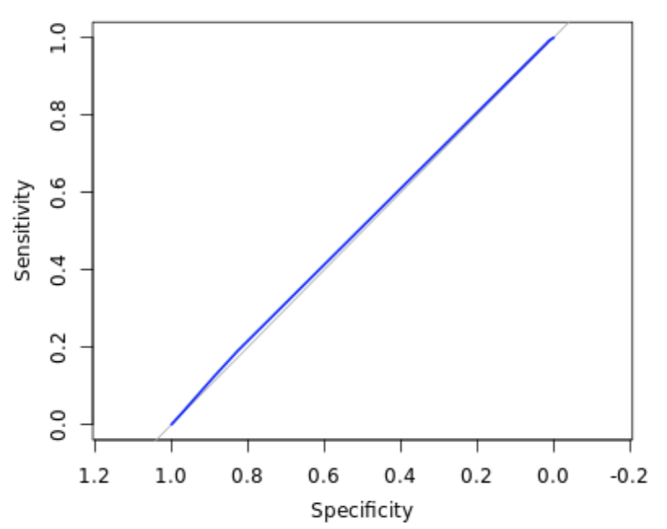
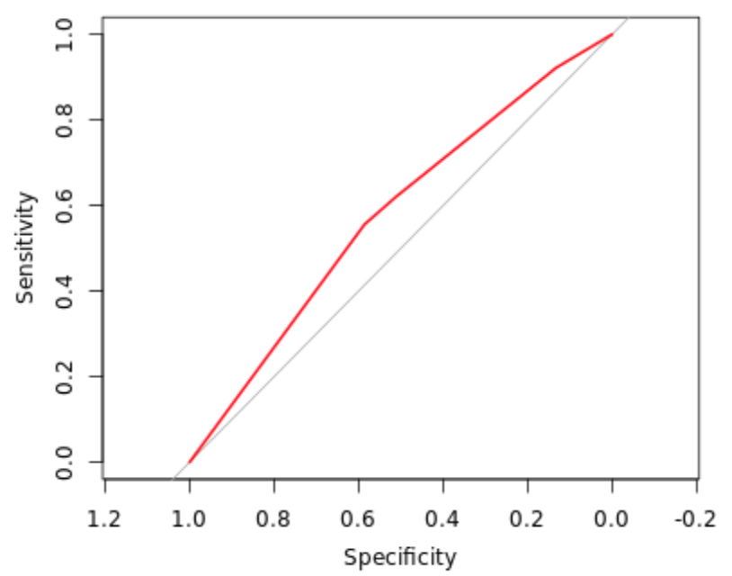
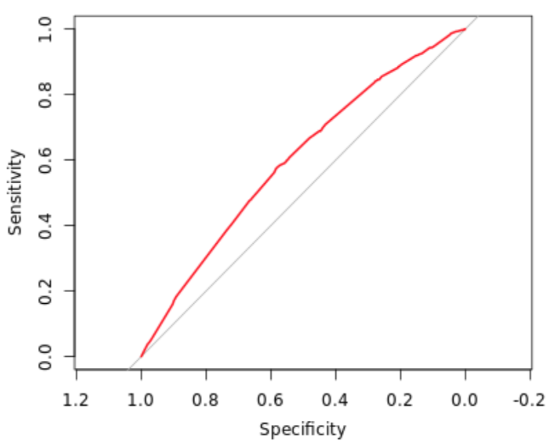
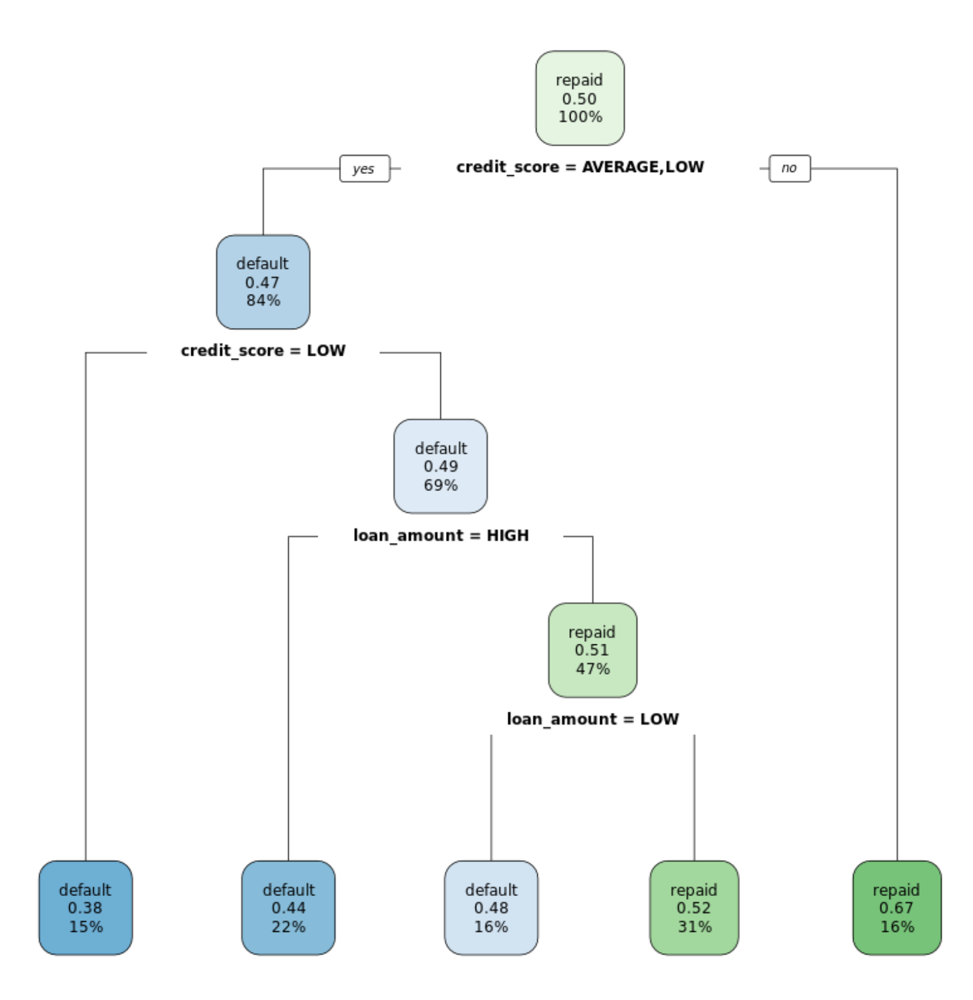
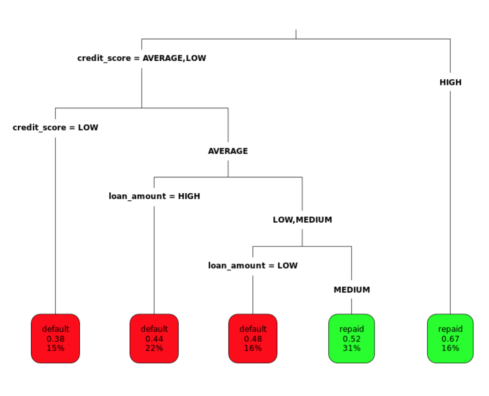
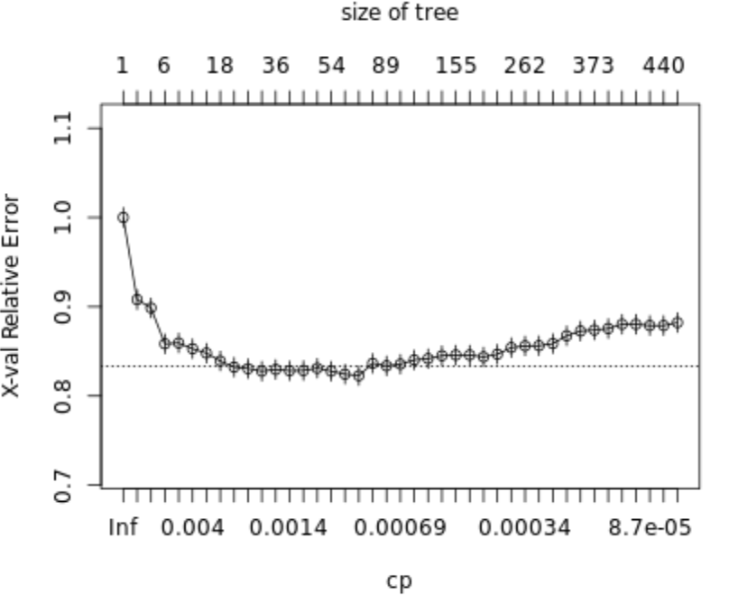

# Supervised Learning in R: Classification

Recognizing a road sign with kNN
===

After several trips with a human behind the wheel, it is time for the self-driving car to attempt the test course alone.

As it begins to drive away, its camera captures the following image:

Can you apply a kNN classifier to help the car recognize this sign?

```R
# Load the 'class' package
library(class)

# Create a vector of labels
sign_types <- signs$sign_type

# Classify the next sign observed
knn(train = signs[-1], test = next_sign, cl = sign_types)
[1] stop
Levels: pedestrian speed stop
```

You've trained your first nearest neighbor classifier!

Thinking like kNN
===

With your help, the test car successfully identified the sign and stopped safely at the intersection.

How did the `knn()` function correctly classify the stop sign?

**The sign was in some way similar to another stop sign.**

kNN isn't really learning anything; it simply looks for the most similar example.

Exploring the traffic sign dataset
===

To better understand how the `knn()` function was able to classify the stop sign, it may help to examine the training dataset it used.

Each previously observed street sign was divided into a 4x4 grid, and the red, green, and blue level for each of the 16 center pixels is recorded as illustrated here.

The result is a dataset that records the `sign_type` as well as 16 x 3 = 48 color properties of each sign.

```R
# Examine the structure of the signs dataset
str(signs)
'data.frame':	146 obs. of  49 variables:
 $ sign_type: chr  "pedestrian" "pedestrian" "pedestrian" "pedestrian" ...
 $ r1       : int  155 142 57 22 169 75 136 149 13 123 ...
 $ g1       : int  228 217 54 35 179 67 149 225 34 124 ...
 $ b1       : int  251 242 50 41 170 60 157 241 28 107 ...
 $ r2       : int  135 166 187 171 231 131 200 34 5 83 ...
 $ g2       : int  188 204 201 178 254 89 203 45 21 61 ...
 $ b2       : int  101 44 68 26 27 53 107 1 11 26 ...
 $ r3       : int  156 142 51 19 97 214 150 155 123 116 ...
 $ g3       : int  227 217 51 27 107 144 167 226 154 124 ...
 $ b3       : int  245 242 45 29 99 75 134 238 140 115 ...
 $ r4       : int  145 147 59 19 123 156 171 147 21 67 ...
 $ g4       : int  211 219 62 27 147 169 218 222 46 67 ...
 $ b4       : int  228 242 65 29 152 190 252 242 41 52 ...
 $ r5       : int  166 164 156 42 221 67 171 170 36 70 ...
 $ g5       : int  233 228 171 37 236 50 158 191 60 53 ...
 $ b5       : int  245 229 50 3 117 36 108 113 26 26 ...
 $ r6       : int  212 84 254 217 205 37 157 26 75 26 ...
 $ g6       : int  254 116 255 228 225 36 186 37 108 26 ...
 $ b6       : int  52 17 36 19 80 42 11 12 44 21 ...
 $ r7       : int  212 217 211 221 235 44 26 34 13 52 ...
 $ g7       : int  254 254 226 235 254 42 35 45 27 45 ...
 $ b7       : int  11 26 70 20 60 44 10 19 25 27 ...
 $ r8       : int  188 155 78 181 90 192 180 221 133 117 ...
 $ g8       : int  229 203 73 183 110 131 211 249 163 109 ...
 $ b8       : int  117 128 64 73 9 73 236 184 126 83 ...
 $ r9       : int  170 213 220 237 216 123 129 226 83 110 ...
 $ g9       : int  216 253 234 234 236 74 109 246 125 74 ...
 $ b9       : int  120 51 59 44 66 22 73 59 19 12 ...
 $ r10      : int  211 217 254 251 229 36 161 30 13 98 ...
 $ g10      : int  254 255 255 254 255 34 190 40 27 70 ...
 $ b10      : int  3 21 51 2 12 37 10 34 25 26 ...
 $ r11      : int  212 217 253 235 235 44 161 34 9 20 ...
 $ g11      : int  254 255 255 243 254 42 190 44 23 21 ...
 $ b11      : int  19 21 44 12 60 44 6 35 18 20 ...
 $ r12      : int  172 158 66 19 163 197 187 241 85 113 ...
 $ g12      : int  235 225 68 27 168 114 215 255 128 76 ...
 $ b12      : int  244 237 68 29 152 21 236 54 21 14 ...
 $ r13      : int  172 164 69 20 124 171 141 205 83 106 ...
 $ g13      : int  235 227 65 29 117 102 142 229 125 69 ...
 $ b13      : int  244 237 59 34 91 26 140 46 19 9 ...
 $ r14      : int  172 182 76 64 188 197 189 226 85 102 ...
 $ g14      : int  228 228 84 61 205 114 171 246 128 67 ...
 $ b14      : int  235 143 22 4 78 21 140 59 21 6 ...
 $ r15      : int  177 171 82 211 125 123 214 235 85 106 ...
 $ g15      : int  235 228 93 222 147 74 221 252 128 69 ...
 $ b15      : int  244 196 17 78 20 22 201 67 21 9 ...
 $ r16      : int  22 164 58 19 160 180 188 237 83 43 ...
 $ g16      : int  52 227 60 27 183 107 211 254 125 29 ...
 $ b16      : int  53 237 60 29 187 26 227 53 19 11 ...
 
# Count the number of signs of each type
table(signs$sign_type)
pedestrian      speed       stop 
        46         49         51

# Check r10's average red level by sign type
aggregate(r10 ~ sign_type, data = signs, mean)
   sign_type       r10
1 pedestrian 113.71739
2      speed  80.63265
3       stop 132.39216
```

As you might have expected, stop signs tend to have a higher average red value. This is how kNN identifies similar signs.

Classifying a collection of road signs
===

Now that the autonomous vehicle has successfully stopped on its own, your team feels confident allowing the car to continue the test course.

The test course includes 59 additional road signs divided into three types:

At the conclusion of the trial, you are asked to measure the car's overall performance at recognizing these signs.

```R
# Use kNN to identify the test road signs
sign_types <- signs$sign_type
signs_pred <- knn(train = signs[-1], test = test_signs[-1], cl = sign_types)

# Create a confusion matrix of the actual versus predicted values
signs_actual <- test_signs$sign_type

table(signs_pred, signs_actual)
            signs_actual
signs_pred   pedestrian speed stop
  pedestrian         19     2    0
  speed               0    17    0
  stop                0     2   19

# Compute the accuracy
mean(signs_pred == signs_actual)
[1] 0.9322034
```

That self-driving car is really coming along! The confusion matrix lets you look for patterns in the classifier's errors.

Understanding the impact of 'k'
===

There is a complex relationship between k and classification accuracy. Bigger is not always better.

Which of these is a valid reason for keeping k as small as possible (but no smaller)?

**A smaller k may utilize more subtle patterns**

Testing other 'k' values
===

By default, the `knn()` function in the `class` package uses only the single nearest neighbor.

Setting a `k` parameter allows the algorithm to consider additional nearby neighbors. This enlarges the collection of neighbors which will vote on the predicted class.

Compare `k` values of 1, 7, and 15 to examine the impact on traffic sign classification accuracy.

```R
# Compute the accuracy of the baseline model (default k = 1)
k_1 <- knn(train = signs[-1], test = signs_test[-1], cl = sign_types)
mean(k_1 == signs_actual)
[1] 0.9322034

# Modify the above to set k = 7
k_7 <- knn(train = signs[-1], test = signs_test[-1], cl = sign_types, k = 7)
mean(k_7 == signs_actual)
[1] 0.9661017

# Set k = 15 and compare to the above
k_15 <- knn(train = signs[-1], test = signs_test[-1], cl = sign_types, k = 15)
mean(k_15 == signs_actual)
[1] 0.8644068
```

Seeing how the neighbors voted
===

When multiple nearest neighbors hold a vote, it can sometimes be useful to examine whether the voters were unanimous or widely separated.

For example, knowing more about the voters' confidence in the classification could allow an autonomous vehicle to use caution in the case there is *any chance at all* that a stop sign is ahead.

In this exercise, you will learn how to obtain the voting results from the `knn()` function.

```R
# Use the prob parameter to get the proportion of votes for the winning class
sign_pred <- knn(train = signs[-1], test = signs_test[-1], cl = sign_types, k = 7, prob = TRUE)

# Get the "prob" attribute from the predicted classes
sign_prob <- attr(sign_pred, "prob")

# Examine the first several predictions
head(sign_prob)
[1] 0.5714286 0.5714286 0.8571429 0.5714286 0.8571429 0.5714286

# Examine the proportion of votes for the winning class
head(sign_pred)
[1] pedestrian pedestrian pedestrian stop       pedestrian pedestrian
Levels: pedestrian speed stop
```

Now you can get an idea of how certain your kNN learner is about its classifications.

Why normalize data?
===

Before applying kNN to a classification task, it is common practice to rescale the data using a technique like **min-max normalization**. What is the purpose of this step?

**To ensure all data elements may contribute equal shares to distance.**

Yes! Rescaling reduces the influence of extreme values on kNN's distance function.

---

# Naive Bayes

Computing probabilities
===

The `where9am` data frame contains 91 days (thirteen weeks) worth of data in which Brett recorded his `location` at 9am each day as well as whether the `daytype` was a weekend or weekday.

Using the conditional probability formula below, you can compute the probability that Brett is working in the office, given that it is a weekday.
$$
P(A|B)= \frac {P(A and B)}{P(B)}
$$
Calculations like these are the basis of the Naive Bayes destination prediction model you'll develop in later exercises.

```R
# Compute P(A) 
p_A <- nrow(subset(where9am, location == "office")) / 91

# Compute P(B)
p_B <- nrow(subset(where9am, daytype == "weekday")) / 91

# Compute the observed P(A and B)
p_AB <- nrow(subset(where9am, where9am$location == "office" & where9am$daytype == "weekday")) / 91

# Compute P(A | B)
p_A_given_B <- p_AB / p_B
p_A_given_B
[1] 0.6
```

Understanding dependent events
===

In the previous exercise, you found that there is a 55% chance Brett is in the office at 9am given that it is a weekday. On the other hand, if Brett is never in the office on a weekend, which means:

- P(office and weekend) = 0
- P(office | weekend) = 0
- Brett's location is dependent on the day of the week

A simple Naive Bayes location model
===

The previous exercises showed that the probability that Brett is at work or at home at 9am is highly dependent on whether it is the weekend or a weekday.

To see this finding in action, use the `where9am` data frame to build a Naive Bayes model on the same data.

You can then use this model to predict the future: where does the model think that Brett will be at 9am on Thursday and at 9am on Saturday?

```R
# Load the naivebayes package
library(naivebayes)

# Build the location prediction model
locmodel <- naive_bayes(location ~ daytype, data = where9am)

# Predict Thursday's 9am location
predict(locmodel, newdata = thursday9am)
[1] office
Levels: appointment campus home office

# Predict Saturdays's 9am location
predict(locmodel, newdata = saturday9am)
[1] home
Levels: appointment campus home office
```

Not surprisingly, Brett is most likely at the office at 9am on a Thursday, but at home at the same time on a Saturday!

Examining "raw" probabilities
===

The `naivebayes` package offers several ways to peek inside a Naive Bayes model.

Typing the name of the model object provides the *a priori* (overall) and conditional probabilities of each of the model's predictors. If one were so inclined, you might use these for calculating *posterior* (predicted) probabilities by hand.

Alternatively, R will compute the posterior probabilities for you if the `type = "prob"` parameter is supplied to the `predict()` function.

Using these methods, examine how the model's predicted 9am location probability varies from day-to-day.

```R
# The 'naivebayes' package is loaded into the workspace
# and the Naive Bayes 'locmodel' has been built

# Examine the location prediction model
print(locmodel)
===================== Naive Bayes ===================== 
Call: 
naive_bayes.formula(formula = location ~ daytype, data = where9am)

A priori probabilities: 

appointment      campus        home      office 
 0.01098901  0.10989011  0.45054945  0.42857143 

Tables: 
         
daytype   appointment    campus      home    office
  weekday   1.0000000 1.0000000 0.3658537 1.0000000
  weekend   0.0000000 0.0000000 0.6341463 0.0000000
  
# Obtain the predicted probabilities for Thursday at 9am
predict(locmodel, newdata = thursday9am , type = "prob")
     appointment    campus      home office
[1,]  0.01538462 0.1538462 0.2307692    0.6

# Obtain the predicted probabilities for Saturday at 9am
predict(locmodel, newdata = saturday9am , type = "prob")
     appointment campus home office
[1,]           0      0    1      0
```

Understanding independence
===

Understanding the idea of event independence will become important as you learn more about how "naive" Bayes got its name. Independent events means?

One event is independent of another if knowing one doesn't give you information about how likely the other is. For example, knowing if it's raining in New York doesn't help you predict the weather in San Francisco. The weather events in the two cities are independent of each other.

Who are you calling naive?
===

The Naive Bayes algorithm got its name because it makes a "naive" assumption about event independence.

The purpose of making this assumption?

**The joint probability of independent events can be computed much more simply by multiplying their individual probabilities.**

A more sophisticated location model
===

The `locations` dataset records Brett's location every hour for 13 weeks. Each hour, the tracking information includes the `daytype`(weekend or weekday) as well as the `hourtype` (morning, afternoon, evening, or night).

Using this data, build a more sophisticated model to see how Brett's predicted location not only varies by the day of week but also by the time of day.

```R
# The 'naivebayes' package is loaded into the workspace already

# Build a NB model of location
locmodel <- naive_bayes(location ~ daytype + hourtype, data = locations)

# Predict Brett's location on a weekday afternoon
predict(locmodel , newdata = weekday_afternoon)
[1] office
Levels: appointment campus home office restaurant store theater

# Predict Brett's location on a weekday evening
predict(locmodel , newdata = weekday_evening)
[1] home
Levels: appointment campus home office restaurant store theater
```

Your Naive Bayes model forecasts that Brett will be at the office on a weekday afternoon and at home in the evening.

Preparing for unforeseen circumstances
===

While Brett was tracking his location over 13 weeks, he never went into the office during the weekend. Consequently, the joint probability of P(office and weekend) = 0.

Explore how this impacts the predicted probability that Brett may go to work on the weekend in the future. Additionally, you can see how using the **Laplace correction** will allow a small chance for these types of unforeseen circumstances.

```R
# The 'naivebayes' package is loaded into the workspace already
# The Naive Bayes location model (locmodel) has already been built

# Observe the predicted probabilities for a weekend afternoon
predict(locmodel, newdata = weekend_afternoon, type = "prob")
     appointment campus      home office restaurant      store theater
[1,]  0.02472535      0 0.8472217      0  0.1115693 0.01648357       0

# Build a new model using the Laplace correction
locmodel2 <- naive_bayes(location ~ daytype + hourtype, data = locations, laplace = 1)

# Observe the new predicted probabilities for a weekend afternoon
predict(locmodel2, newdata = weekend_afternoon, type = "prob")
     appointment      campus      home      office restaurant      store
[1,]  0.01107985 0.005752078 0.8527053 0.008023444  0.1032598 0.01608175
         theater
[1,] 0.003097769
```

Adding the Laplace correction allows for the small chance that Brett might go to the office on the weekend in the future.

Understanding the Laplace correction
===

By default, the `naive_bayes()` function in the `naivebayes` package does not use the Laplace correction. What is the risk of leaving this parameter unset?

Some potential outcomes may be predicted to be impossible.

The small probability added to every outcome ensures that they are all possible even if never previously observed.

Handling numeric predictors
===

Numeric data is often **binned** before it is used with Naive Bayes. As example:

- age values recoded as 'child' or 'adult' categories
- geographic coordinates recoded into geographic regions (West, East, etc.)
- test scores divided into four groups by percentile

---

# Logistic Regression

Building simple logistic regression models
===

The `donors` dataset contains 93,462 examples of people mailed in a fundraising solicitation for paralyzed military veterans. The `donated`column is `1` if the person made a donation in response to the mailing and `0` otherwise. This binary outcome will be the *dependent* variable for the logistic regression model.

The remaining columns are features of the prospective donors that may influence their donation behavior. These are the model's *independent variables*.

When building a regression model, it it often helpful to form a hypothesis about which independent variables will be predictive of the dependent variable. The `bad_address` column, which is set to `1` for an invalid mailing address and `0` otherwise, seems like it might reduce the chances of a donation. Similarly, one might suspect that religious interest (`interest_religion`) and interest in veterans affairs (`interest_veterans`) would be associated with greater charitable giving.

In this exercise, you will use these three factors to create a simple model of donation behavior.

```R
# Examine the dataset to identify potential independent variables
str(donors)
'data.frame':	93462 obs. of  13 variables:
 $ donated          : int  0 0 0 0 0 0 0 0 0 0 ...
 $ veteran          : int  0 0 0 0 0 0 0 0 0 0 ...
 $ bad_address      : int  0 0 0 0 0 0 0 0 0 0 ...
 $ age              : int  60 46 NA 70 78 NA 38 NA NA 65 ...
 $ has_children     : int  0 1 0 0 1 0 1 0 0 0 ...
 $ wealth_rating    : int  0 3 1 2 1 0 2 3 1 0 ...
 $ interest_veterans: int  0 0 0 0 0 0 0 0 0 0 ...
 $ interest_religion: int  0 0 0 0 1 0 0 0 0 0 ...
 $ pet_owner        : int  0 0 0 0 0 0 1 0 0 0 ...
 $ catalog_shopper  : int  0 0 0 0 1 0 0 0 0 0 ...
 $ recency          : Factor w/ 2 levels "CURRENT","LAPSED": 1 1 1 1 1 1 1 1 1 1 ...
 $ frequency        : Factor w/ 2 levels "FREQUENT","INFREQUENT": 1 1 1 1 1 2 2 1 2 2 ...
 $ money            : Factor w/ 2 levels "HIGH","MEDIUM": 2 1 2 2 2 2 2 2 2 2 ...
 
# Explore the dependent variable
table(donors$donated)
    0     1 
88751  4711

# Build the donation model
donation_model <- glm(donated ~ bad_address + interest_religion + interest_veterans, 
                      data = donors, family = "binomial")

# Summarize the model results
summary(donation_model)
Call:
glm(formula = donated ~ bad_address + interest_religion + interest_veterans, 
    family = "binomial", data = donors)

Deviance Residuals: 
    Min       1Q   Median       3Q      Max  
-0.3480  -0.3192  -0.3192  -0.3192   2.5678  

Coefficients:
                  Estimate Std. Error  z value Pr(>|z|)    
(Intercept)       -2.95139    0.01652 -178.664   <2e-16 ***
bad_address       -0.30780    0.14348   -2.145   0.0319 *  
interest_religion  0.06724    0.05069    1.327   0.1847    
interest_veterans  0.11009    0.04676    2.354   0.0186 *  
---
Signif. codes:  0 '***' 0.001 '**' 0.01 '*' 0.05 '.' 0.1 ' ' 1

(Dispersion parameter for binomial family taken to be 1)

    Null deviance: 37330  on 93461  degrees of freedom
Residual deviance: 37316  on 93458  degrees of freedom
AIC: 37324

Number of Fisher Scoring iterations: 5
```

Making a binary prediction
===

In the previous exercise, you used the `glm()` function to build a logistic regression model of donor behavior. As with many of R's machine learning methods, you can apply the `predict()` function to the model object to forecast future behavior. By default, `predict()`outputs predictions in terms of *log odds* unless `type = "response"` is specified. This converts the log odds to *probabilities*.

Because a logistic regression model estimates the *probability* of the outcome, it is up to you to determine the threshold at which the probability implies action. One must balance the extremes of being too cautious versus being too aggressive. For example, if you were to solicit only the people with a 99% or greater donation probability, you may miss out on many people with lower estimated probabilities that still choose to donate. This balance is particularly important to consider for severely imbalanced outcomes, such as in this dataset where donations are relatively rare.

```R
# Estimate the donation probability
donors$donation_prob <- predict(donation_model, type = "response")

# Find the donation probability of the average prospect
mean(donors$donated)
[1] 0.05040551

# Predict a donation if probability of donation is greater than average (0.0504)
donors$donation_pred <- ifelse(donors$donation_prob > 0.0504, 1, 0)

# Calculate the model's accuracy
mean(donors$donated == donors$donation_pred)
[1] 0.794815
```

With an accuracy of nearly 80%, the model seems to be doing its job. But is it too good to be true?

The limitations of accuracy
===

In the previous exercise, you found that the logistic regression model made a correct prediction nearly 80% of the time. Despite this relatively high accuracy, the result is misleading due to the rarity of outcome being predicted.

The `donors` dataset is available in your workspace. What would the accuracy have been if a model had simply predicted "no donation" for each person?

```R
> mean(donors$donated == 0)
[1] 0.9495945
```

With an accuracy of only 80%, the model is actually performing WORSE than if it were to predict non-donor for every record.

Calculating ROC Curves and AUC
===

The previous exercises have demonstrated that accuracy is a very misleading measure of model performance on imbalanced datasets. **Graphing the model's performance better illustrates the tradeoff between a model that is overly agressive and one that is overly passive.**

In this exercise you will create a ROC curve and compute the area under the curve (AUC) to evaluate the logistic regression model of donations you built earlier.

```R
# Load the pROC package
library(pROC)

# Create a ROC curve
ROC <- roc(donors$donated, donors$donation_prob)

# Plot the ROC curve
plot(ROC, col = "blue")

# Calculate the area under the curve (AUC)
auc(ROC)
Area under the curve: 0.5102
```



Based on this visualization, the model isn't doing much better than baseline— a model doing nothing but making predictions at random.

Coding categorical features
===

Sometimes a dataset contains numeric values that represent a categorical feature.

In the `donors` dataset, `wealth_rating` uses numbers to indicate the donor's wealth level:

- **0** = Unknown
- **1** = Low
- **2** = Medium
- **3** = High

This exercise illustrates how to prepare this type of categorical feature and the examines its impact on a logistic regression model.

```R
# Model summary before prepare the categorical feature
summary(glm(donated ~ wealth_rating, data = donors, family = "binomial"))

Call:
glm(formula = donated ~ wealth_rating, family = "binomial", data = donors)

Deviance Residuals: 
    Min       1Q   Median       3Q      Max  
-0.3303  -0.3255  -0.3209  -0.3163   2.4578  

Coefficients:
              Estimate Std. Error  z value Pr(>|z|)    
(Intercept)   -2.97037    0.02075 -143.122   <2e-16 ***
wealth_rating  0.02966    0.01219    2.433    0.015 *  
---
Signif. codes:  0 '***' 0.001 '**' 0.01 '*' 0.05 '.' 0.1 ' ' 1

(Dispersion parameter for binomial family taken to be 1)

    Null deviance: 37330  on 93461  degrees of freedom
Residual deviance: 37324  on 93460  degrees of freedom
AIC: 37328

Number of Fisher Scoring iterations: 5
 
# Convert the wealth rating to a factor
donors$wealth_rating <- factor(donors$wealth_rating, levels = c(0,1,2,3), labels = c("Unknown", "Low", "Medium", "High"))

# Use relevel() to change reference category
donors$wealth_rating <- relevel(donors$wealth_rating, ref = "Medium")

# See how our factor coding impacts the model
summary(glm(donated ~ wealth_rating, data = donors, family = "binomial"))

Call:
glm(formula = donated ~ wealth_rating, family = "binomial", data = donors)

Deviance Residuals: 
    Min       1Q   Median       3Q      Max  
-0.3320  -0.3243  -0.3175  -0.3175   2.4582  

Coefficients:
                     Estimate Std. Error z value Pr(>|z|)    
(Intercept)          -2.91894    0.03614 -80.772   <2e-16 ***
wealth_ratingUnknown -0.04373    0.04243  -1.031    0.303    
wealth_ratingLow     -0.05245    0.05332  -0.984    0.325    
wealth_ratingHigh     0.04804    0.04768   1.008    0.314    
---
Signif. codes:  0 '***' 0.001 '**' 0.01 '*' 0.05 '.' 0.1 ' ' 1

(Dispersion parameter for binomial family taken to be 1)

    Null deviance: 37330  on 93461  degrees of freedom
Residual deviance: 37323  on 93458  degrees of freedom
AIC: 37331

Number of Fisher Scoring iterations: 5
```

What would the model output have looked like if this variable had been left as a numeric column?

Handling missing data
===

Some of the prospective donors have missing `age` data. Unfortunately, R will exclude any cases with `NA` values when building a regression model.

One workaround is to replace, or **impute**, the missing values with an estimated value. After doing so, you may also create a missing data indicator to model the possibility that cases with missing data are different in some way from those without.

```R
# Find the average age among non-missing values
summary(donors$age)
Min. 1st Qu.  Median    Mean 3rd Qu.    Max.    NAs 
1.00   48.00   62.00   61.65   75.00   98.00   22546
   
# Impute missing age values with mean(age)
donors$imputed_age <- ifelse(is.na(donors$age), 61.65, donors$age)

# Create missing value indicator for age
donors$missing_age <- ifelse(is.na(donors$age), 1, 0)
```

Understanding missing value indicators
===

A missing value indicator provides a reminder that, before imputation, there was a missing value present on the record.

Why is it often useful to include this indicator as a predictor in the model?

- A missing value may represent a unique category by itself
- There may be an important difference between records with and without missing data
- Whatever caused the missing value may also be related to the outcome

Building a more sophisticated model
===

One of the best predictors of future giving is a history of recent, frequent, and large gifts. In marketing terms, this is known as R/F/M:

- Recency
- Frequency
- Money

Donors that haven given both recently and frequently may be especially likely to give again; in other words, the *combined* impact of recency and frequency may be greater than the sum of the separate effects.

Because these predictors together have a greater impact on the dependent variable, their joint effect must be modeled as an interaction.

```R
# Build a recency, frequency, and money (RFM) model
rfm_model <- glm(donated ~ money + recency * frequency, data = donors, family = "binomial")

# Summarize the RFM model to see how the parameters were coded
summary(rfm_model)

Call:
glm(formula = donated ~ money + recency * frequency, family = "binomial", 
    data = donors)

Deviance Residuals: 
    Min       1Q   Median       3Q      Max  
-0.3696  -0.3696  -0.2895  -0.2895   2.7924  

Coefficients:
                                 Estimate Std. Error z value Pr(>|z|)    
(Intercept)                       -2.9999     0.3086  -9.721   <2e-16 ***
moneyHIGH                         -0.3619     0.0430  -8.415   <2e-16 ***
recencyCURRENT                    -0.1511     0.3094  -0.488    0.625    
frequencyFREQUENT                 -0.5164     0.5162  -1.000    0.317    
recencyCURRENT:frequencyFREQUENT   1.0179     0.5171   1.968    0.049 *  
---
Signif. codes:  0 '***' 0.001 '**' 0.01 '*' 0.05 '.' 0.1 ' ' 1

(Dispersion parameter for binomial family taken to be 1)

    Null deviance: 37330  on 93461  degrees of freedom
Residual deviance: 36938  on 93457  degrees of freedom
AIC: 36948

Number of Fisher Scoring iterations: 6
 
# Compute predicted probabilities for the RFM model
rfm_prob <- predict(rfm_model, type = "response")

# Plot the ROC curve and find AUC for the new model
library(pROC)
ROC <- roc(donors$donated, rfm_prob)
plot(ROC, col = "red")
auc(ROC)
Area under the curve: 0.5785
```



Based on the ROC curve, you've confirmed that past giving patterns are certainly predictive of future giving.

The dangers of stepwise regression
===

In spite of its utility for feature selection, stepwise regression is not frequently used in disciplines outside of machine learning due to some important caveats. Concerns such as:

- It is not guaranteed to find the best possible model
- The stepwise regression procedure violates some statistical assumptions
- It can result in a model that makes little sense in the real world

Building a stepwise regression model
===

In the absence of subject-matter expertise, **stepwise regression** can assist with the search for the most important predictors of the outcome of interest.

In this exercise, you will use a forward stepwise approach to add predictors to the model one-by-one until no additional benefit is seen.

```R
# Specify a null model with no predictors
null_model <- glm(donated ~ 1, data = donors, family = "binomial")

# Specify the full model using all of the potential predictors
full_model <- glm(donated ~ ., data = donors, family = "binomial")

# Use a forward stepwise algorithm to build a parsimonious model
step_model <- step(null_model, scope = list(lower = null_model, upper = full_model), direction = "forward")

# Estimate the stepwise donation probability
step_prob <- predict(step_model, type = "response")

# Plot the ROC of the stepwise model
library(pROC)
ROC <- roc(donors$donated, step_prob)
plot(ROC, col = "red")
auc(ROC)
Area under the curve: 0.6006
```



Despite the caveats of stepwise regression, it seems to have resulted in a relatively strong model!

---

# Classification Trees

Building a simple decision tree
===

The `loans` dataset contains 11,312 randomly-selected people who were applied for and later received loans from Lending Club, a US-based peer-to-peer lending company.

You will use a decision tree to try to learn patterns in the outcome of these loans (either repaid or default) based on the requested loan amount and credit score at the time of application.

Then, see how the tree's predictions differ for an applicant with good credit versus one with bad credit.

```R
# Load the rpart package
library(rpart)

# Build a lending model predicting loan outcome versus loan amount and credit score
loan_model <- rpart(outcome ~ loan_amount + credit_score, data = loans, method = "class", control = rpart.control(cp = 0))

# Make a prediction for someone with good credit
predict(loan_model, good_credit, type = "class")
     1 
repaid 
Levels: default repaid

# Make a prediction for someone with bad credit
predict(loan_model, bad_credit, type = "class")
      1 
default 
Levels: default repaid
```

Visualizing classification trees
===

Due to government rules to prevent illegal discrimination, lenders are required to explain why a loan application was rejected.

The structure of classification trees can be depicted visually, which helps to understand how the tree makes its decisions.

```R
# Examine the loan_model object
loan_model
n= 11312 

node), split, n, loss, yval, (yprob)
      * denotes terminal node

 1) root 11312 5654 repaid (0.4998232 0.5001768)  
   2) credit_score=AVERAGE,LOW 9490 4437 default (0.5324552 0.4675448)  
     4) credit_score=LOW 1667  631 default (0.6214757 0.3785243) *
     5) credit_score=AVERAGE 7823 3806 default (0.5134859 0.4865141)  
      10) loan_amount=HIGH 2472 1079 default (0.5635113 0.4364887) *
      11) loan_amount=LOW,MEDIUM 5351 2624 repaid (0.4903756 0.5096244)  
        22) loan_amount=LOW 1810  874 default (0.5171271 0.4828729) *
        23) loan_amount=MEDIUM 3541 1688 repaid (0.4767015 0.5232985) *
   3) credit_score=HIGH 1822  601 repaid (0.3298573 0.6701427) *
# Load the rpart.plot package
library(rpart.plot)

# Plot the loan_model with default settings
rpart.plot(loan_model)

# Plot the loan_model with customized settings
rpart.plot(loan_model, type = 3, box.palette = c("red", "green"), fallen.leaves = TRUE)
```





Why do some branches split?
===

A classification tree grows using a **divide-and-conquer** process. Each time the tree grows larger, it splits groups of data into smaller subgroups, creating new branches in the tree.

Given the following groups to divide-and-conquer, how would the algorithm prioritize to split first?

**The group it can split to create the greatest improvement in subgroup homogeneity.**

Creating random test datasets
===

Before building a more sophisticated lending model, it is important to hold out a portion of the loan data to simulate how well it will predict the outcomes of future loan applicants.

As depicted in the following image, you can use 75% of the observations for training and 25% for testing the model.

The `sample()` function can be used to generate a random sample of rows to include in the training set. Simply supply it the total number of observations and the number needed for training.

Use the resulting vector of row IDs to subset the loans into training and testing datasets.

```R
# Determine the number of rows for training
nrow(loans) * 0.75
[1] 8484

# Create a random sample of row IDs
sample_rows <- sample(11312, 8484)

# Create the training dataset
loans_train <- loans[sample_rows, ]

# Create the test dataset
loans_test <- loans[-sample_rows, ]
```

Building and evaluating a larger tree
===

Previously, you created a simple decision tree that used the applicant's credit score and requested loan amount to predict the loan outcome.

Lending Club has additional information about the applicants, such as home ownership status, length of employment, loan purpose, and past bankruptcies, that may be useful for making more accurate predictions.

Using all of the available applicant data, build a more sophisticated lending model using the random training dataset created previously. Then, use this model to make predictions on the testing dataset to estimate the performance of the model on future loan applications.

```R
# The 'rpart' package is loaded into the workspace
# The loans_train and loans_test datasets have been created

# Grow a tree using all of the available applicant data
loan_model <- rpart(outcome ~ ., data = loans_train, method = "class", control = rpart.control(cp = 0))

# Make predictions on the test dataset
loans_test$pred <- predict(loan_model, loans_test, type = "class")

# Examine the confusion matrix
table(loans_test$outcome, loans_test$pred)
          default repaid
  default     821    632
  repaid      546    829

# Compute the accuracy on the test dataset
mean(loans_test$outcome == loans_test$pred)
[1] 0.5834512
```

Conducting a fair performance evaluation
===

Holding out test data reduces the amount of data available for growing the decision tree. In spite of this, it is very important to evaluate decision trees on data it has not seen before. which means:

- Decision trees sometimes overfit the training data.
- Performance on the training dataset can overestimate performance on future data.
- Creating a test dataset simulates the model's performance on unseen data.

Preventing overgrown trees
===

The tree grown on the full set of applicant data grew to be extremely large and extremely complex, with hundreds of splits and leaf nodes containing only a handful of applicants. This tree would be almost impossible for a loan officer to interpret.

Using the **pre-pruning** methods for early stopping, you can prevent a tree from growing too large and complex. See how the `rpart` control options for maximum tree depth and minimum split count impact the resulting tree.

```R
# The 'rpart' package is loaded into the workspace

# Grow a tree with maxdepth of 6
loan_model <- rpart(outcome ~ ., data = loans_train, method = "class", control = rpart.control(cp = 0, maxdepth = 6))

# Compute the accuracy of the simpler tree
loans_test$pred <- predict(loan_model, loans_test, type = "class")
mean(loans_test$pred == loans_test$outcome)
[1] 0.5919378

# Grow a tree with minsplit of 500
loan_model2 <- rpart(outcome ~ ., data = loans_train, method = "class", control = rpart.control(cp = 0, minsplit = 500))

# Compute the accuracy of the simpler tree
loans_test$pred2 <- predict(loan_model2, loans_test, type = "class")
mean(loans_test$pred2 == loans_test$outcome)
[1] 0.5922914
```

It may seem surprising, but creating a simpler decision tree may actually result in greater performance on the test dataset.

Creating a nicely pruned tree
===

Stopping a tree from growing all the way can lead it to ignore some aspects of the data or miss important trends it may have discovered later.

By using **post-pruning**, you can intentionally grow a large and complex then prune it to be smaller and more efficient later on.

In this exercise, you will have the opportunity to construct a visualization of the tree's performance versus complexity, and use this information to prune the tree to an appropriate level.

```R
# The 'rpart' package is loaded into the workspace

# Grow an overly complex tree
loan_model <- rpart(outcome ~ ., data = loans_train, method = "class", control = rpart.control(cp = 0))

# Examine the complexity plot
plotcp(loan_model)

# Prune the tree
loan_model_pruned <- prune(loan_model, cp = .0014)

# Compute the accuracy of the pruned tree
loans_test$pred <- predict(loan_model_pruned, loans_test, type="class")
mean(loans_test$pred == loans_test$outcome)
[1] 0.6007779
```



As with pre-pruning, creating a simpler tree actually improved the performance of the tree on the test dataset.

Why do trees benefit from pruning?
===

Classification trees can grow indefinitely, until they are told to stop or run out of data to divide-and-conquer.

Just like trees in nature, classification trees that grow overly large can require pruning to reduce the excess growth. However, this generally results in a tree that classifies fewer training examples correctly.

Why, then, are pre-pruning and post-pruning almost always used?

- Simpler trees are easier to interpret
- Simpler trees using early stopping are faster to train
- Simpler trees may perform better on the testing data

Understanding random forests
===

Groups of classification trees can be combined into an **ensemble** that generates a single prediction by allowing the trees to "vote" on the outcome.

Why might someone think that this could result in more accurate predictions than a single tree?

**That's because, the diversity among the trees may lead it to discover more subtle patterns.**

Building a random forest model
===

In spite of the fact that a forest can contain hundreds of trees, growing a decision tree forest is perhaps even easier than creating a single highly-tuned tree.

Using the `randomForest` package, build a random forest and see how it compares to the single trees you built previously.

Keep in mind that due to the random nature of the forest, the results may vary slightly each time you create the forest.

```R
# Load the randomForest package
library(randomForest)

# Build a random forest model
loan_model <- randomForest(outcome ~ ., data = loans_train)

# Compute the accuracy of the random forest
loans_test$pred <- predict(loan_model, loans_test)
mean(loans_test$pred == loans_test$outcome)
[1] 0.5968883
```

