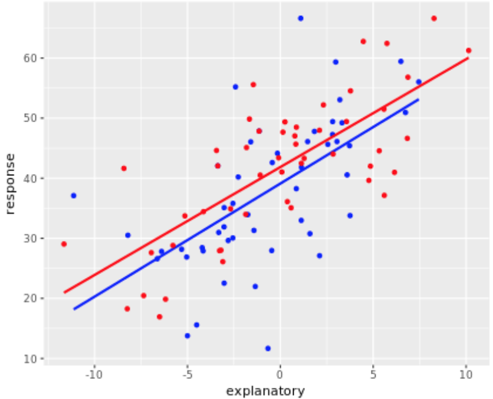
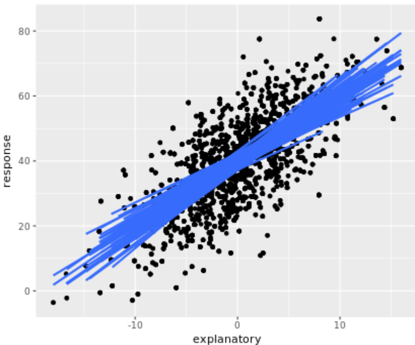
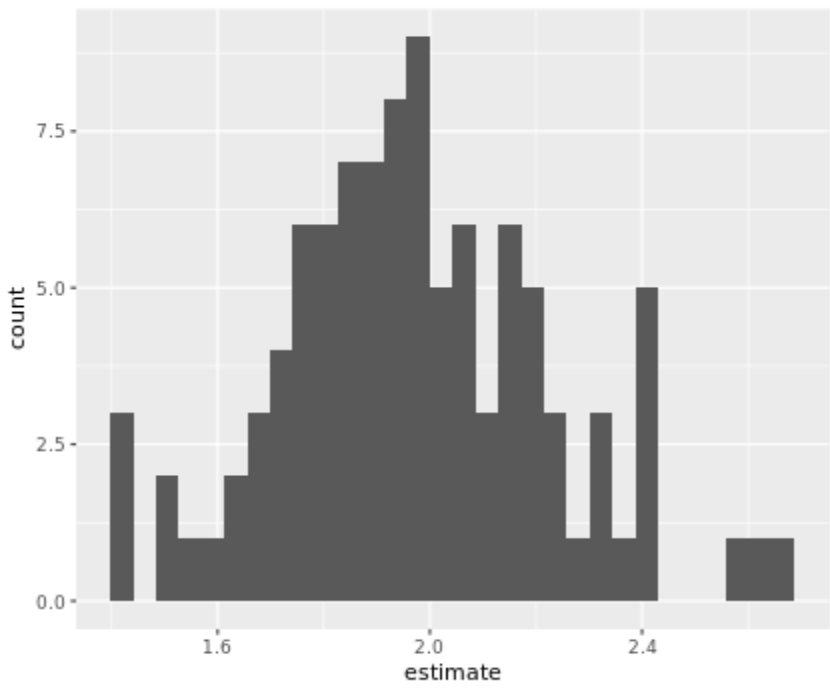
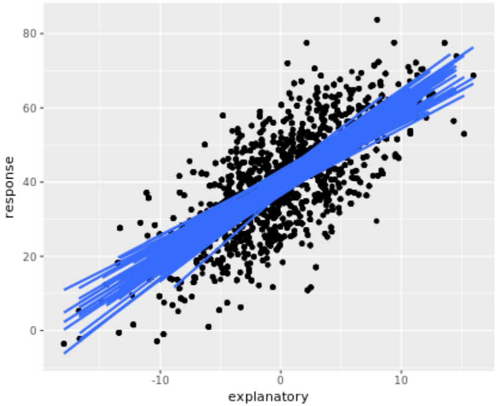
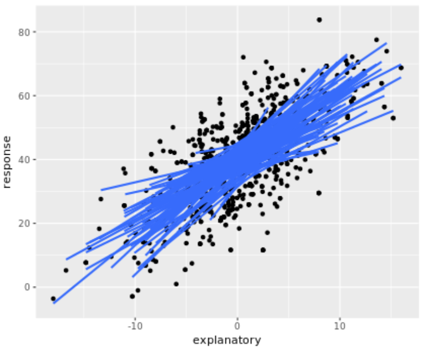
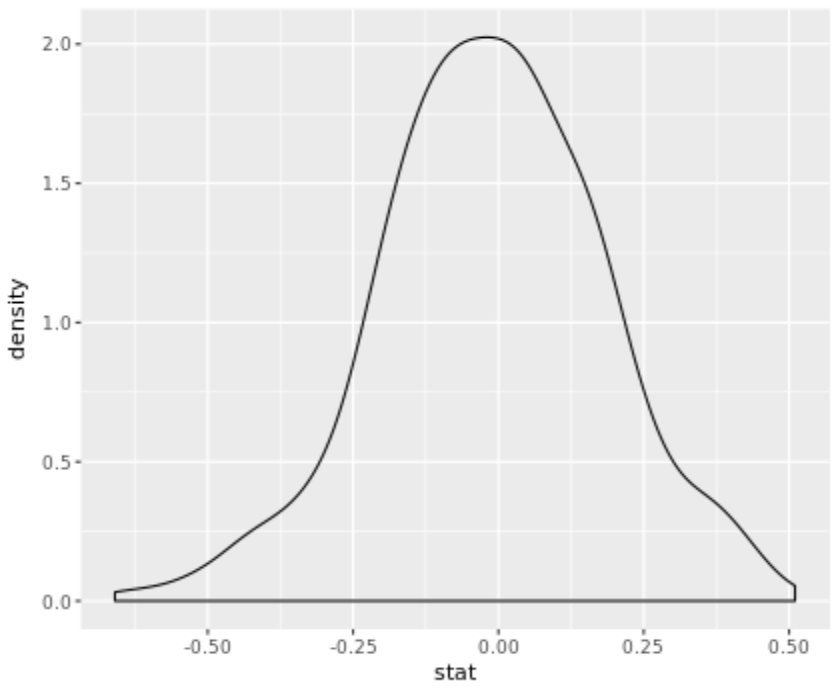

# Inferential ideas

Regression output: example I
===

The following code provides two equivalent methods for calculating the most important pieces of the linear model output. Recall that the p-value is the probability of the observed data (or more extreme) given the null hypothesis is true. As with inference in other settings, you will need the sampling distribution for the statistic (here the slope) assuming the null hypothesis is true. You will generate the null sampling distribution in later chapters, but for now, assume that the null sampling distribution is correct. Additionally, notice that the standard error of the slope and intercept estimates describe the variability of those estimates.

```R
# Load the mosaicData package and the RailTrail data
library(mosaicData)
data(RailTrail)

# Fit a linear model
ride_lm <- lm(volume ~ hightemp, data = RailTrail)

# View the summary of your model
summary(ride_lm)

Call:
lm(formula = volume ~ hightemp, data = RailTrail)

Residuals:
     Min       1Q   Median       3Q      Max 
-254.562  -57.800    8.737   57.352  314.035 

Coefficients:
            Estimate Std. Error t value Pr(>|t|)    
(Intercept)  -17.079     59.395  -0.288    0.774    
hightemp       5.702      0.848   6.724 1.71e-09 ***
---
Signif. codes:  0 '***' 0.001 '**' 0.01 '*' 0.05 '.' 0.1 ' ' 1

Residual standard error: 104.2 on 88 degrees of freedom
Multiple R-squared:  0.3394,	Adjusted R-squared:  0.3319 
F-statistic: 45.21 on 1 and 88 DF,  p-value: 1.705e-09

# Print the tidy model output
ride_lm %>% tidy()

         term   estimate  std.error  statistic      p.value
1 (Intercept) -17.079281 59.3953040 -0.2875527 7.743652e-01
2    hightemp   5.701878  0.8480074  6.7238541 1.705138e-09
```

First random sample, second random sample
===

Now, you will dive in to understanding how linear models vary from sample to sample. Here two random samples from a population are plotted onto the scatterplot. The population data (called `popdata`) already exists and is pre-loaded, along with `ggplot` and `dplyr`.

```R
# Plot the whole dataset
ggplot(popdata, aes(x = explanatory, y = response)) + 
  geom_point() + 
  geom_smooth(method = "lm", se = FALSE) 

# Take 2 samples of size 50
set.seed(4747)
sample1 <- sample_n(popdata, 50)

sample2 <- sample_n(popdata, 50)

# Plot sample1
plot1 <- ggplot(sample1, aes(x = explanatory, y = response)) + 
  geom_point(color = "blue") + 
  geom_smooth(method = "lm", se = FALSE, color = "blue")

plot1 

# Plot sample2 over sample1
plot1 + geom_point(data = sample2, 
                   aes(x = explanatory, y = response),
                   color = "red") + 
  geom_smooth(data = sample2, 
              aes(x = explanatory, y = response), 
              method = "lm", 
              se = FALSE, 
              color = "red")
```



Superimpose lines
===

Building on the previous exercise, you will now repeat the process 100 times in order to visualize the sampling distribution of regression lines generated by 100 different random samples of the population.

```R
# Repeatedly sample the population
manysamples <- popdata %>%
  rep_sample_n(size = 50, reps = 100)

# Plot the regression lines
ggplot(manysamples, aes(x = explanatory, y = response, group = replicate)) + 
  geom_point() + 
  geom_smooth(method = "lm", se = FALSE) 

# Fit and tidy many linear models
manylms <- manysamples %>% 
  group_by(replicate) %>% 
  do(lm(response ~ explanatory, data=.)  %>% 
     tidy()) %>%
  filter(term == "explanatory")

# Plot a histogram of the slope coefficients
ggplot(manylms, aes(x = estimate)) +
  geom_histogram()
```





Original population - change sample size
===

In order to understand the sampling distribution associated with the slope coefficient, it is valuable to visualize the impact changes in the sample and population have on the slope coefficient. Here, changing the sample size directly impacts how variable the slope is.

```R
# Take 100 samples of size 50
manysamples1 <- popdata %>% rep_sample_n(size = 50, reps = 100)

# Plot the regression line for each sample
ggplot(manysamples1, aes(x = explanatory, y = response, group = replicate)) + 
  geom_point() + 
  geom_smooth(method = "lm", se = FALSE)

# Take 100 samples of size 10
manysamples2 <- popdata %>% rep_sample_n(size = 10, reps = 100)

# Plot the regression line for each sample
ggplot(manysamples2, aes(x = explanatory, y = response, group = replicate)) + 
  geom_point() + 
  geom_smooth(method = "lm", se = FALSE)
```





Hypothetical population - less variability around the line
===

Notice that the farther the points are from the line (the more variable the points are), the more variable the slope coefficients will be.

Hypothetical population - less variability in x direction
===

Somewhat counter-intuitively, reducing the variability in the direction of the explanatory variable INCREASES the variability of the slope coefficients. This is because with a smaller range of the explanatory variable, there is less information on which to build the model.

What changes the variability of the coefficients?
===

Smaller sample size, larger variability around the line, decreased range of explanatory variable.

---

# Simulation-based inference for the slope parameter

Null sampling distribution of the slope
===

In the previous chapter, you investigated the sampling distribution of the slope from a population where the slope was non-zero. Typically, however, to do inference, you will need to know the sampling distribution of the slope under the hypothesis that there is no relationship between the explanatory and response variables. Additionally, in most situations, you don't know the population from which the data came, so the null sampling distribution must be derived from only the original dataset.

In the mid-20th century, a study was conducted that tracked down identical twins that were separated at birth: one child was raised in the home of their biological parents and the other in a foster home. In an attempt to answer the question of whether intelligence is the result of nature or nurture, both children were given IQ tests. The resulting data is given for the IQs of the foster twins (`Foster` is the response variable) and the IQs of the biological twins (`Biological` is the explanatory variable).

In this exercise you'll use the `pull()` function. This function takes a data frame and returns a selected column as a vector (similar to `$`).

```R
# Load the infer package
library(infer)

# Calculate the observed slope
obs_slope <- lm(Foster ~ Biological, data = twins) %>%
  tidy() %>%   
  filter(term == 'Biological') %>%
  pull(estimate)    

# Simulate 10 slopes with a permuted dataset
set.seed(4747)
perm_slope <- twins %>%
  specify(Foster ~ Biological) %>%
  hypothesize(null = "independence") %>%
  generate(reps = 10, type = "permute") %>%
  calculate(stat = "slope") 

# Print the observed slope and the 10 permuted slopes
obs_slope
[1] 0.901436
perm_slope
# A tibble: 10 x 2
   replicate          stat
       <int>         <dbl>
 1         1  0.0007709302
 2         2 -0.0353592305
 3         3 -0.0278627974
 4         4 -0.0072547982
 5         5 -0.1252761541
 6         6 -0.1669869287
 7         7 -0.2610519170
 8         8 -0.0157695494
 9         9  0.0581361900
10        10  0.1598471947
```

SE of the slope
===

The previous exercise generated 10 different slopes under a model of no (i.e., null) relationship between the explanatory and response variables. Now repeat the null slope calculations 1000 times to derive a null sampling distribution for the slope coefficient. The null sampling distribution will be used as a benchmark against which to compare the original data. calculate the average and SE of the sampling distribution

```R
# Make a dataframe with replicates and plot them!
set.seed(4747)
perm_slope <- twins %>%
  specify(Foster ~ Biological) %>%
  hypothesize(null = "independence") %>%
  generate(reps = 500, type = "permute") %>%
  calculate(stat = "slope") 

ggplot(perm_slope, aes(x = stat)) +
  geom_density()

# Calculate the mean and the standard deviation of the slopes
mean(perm_slope$stat)
[1] -0.01261261
sd(perm_slope$stat)
[1] 0.1932817
```



p-value
===

Now that you have created the null sampling distribution, you can use it to find the p-value associated with the original slope statistic from the twins data. Although you might first consider this to be a one-sided research question, instead, use the absolute value function for practice performing two-sided tests on a slope coefficient.

```R
# Calculate the absolute value of the slope
abs_obs_slope <- lm(Foster ~ Biological, data = twins) %>%
  tidy() %>%   
  filter(term == "Biological") %>%
  pull(estimate) %>%
  abs()

# Compute the p-value  
perm_slope %>% 
  mutate(abs_perm_slope = abs(stat)) %>%
  summarize(p_value = mean(abs_perm_slope > abs_obs_slope))
# A tibble: 1 x 1
  p_value
    <dbl>
1       0
```

Inference on slope:

If there were no association between foster and biological twin IQ (no nature) in the population, we would be extremely unlikely to have collected a sample of data like we did. Or in more simple terms:  The data are unlikely under the null hypothesis assumption.

Bootstrapping the data
===

Using the `infer` package with `type="bootstrap"`, you can repeatedly sample from the dataset to estimate the sampling distribution and standard error of the slope coefficient. Using the sampling distribution will allow you to directly find a confidence interval for the underlying population slope.

```R
# Load the infer package
library(infer)

# Calculate 1000 bootstrapped slopes
set.seed(4747)
BS_slope <- twins %>%
  specify(Foster ~ Biological) %>%
  generate(reps = 1000, type = "bootstrap") %>%
  calculate(stat = "slope") 

# Look at the head of BS_slope  
head(BS_slope)
# A tibble: 6 x 2
  replicate      stat
      <int>     <dbl>
1         1 0.9455010
2         2 0.9656946
3         3 0.8703141
4         4 0.9300292
5         5 0.8067513
6         6 0.9000821
```

SE method - bootstrap CI for slope
===

The twins study was used to weigh in on the question of whether IQ is a result of nature (your genes) or nurture (your environment). If IQ was purely a result of nature, what slope would you expect to see in your linear model?

Recall that one way to create a confidence interval for a statistic is to calculate the statistic repeatedly under different bootstrap samples and to find the standard deviation associated with the bootstrapped statistics.

```R
# Bootstrap the slopes
set.seed(4747)
BS_slope <- twins %>%
  specify(Foster ~ Biological) %>%
  generate(reps = 1000, type = "bootstrap") %>%
  calculate(stat = "slope") 

# Create a confidence interval
BS_slope %>% 
summarize(lower = mean(stat) - 2 * sd(stat),
          upper = mean(stat) + 2 * sd(stat))

# A tibble: 1 x 2
      lower    upper
      <dbl>    <dbl>
1 0.7190023 1.081224
```

Percentile method - bootstrap CI for slope
===

Alternatively, a CI for the slope can be created using the percentiles of the distribution of the bootstrapped slope statistics.

```R
# Set alpha
alpha <- .05

# Bootstrap the slopes
set.seed(4747)
BS_slope <- twins %>%
  specify(Foster ~ Biological) %>%
  generate(reps = 1000, type = 'bootstrap') %>%
  calculate(stat = 'slope')

# Create a confidence interval  
BS_slope %>% 
summarize(low = quantile(stat, p = alpha / 2), 
          high = quantile(stat, p = 1 - alpha / 2))
# A tibble: 1 x 2
        low     high
      <dbl>    <dbl>
1 0.7236565 1.075896
```

Inference from randomization and bootstrapped distributions
===

Throughout this chapter we have investigated the slope associated with the regression of `Foster` twins on `Biological` twins. The inference question was based on a randomization test assuming no relationship between the two types of twins (i.e., a slope of zero). The confidence intervals investigated a research question associated with a 100% nature relationship (i.e., a slope of one). What are the appropriate conclusions of this study? Throughout this chapter we have investigated the slope associated with the regression of `Foster` twins on `Biological` twins. The inference question was based on a randomization test assuming no relationship between the two types of twins (i.e., a slope of zero). The confidence intervals investigated a research question associated with a 100% nature relationship (i.e., a slope of one). What are the appropriate conclusions of this study?

**Zero is not a plausible value for the population slope, one is a plausible value for the population slope.**

How do the theoretical results play a role?
===

Instead of simulating a null distribution (using permutations), the t-distribution can be used to calculate p-values and confidence intervals. The theoretical result provides a t-distribution fit for the sampling distribution of the standardized slope statistic.