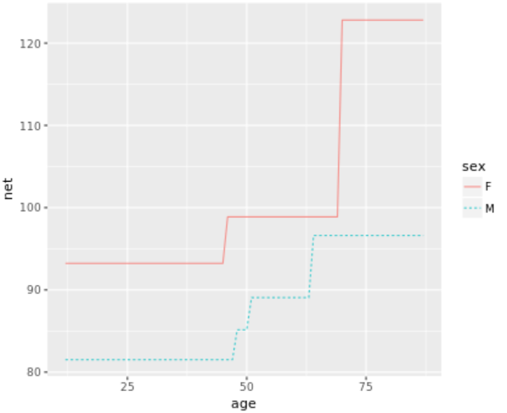
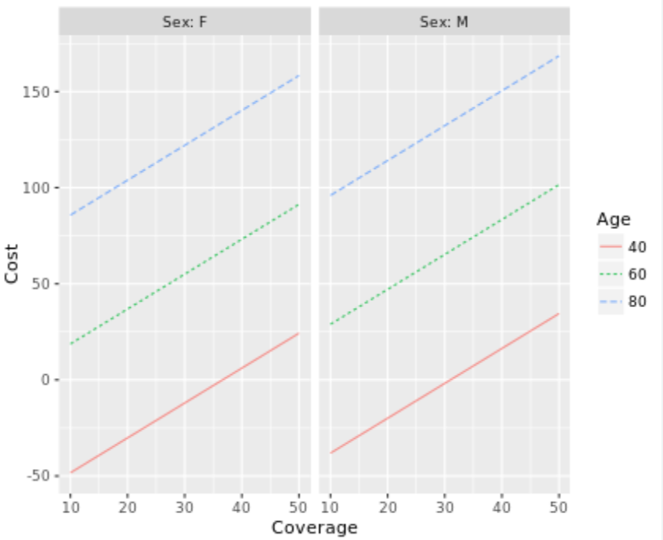
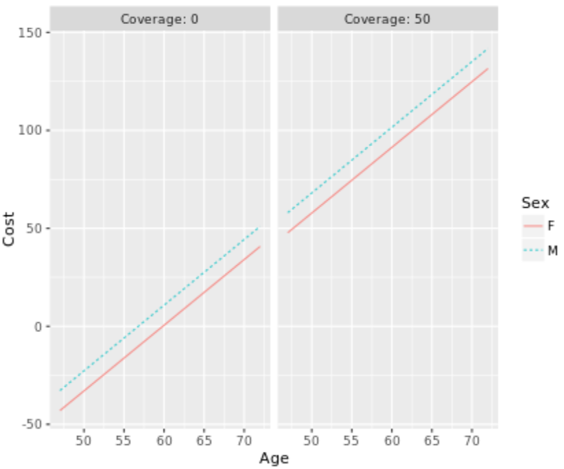
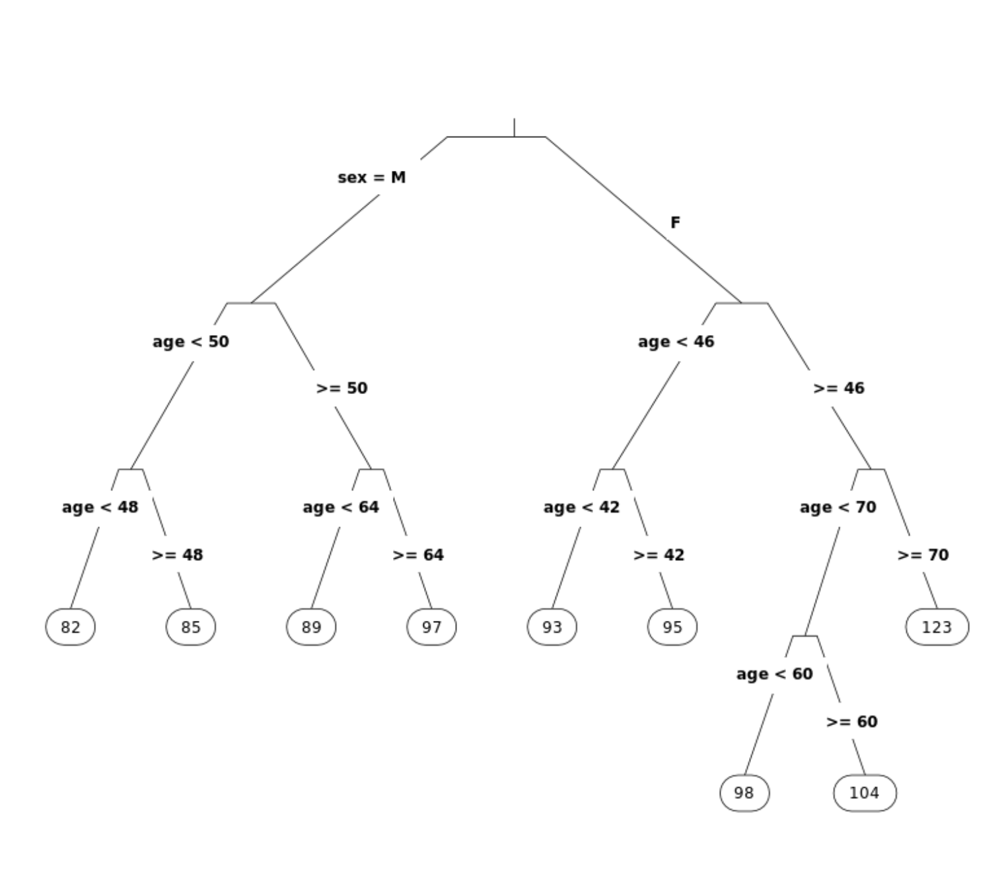
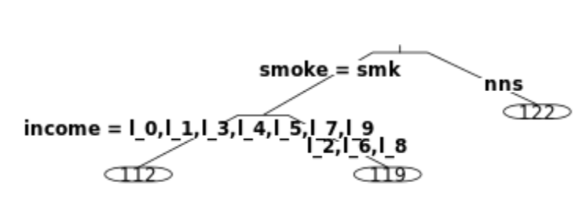
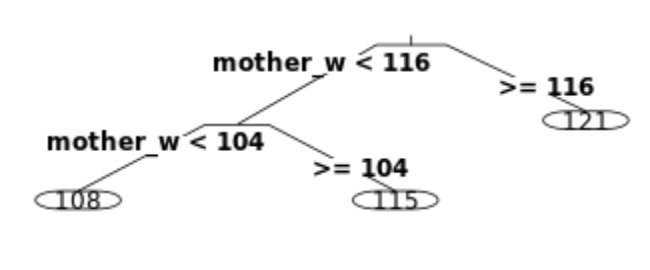
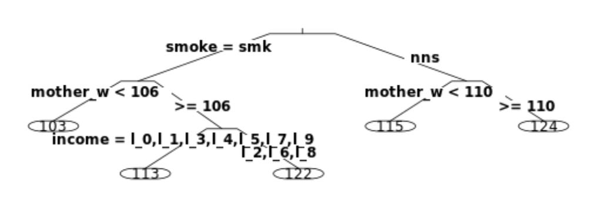
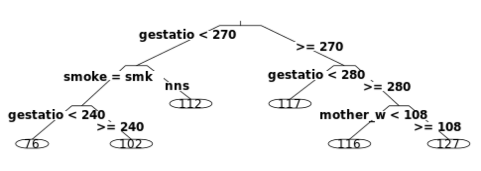
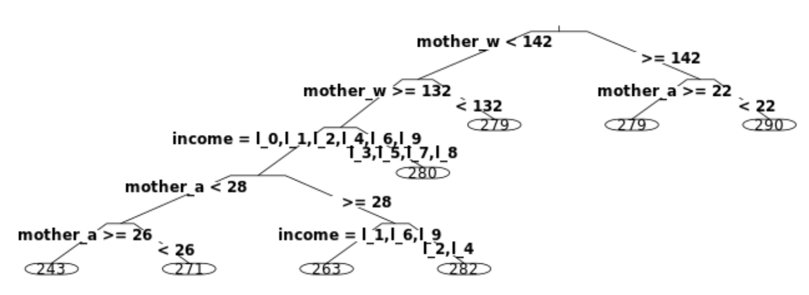

A mathematical model
===

Recall that a mathematical model is a model framed in terms of mathematical stuff such as formulas. In contrast, a statistical model is a mathematical model based on data.

In this exercise, you'll use a toy mathematical model of outcomes on student tests. The model is implemented as a function, `test_scores()`, which takes the following inputs:

- `acad_motivation`: a number from -3 to 3 indicating the level of academic motivation
- `relig_motivation`: a number from -3 to 3 indicating the level of religious motivation
- `school`: either `"public"` or `"private"` to indicate whether the student attends public or private school

You'll start simply by using the `test_scores()` function to produce outputs for various levels of the inputs. Use the function like this (copy and paste into the console):

```R
test_scores(school = "private", 
            acad_motivation = 1, 
            relig_motivation = 3)
[1] 114
```

Starting with formulas
===

Formulas such as `wage ~ age + exper` are used to describe the form of relationships among variables. In this exercise, you are going to use formulas and functions to summarize data on the cost of life insurance policies. The data are in the `AARP` data frame, which has been preloaded from the `statisticalModeling` package.

The `mosaic` package augments simple statistical functions such as `mean()`, `sd()`, `median()`, etc. so that they can be used with formulas. For instance, `mosaic::mean(wage ~ sex, data = CPS85)`will calculate the mean wage for each sex. In contrast, the "built-in" `mean()` function (part of the `base` package) doesn't accept formulas, making it unnecessarily hard to do things like calculate groupwise means.

Note that we explicitly reference the `mean()` function from the `mosaic` package using double-colon notation (i.e. `package::function()`) to make it clear that we're not using the base R version of `mean()`.

```R
# Find the variable names in AARP
names(AARP)
[1] "Age"      "Sex"      "Coverage" "Cost"

# Find the mean cost broken down by sex
mosaic::mean(Cost ~ Sex, data = AARP)
       F        M 
47.29778 57.53056
```

Right, about $47.30 for women and $57.53 for men. It costs more to insure men, because their life expectancy is shorter (and so the insurance company must collect more money early on to cover the payment on death).

Graphics with formulas
===

Formulas can be used to describe graphics in each of the three popular graphics systems: base graphics, lattice graphics, and in `ggplot2` with the `statisticalModeling` package. Most people choose to work in one of the graphics systems. I recommend `ggplot2` with the formula interface provided by `statisticalModeling`.

```R
# Create a boxplot using base, lattice, or ggplot2
boxplot(Cost ~ Sex, data = AARP)
bwplot(Cost ~ Sex, data = AARP)
gf_boxplot(Cost ~ Sex, data = AARP)

# Make a scatterplot using base, lattice, or ggplot2
plot(Cost ~ Age, data = AARP)
xyplot(Cost ~ Age, data = AARP)
gf_point(Cost ~ Age, data = AARP)
```

Modeling running times
===

In this exercise, you'll build three different models based on the data `Runners`, which is already in your workspace. The data come from records of the [Cherry Blossom Ten Mile Run](http://www.cherryblossom.org/), a foot race held in Washington, DC each spring.

Imagine that you have been assigned the task of constructing a handicap for the runners, so that different runners can compare their times adjusting for their age and/or sex.

You will construct three different models using the linear model architecture. Each will have the "net" running time as a response and age and/or sex as explanatory variables. After you build the models, you can visualize them as a graph using simple commands that have been provided to you in the editor.

```R
# Find the variable names in Runners 
names(Runners)

# Build models: handicap_model_1, handicap_model_2, handicap_model_3 
handicap_model_1 <- lm(net ~ age, data = Runners)
handicap_model_2 <- lm(net ~ sex, data = Runners)
handicap_model_3 <- lm(net ~ age + sex, data = Runners)

# For now, here's a way to visualize the models
fmodel(handicap_model_1)
fmodel(handicap_model_2)
fmodel(handicap_model_3)
```

Since `age` is quantitative, graphs of models of `net` versus `age` are continuous curves. On the other hand, `sex` is categorical. The third plot, with both age and sex as explanatory variables shows two continuous curves, one for each sex.

Using the recursive partitioning model architecture
===

In the previous exercise, you used the linear modeling architecture to construct a model of a runner's time as a function of age and sex. There are many different model architectures available. In this exercise, you'll build models using the recursive partitioning architecture and the same `Runners` data frame as in the previous question. The model-building function to use is `rpart()`, which is analogous to `lm()` for linear models.

The recursive partitioning architecture has a parameter, `cp`, that allows you to dial up or down the complexity of the model being built. Without worrying about the details just yet, you can set this parameter as a named argument to `rpart()`. In later chapters, you'll work with tools for determining a good value for `cp`. (If you're really curious about the nitty-gritty details of `cp`, check out `?rpart.control`.)

```R
# Load rpart
library(rpart)

# Build rpart model: model_2
model_2 <- rpart(net ~ age + sex, data = Runners, cp = 0.002)

# Examine graph of model_2 (don't change)
fmodel(model_2, ~ age + sex)
```



In the recursive partitioning architecture, the model functions have 'steps'. It seems unlikely that real people change in the specific way indicated by the model. Presumably, the real change is more gradual and steady. The architecture you choose has consequences for the kinds of relationships that can be depicted.

From inputs to outputs
===

In this exercise, you'll look at the mechanics of specifying the new inputs that are to be used in evaluating models. It's common to use a data frame for this purpose.

```R
my_inputs <- data.frame(age = 60, sex = "F")
```

The traditional function for evaluating a model is `predict()`, which takes as arguments the model and `newdata`, which gets the data frame containing the desired inputs. The result will be the model output(s) corresponding to the specified input(s). This [supplemental video](https://campus.datacamp.com/courses/introduction-to-statistical-modeling-sidebars/sidebar-videos?ex=5)includes information on how you can find the appropriate `help()`documentation on the `predict()` function.

The `statisticalModeling` package provides an alternative to the `predict()` function called `evaluate_model()`. `evaluate_model()`has certain advantages, such as formatting the output as a data frame alongside the inputs, and takes two arguments: the model and a `data`argument containing the data frame of model inputs.

```R
# Display the variable names in the AARP data frame
names(AARP)
[1] "Age"      "Sex"      "Coverage" "Cost"

# Build a model: insurance_cost_model
insurance_cost_model <- lm(Cost ~ Age + Sex + Coverage, AARP)

# Construct a data frame: example_vals 
example_vals <- data.frame(Age = 60, Sex = "F", Coverage = 200)

# Predict insurance cost using predict()
predict(insurance_cost_model, newdata = example_vals)
      1 
363.637

# Load statisticalModeling
library(statisticalModeling)

# Calculate model output using evaluate_model()
evaluate_model(insurance_cost_model, data = example_vals)
  Age Sex Coverage model_output
1  60   F      200      363.637
```

Extrapolation
===

One purpose for evaluating a model is extrapolation: finding the model output for inputs that are outside the range of the data used to train the model.

Extrapolation makes sense only for quantitative explanatory variables. For example, given a variable `x` that ranges from 50 to 100, any value greater than 100 or smaller than 50 is an extrapolation.

In this exercise, you'll extrapolate the `AARP` insurance cost model to examine what the model suggests about insurance costs for 30-year-olds and 90-year-olds. Keep in mind that the model outputs might not make sense. Models trained on data can be a bit wild when evaluated outside the range of the data.

```R
# Build a model: insurance_cost_model
insurance_cost_model <- lm(Cost ~ Age + Sex + Coverage, data = AARP)

# Create a data frame: new_inputs_1
new_inputs_1 <- data.frame(Age = c(30, 90), Sex = c("F", "M"), 
                           Coverage = c(0, 100))

# Use expand.grid(): new_inputs_2
new_inputs_2 <- expand.grid(Age = c(30, 90), Sex = c("F", "M"), 
                           Coverage = c(0, 100))

# Use predict() for new_inputs_1 and new_inputs_2
predict(insurance_cost_model, newdata = new_inputs_1)
        1         2 
-99.98726 292.88435
predict(insurance_cost_model, newdata = new_inputs_2)
        1         2         3         4         5         6         7         8 
-99.98726 101.11503 -89.75448 111.34781  81.54928 282.65157  91.78206 292.88435

# Use evaluate_model() for new_inputs_1 and new_inputs_2
evaluate_model(insurance_cost_model, data = new_inputs_1)
  Age Sex Coverage model_output
1  30   F        0    -99.98726
2  90   M      100    292.88435

evaluate_model(insurance_cost_model, data = new_inputs_2)
  Age Sex Coverage model_output
1  30   F        0    -99.98726
2  90   F        0    101.11503
3  30   M        0    -89.75448
4  90   M        0    111.34781
5  30   F      100     81.54928
6  90   F      100    282.65157
7  30   M      100     91.78206
8  90   M      100    292.88435
```

Notice how `predict()` produces only the model output, not the inputs used to generate that output. `evaluate_model()` helps you keep track of what the inputs were. Returning to a modeling perspective for a moment… Note that the cost of a policy with zero coverage is actually negative for younger people. This kind of thing can happen when extrapolating outside the domain of the data used for training the model. In this case, you didn't have any AARP data for zero coverage. The moral of the story: beware of extrapolation.

Typical values of data
===

Sometimes you want to make a very quick check of what the model output looks like for "typical" inputs. When you use `evaluate_model()` without the `data` argument, the function will use the data on which the model was trained to select some typical levels of the inputs. `evaluate_model()` provides a tabular display of inputs and outputs.

Many people prefer a graphical display. The `fmodel()` function works in the same way as `evaluate_model()`, but displays the model graphically. When models have more than one input variable (the usual case) choices need to be made about which variable to display in what role in the graphic. For instance, if there is a quantitative input, it's natural to put that on the x-axis. Additional explanatory variables can be displayed as color or as *facets* (i.e. small subgraphs). You do not need to display all of the explanatory variables in the graph.

The syntax for `fmodel()` is

```R
fmodel(model_object, ~ x_var + color_var + facet_var)
```

where, of course, you'll use the name of the variable you want on the x-axis instead of `x_var` and similarly for `color_var` and `facet_var`(which are optional). Only the right-hand side of the `~` is used in the formula.

```R
# Evaluate insurance_cost_model
evaluate_model(insurance_cost_model)
   Age Coverage Sex model_output
1   40        0   F  -66.4702087
2   60        0   F    0.5638866
3   80        0   F   67.5979818
4   40       50   F   24.2980606
5   60       50   F   91.3321558
6   80       50   F  158.3662510
7   40        0   M  -56.2374309
8   60        0   M   10.7966643
9   80        0   M   77.8307596
10  40       50   M   34.5308383
11  60       50   M  101.5649336
12  80       50   M  168.5990288

# Use fmodel() to reproduce the graphic
fmodel(insurance_cost_model, ~ Coverage + Age + Sex)

# A new formula to highlight difference in sexes
new_formula <- ~ Age + Sex + Coverage

# Make the new plot (don't change)
fmodel(insurance_cost_model, new_formula)
```





The choices you make in constructing a graphic are important. Using a given variable in a different role in a plot, or omitting it, can highlight or suppress different aspects of the story.

Running experience
===

Let's return to the data on runners in the Cherry Blossom Ten Mile Race. Suppose that we've built a linear model of `net` running time using the obvious explanatory variables: `age` and `sex`. For this exercise, you'll use a small set of data with only 100 runners: `Runners_100`. It's already been loaded in your workspace.

Now you want to find out if you can use use a runner's `previous`experience to improve the model predictions, so you'll build a second model that includes `previous` as an explanatory variable in addition to `age` and `sex`. When evaluated on the training data, each of the two models will produce an output for every case in the training data.

```R
# Build a model of net running time
base_model <- lm(net ~ age + sex, data = Runners_100)

# Evaluate base_model on the training data
base_model_output <- predict(base_model, newdata = Runners_100)

# Build the augmented model
aug_model <- lm(net ~ age + sex + previous, data = Runners_100)

# Evaluate aug_model on the training data
aug_model_output <- predict(aug_model, newdata = Runners_100)

# How much do the model outputs differ?
mean((base_model_output - aug_model_output) ^ 2, na.rm = TRUE)
[1] 0.5157921
```

Adding `previous` as an explanatory variable changes the model outputs. But, we still don't know that change was positive or negative.

Prediction performance
===

In the previous exercise, you built two models of `net` running time: `net ~ age + sex` and `net ~ age + sex + previous`. The models were trained on the `Runners_100` data. The two models made somewhat different predictions: the standard deviation of the difference was about 1 minute (as compared to a mean net running time of about 90 minutes).

Knowing that the models make different predictions doesn't tell you which model is better. In this exercise, you'll compare the models' predictions to the *actual* values of the response variable. The term *prediction error* or just *error* is often used, rather than *difference*. So, rather than speaking of the mean square difference, we'll say *mean square error*.

```R
# Build and evaluate the base model on Runners_100
base_model <- lm(net ~ age + sex, data = Runners_100)
base_model_output <- predict(base_model, newdata = Runners_100)

# Build and evaluate the augmented model on Runners_100
aug_model <- lm(net ~ age + sex + previous, data = Runners_100)
aug_model_output <- predict(aug_model, newdata = Runners_100)

# Find the case-by-case differences
base_model_differences <- with(Runners_100, net - base_model_output)
aug_model_differences <- with(Runners_100, net - aug_model_output)

# Calculate mean square errors
mean(base_model_differences ^ 2)
[1] 131.5594
mean(aug_model_differences ^ 2)
[1] 131.0436
```

The augmented model gives slightly better predictions. But, as you'll see in the next exercise, comparing models using the training data gives an unfair advantage to the augmented model. This problem can be addressed with cross validation.

Where's the statistics?
===

You've seen only part of the technique for using mean square error (MSE) to decide whether to include an explanatory variable in a linear model architecture. The technique isn't yet complete because of a problem: Whenever you use it you will find that the model with the additional explanatory variable has smaller prediction errors than the base model! The technique always gives the same indication: include the additional explanatory variable. You'll start to fix this problem so that the technique of comparing MSE becomes useful and meaningful in practice.

This exercise gives another example of the problem at work. To start, build a model to serve as the base. You'll use `wage` from the `CPS85`dataset as the response variable, and any of the other variables as the explanatory variables. Then you'll build a second model that adds another explanatory variable to those in the base model. You'll see that the MSE is smaller in the expanded model than in the base model.

Of course, it might be that the added variable genuinely contributes to the quality of predictions. To make sure that the variable added to the second model is not in fact genuinely capable of improving predictions, you'll construct that variable to be complete random junk with no explanatory power whatsoever.

```R
# Add bogus column to CPS85 (don't change)
CPS85$bogus <- rnorm(nrow(CPS85)) > 0

# Make the base model
base_model <- lm(wage ~ educ + sector + sex, data = CPS85)

# Make the bogus augmented model
aug_model <- lm(wage ~ educ + sector + sex + bogus, data = CPS85)

# Find the MSE of the base model
mean((CPS85$wage - predict(base_model, newdata = CPS85)) ^ 2)
[1] 19.73308

# Find the MSE of the augmented model
mean((CPS85$wage - predict(aug_model, newdata = CPS85)) ^ 2)
[1] 19.71933
```

Even though the `bogus` variable has no genuine explanatory power, the MSE is smaller when `bogus` is included as an explanatory variable.

Tidying up
===

Before you get started with cross validation, take a moment to tidy up your R commands. 

> The term *tidy programming* refers to a style where variables are always kept as part of a data frame and the functions always take a data frame as an input.

Let's look at some examples of the (untidy?) style that you have been using up to now, along a tidy version that accomplishes the same thing.

Model training is intrinsically tidy. `predict()` is untidy, since its output is not part of a data frame:

```R
mod <- lm(net ~ age + sex, data = Runners)
out <- predict(mod, newdata = Runners)
```

`mean()` (the base R version) is also untidy, since you have to use `$` to extract a variable from a data frame:

```R
mean((Runners$net - out)^2, na.rm = TRUE)
```

Here's a tidier way to predict and calculate MSE:

```R
out2 <- evaluate_model(mod, data = Runners)
with(data = out2, mean((net - model_output) ^ 2, na.rm = TRUE))
```

Thanks to the `evaluate_model()` function from the `statisticalModeling` package, `out2` is a data frame containing both inputs and the corresponding outputs, side-by-side. This will replace the untidy `predict()` for the remainder of the course. `with()` avoids the need to use the untidy `$`.

Testing and training datasets
===

In this exercise, you'll see one way to split your data into non-overlapping training and testing groups. Of course, the split will be done at random so that the testing and training data are similar in a statistical sense.

The code in the editor uses a style that will give you two prediction error results: one for the training cases and one for the testing cases. Your goal is to see whether there is a systematic difference between prediction accuracy on the training and on the testing cases.

Since the split is being done at random, the results will vary somewhat each time you do the calculation. As you'll see in later exercises, you deal with this randomness by rerunning the calculation many times.

```R
# Generate a random TRUE or FALSE for each case in Runners_100
Runners_100$training_cases <- rnorm(nrow(Runners_100)) > 0

# Build base model net ~ age + sex with training cases
base_model <- lm(net ~ age + sex, data = subset(Runners_100, training_cases))

# Evaluate the model for the testing cases
Preds <- evaluate_model(base_model, data = subset(Runners_100, !training_cases))

# Calculate the MSE on the testing data
with(data = Preds, mean((net - model_output)^2))
[1] 148.1821
```

As a general rule, estimates of prediction error based on the training data will be smaller than those based on the testing data. Still, because the division into training and testing sets is done at random, it will happen from time to time that the opposite appears. Now you can explain why we had you work with `Runners_100`rather than the full dataset `Runners`. The worsening in prediction error between the training and testing phases is more evident in small datasets than in large ones.

Repeating random trials
===

In the previous exercise, you implemented a cross validation *trial*. We call it a trial because it involves random assignment of cases to the training and testing sets. The result of the calculation was therefore (somewhat) random.

Since the result of cross validation varies from trial to trial, it's helpful to run many trials so that you can see how much variation there is. As you'll see, this will be a common process as you move through the course.

To simplify things, the `cv_pred_error()` function in the `statisticalModeling` package will carry out this repetitive process for you. All you need do is provide one or more models as input to `cv_pred_error()`; the function will do all the work of creating training and testing sets for each trial and calculating the mean square error for each trial. Easy!

The context for this exercise is to see whether the prediction error calculated from the *training* data is consistently different from the cross-validated prediction error. To that end, you'll calculate the *in-sample* error using only the training data. Then, you'll do the cross validation and use a t-test to see if the in-sample error is statistically different from the cross-validated error.

Run the following code in the console (it's okay to copy and paste):

```R
# The model
model <- lm(net ~ age + sex, data = Runners_100)

# Find the in-sample error (using the training data)
in_sample <- evaluate_model(model, data = Runners_100)
in_sample_error <- 
  with(in_sample, mean((net - model_output)^2, na.rm = TRUE))

# Calculate MSE for many different trials
trials <- cv_pred_error(model)

# View the cross-validated prediction errors
trials
       mse model
1 140.1206 model
2 140.7217 model
3 139.7301 model
4 138.9152 model
5 140.9870 model

# Find confidence interval on trials and compare to training_error
mosaic::t.test(~ mse, mu = in_sample_error, data = trials)
	One Sample t-test

data:  trials$mse
t = 23.17, df = 4, p-value = 2.056e-05
alternative hypothesis: true mean is not equal to 131.5594
95 percent confidence interval:
 139.0721 141.1177
sample estimates:
mean of x 
 140.0949
```

The error based on the training data is below the 95% confidence interval representing the cross-validated prediction error.

Right. The *in-sample* prediction error (that is, the prediction error based on the training data) is, in general, less than the cross-validated prediction error.

To add or not to add (an explanatory variable)?
===

In this exercise, you're going to use cross validation to find out whether adding a new explanatory variable improves the prediction performance of a model. Remember that models are biased to perform well on the training data. Cross validation gives a fair indication of the prediction error on new data.

Perform a *two-sample* t-test to compare the cross validation trials for the two models. The general syntax for a two-sample t-test is:

```R
 t.test(quant ~ group, data = ___)
```

 You'll have to figure out what are the names corresponding to `quant` and `group` in the output of `cv_pred_error()`.

```R
# The base model
base_model <- lm(net ~ age + sex, data = Runners_100)

# An augmented model adding previous as an explanatory variable
aug_model <- lm(net ~ age + sex + previous, data = Runners_100)

# Run cross validation trials on the two models
trials <- cv_pred_error(base_model, aug_model)

# Compare the two sets of cross-validated errors
t.test(mse ~ model, data = trials)

	Welch Two Sample t-test

data:  mse by model
t = 0.20881, df = 5.6674, p-value = 0.8419
alternative hypothesis: true difference in means is not equal to 0
95 percent confidence interval:
 -2.442351  2.891031
sample estimates:
 mean in group aug_model mean in group base_model 
                141.4306                 141.2062
```

Notice that cross validation reveals that the augmented model makes worse predictions (larger prediction error) than the base model. Bigger is not necessarily better when it comes to modeling!

---

The maximum error rate
===

The 10,000 runners in `Runners` can't all start at the same time. They line up behind the start (the line-up goes for about half a mile). There is a handful of elite runners who are given spots right at the start line, but everyone else gets in line.

The `start_position` variable categorizes the enthusiasm of the runners based on how close they maneuvered to the start line before the gun. The variable is categorical, with levels `"calm"`, `"eager"`, and `"mellow"`. The context for this exercise is whether other variables in `Runners` can account for `start_position`. Since the response variable `start_time` is categorical, `rpart()` is an appropriate architecture.

In this exercise, you'll investigate the prediction performance of what is sometimes called the **null model**. This is a model with no explanatory variables, the equivalent to "**I don't know what might explain that.**" The output of the null model will be the same for every input.

You might think that random guessing of the output would be just about the same as the output of the null model. So you'll also look at the prediction performance of random guessing.

```R
# Build the null model with rpart()
Runners$all_the_same <- 1 # null "explanatory" variable
null_model <- rpart(start_position ~ all_the_same, data = Runners)

# Evaluate the null model on training data
null_model_output <- evaluate_model(null_model, data = Runners, type = "class")

# Calculate the error rate
with(data = null_model_output, mean(start_position != model_output, na.rm = TRUE))
[1] 0.5853618

# Generate a random guess...
null_model_output$random_guess <- mosaic::shuffle(Runners$start_position)

# ...and find the error rate
with(data = null_model_output, mean(start_position != random_guess, na.rm = TRUE))
[1] 0.6560341
```

Note that random guessing does not perform as well as the null model.

A non-null model
===

In the previous exercise, you saw that the null model performs better at classification than random guessing. The error rate you found for the null model was 58.5%, whereas random guessing gave an error of about 66%.

In this exercise, you'll build a model of `start_position` as a function of `age` and `sex`.

```R
# Train the model
model <- rpart(start_position ~ age + sex, data = Runners, cp = 0.001)

# Get model output with the training data as input
model_output <- evaluate_model(model, data = Runners, type = "class")

# Find the error rate
with(data = model_output, mean(model_output != start_position, na.rm = TRUE))
[1] 0.5567794
```

The model using `age` and `sex` to predict `start_position`has an in-sample error rate that's only slightly better than that of the null model. Is this because `age` and `sex` are predictive, or because you used the training data to calculate the error rate? The cross validation estimate of error rate will tell you.

A better model?
===

In the previous two exercises, you compared a null model of `start_position` to a model using `age` and `sex` as explanatory variables. You didn't use cross validation, so the calculated error rates are biased to be low. In this exercise, you'll apply a simple cross validation test: splitting the data into training and testing sets.

Your job is to evaluate the models on the testing sets and calculate the error rate.

A hint about interpreting the results: it's often the case that explanatory variables that you think should contribute to prediction in fact do not. Being able to reliably discern when potential explanatory variables do not help is a key skill in modeling.

```R
# Train the models 
null_model <- rpart(start_position ~ all_the_same,
                    data = Training_data, cp = 0.001)
model_1 <- rpart(start_position ~ age, 
                 data = Training_data, cp = 0.001)
model_2 <- rpart(start_position ~ age + sex, 
                 data = Training_data, cp = 0.001)

# Find the out-of-sample error rate
null_output <- evaluate_model(null_model, data = Testing_data, type = "class")
model_1_output <- evaluate_model(model_1, data = Testing_data, type = "class")
model_2_output <- evaluate_model(model_2, data = Testing_data, type = "class")

# Calculate the error rates
null_rate <- with(data = null_output, 
                  mean(model_output != start_position, na.rm = TRUE))
model_1_rate <- with(data = model_1_output, 
                  mean(model_output != start_position, na.rm = TRUE))
model_2_rate <- with(data = model_2_output, 
                  mean(model_output != start_position, na.rm = TRUE))

# Display the error rates
null_rate
[1] 0.6161616
model_1_rate
[1] 0.6161616
model_2_rate
[1] 0.5555556
```

Evaluating a recursive partitioning model
===

Consider this model formula about runners' net times: `net ~ age + sex`. The graphic shows the recursive partitioning for this formula. At the very bottom of the tree, in circles, are values for the response variable. At the very top is the *root*. (Modeling convention is to draw such trees upside down compared to the familiar botantical form, where the roots are at the bottom.)

Training an `rpart()` model amounts to finding a set of divisions of the cases. Starting with all the cases at the root, the model divides them up into two groups: males on the left and females on the right. For males, a further split is made based on age: those younger than 50 and those 50 and over. Similarly, females are also split on age, with a cut-point of 46 years. So, for a 40 year-old female, the model output is 93 (with the same units as the response variable: minutes).

The `rpart()` function uses a sensible default for when to stop dividing subgroups. You can exercise some control over this with the `cp` argument.

Using the console, train a model with the same formula as used in the graphic, but with a value of `cp = 0.001`. Display the model as a tree. Your commands will look like this:

```R
model_2 <- rpart(net ~ age + sex, data = Runners, cp = 0.001)
prp(model_2, type = 3)
```

The `prp()` function plots the model as a tree. `type = 3` is one of several available formats. In this model (with `cp = 0.001`), what is the model output for a 58 year-old female?



Exploring birth-weight data
===

The `Birth_weight` data frame comes from a study of the risks factors for being underweight at birth. Let's explore the factors that might be related to birth weight.

One way to explore data is by building models with explanatory variables that you think are important, but in my view this is really *confirmation* rather than *exploration*. For instance, consider these models. The first involves explanatory variables that relate to social or lifestyle choices and the second involves biological variables. (Note: `income` is given as one of 8 levels, from poorest to richest. `baby_wt` is in ounces: 105 ounces is one kilogram.)

```R
model_1 <- rpart(baby_wt ~ smoke + income, 
                 data = Birth_weight)
model_2 <- rpart(baby_wt ~ mother_age + mother_wt, 
                 data = Birth_weight)
```

Build these models and look at them, e.g.:

```R
prp(model_1, type = 3)
```






The results might suggest to you that some of these explanatory variables are important and others aren't.

Now build a "bigger" model, combining all of those variables. Based on this "bigger" model, interpret the relationship *among* the explanatory variables as they relate to `baby_wt`. 



Based on last model we can say:  Only the subgroup of higher-weight smokers uses the income variable.

Exploring more broadly
===

Sometimes it makes sense just to roll the dice and see what comes up. In the context of modeling, this means throwing a big set of potential explanatory variables into a model and seeing if the process of model training finds something of interest. (Only the `rpart()`architecture provides an opportunity to automatically choose a subset of the explanatory variables. `lm()` will put every variable you give it into the model.)

Let's return to `Birth_weight` and train a recursive partitioning model with the formula `baby_wt ~ .` The single period to the right of the tilde is shorthand for "use all the other variables in the data." In training the model, `rpart()` will partition the cases using the single most effective explanatory variable, and use the same logic to subdivide groups. (That's what the "recursive" means in recursive partitioning: go through the process of building a model for each subgroup.)

In the console, train the model `baby_wt ~ .` on the `Birth_weight` data and plot the model tree using 

```R
prp(your_model, type = 3)
```



You'll see that `gestation` is identified as an important variable. That's not surprising, since that's the natural pattern: babies get bigger the longer they are in the womb.

Is smoking related to gestation period? Explore using models like `gestation ~ . - baby_wt`. (This means "explain gestation by all the other variables *except* baby weight.")

```R
model <- rpart(gestation ~ . - baby_wt, data = Birth_weight)
prp(model, type = 3)
```



As we can see **Smoking doesn't** appear in the model of gestation period, but it does in the model of birth weight.

---

House prices
===

Your employer, a real estate firm, wants you to model the value of various amenities in houses. Today's assignment is to calculate the value of a fireplace. For this purpose, they have provided you with a dataset, `Houses_for_sale`.

A newcomer to modeling might assume that the way to address this question is with a simple model: `price ~ fireplaces`. Let's start there.

As you'll see, a covariate can make a big difference!

- rain a linear model using `Houses_for_sale` with the formula `price ~ fireplaces`. Call the model `simple_model`.
- Use `evaluate_model()` to see what is the difference in price (according to the model) for houses with and without a fireplace.
- Copy and paste values from the `evaluate_model()` output to do a simple subtraction to find the difference in `price`. Store it under the name `naive_worth`.
- The name `naive_worth` might clue you in that there's more going on. Make a second model in which you add a covariate `living_area`. Call the model `sophisticated_model`.
- Use `evaluate_model()` to get the model output for a few values of the inputs.
- Copy and paste values from the `evaluate_model()` output to compare the change in `price` when you hold `living_area`constant at 2000 sq. feet for houses with and without a fireplace. Do the subtraction and store the result as `sophisticated_worth`. Are the values of the worth of a fireplace similar for the two models?

```R
# Train the model price ~ fireplaces
simple_model <- lm(price ~ fireplaces, data = Houses_for_sale)

# Evaluate simple_model
evaluate_model(simple_model)
  fireplaces model_output
1          0     171823.9
2          1     238522.7

# Calculate the difference in model price
naive_worth <- 238522.7 - 171823.9
naive_worth
[1] 66698.8

# Train another model including living_area
sophisticated_model <-lm(price ~ fireplaces + living_area, data = Houses_for_sale)

# Evaluate that model
evaluate_model(sophisticated_model)
  fireplaces living_area model_output
1          0        1000     124043.6
2          1        1000     133006.1
3          0        2000     233357.1
4          1        2000     242319.5
5          0        3000     342670.6
6          1        3000     351633.0

# Find price difference for fixed living_area
sophisticated_worth <- 242319.5 - 233357.1
sophisticated_worth
[1] 8962.4
```

Since the number of fireplaces is related to the amount of living area, a model of price built with just one of the variables will fail to distinguish between the separate effects of each.

Crime and poverty
===

The data frame `Crime` gives some FBI statistics on crime in the various US states in 1960.

- The variable `R` gives the crime rate in each state.
- The variable `X` gives the number of families with low income (i.e. less than half the median).
- The variable `W` gives the average assets of families in the state.

You're going to build separate models `R ~ X` and `R ~ W` to estimate what the effect on the crime rate is of each of those variables. Then you'll construct `R ~ X + W`, using each of the explanatory variables as a covariate for the other.

- Using a linear architecture and the `Crime` data, train `model_1` and `model_2` with formulas `R ~ X` and `R ~ W`, respectively.
- Find the output of each model using `evaluate_model()`.
- Copy and paste values from the `evaluate_model()` output to calculate for each model the change in crime rate from the first level of the explanatory variable to the second level (i.e. `X = 100` to `X = 200` and `W = 400` to `W = 600`).
- Using `lm()`, train `model_3` with the formula `R ~ X + W`. In effect, `X` serves as a covariate for `W` and *vice versa*.
- Evaluate `model_3`.
- Again, copy and paste values from the `evaluate_model()` output to calculate the change in crime rate associated with a decrease of 100 (from 300 to 200) in `X`, holding `W` constant at 600. Call this `change_with_X_holding_W_constant`. Likewise, calculate the change in crime rate associated with a decrease of 200 (from 600 to 400) in `W`, holding `X` constant at 200. Call this `change_with_W_holding_X_constant`. Note that you get very different results with and without covariates.

```R
# Train model_1 and model_2
model_1 <- lm(R ~ X, data = Crime)
model_2 <- lm(R ~ W, data = Crime)

# Evaluate each model...
evaluate_model(model_1)
    X model_output
1 100    106.82223
2 200     89.46721
3 300     72.11219

evaluate_model(model_2)
    W model_output
1 400     68.32909
2 600    103.70777
3 800    139.08644

# ...and calculate the difference in output for each
change_with_X <- 106.82223 - 89.46721
change_with_X
[1] 17.35502

change_with_W <- 68.32909 - 103.70777
change_with_W
[1] -35.37868

# Train model_3 using both X and W as explanatory variables
model_3 <- lm(R ~ X + W, data = Crime)

# Evaluate model_3
evaluate_model(model_3)
    X   W model_output
1 100 400    -62.60510
2 200 400     31.03422
3 300 400    124.67354
4 100 600     41.22502
5 200 600    134.86434
6 300 600    228.50366
7 100 800    145.05515
8 200 800    238.69447
9 300 800    332.33379

# Find the difference in output for each of X and W
change_with_X_holding_W_constant <- 228.50366 - 134.86434
change_with_X_holding_W_constant
[1] 93.63932

change_with_W_holding_X_constant <- 134.86434 - 31.03422
change_with_W_holding_X_constant
[1] 103.8301
```

Notice that the change with `X` is negative in the model that doesn't include `W` as a covariate. That is, the model is indicating that having more families with low income reduces the crime rate. But changing `X` while holding `W` constant gives a strongly positive relationship. This is because areas with high `X` tend to have low `W`: low income is associated with low assets. And low assets tend to be associated with less crime.

Equal pay?
===

Gender pay equity is a matter of considerable concern. That's the setting for this exercise. Keep in mind that the issue is complicated and the data for this exercise are very limited, so don't draw broad conclusions. Instead, focus on the methods: how does the introduction of covariates change the story told by the models?

You'll be working with data (`Trucking_jobs`) from a trucking company, giving information about the earnings of 129 employees. The primary interest is whether `earnings` differ by `sex`.

Potential covariates are:

- Simple personal information: `age` and `hiredyears`.
- Type of work done, as represented by the person's job `title`.

You will build *five* models of `earnings` using a linear model architecture. The first has no covariates. Others include each of the covariates singly and the final one includes *all* of the covariates.

- `earnings ~ sex`
- `earnings ~ sex + age`
- `earnings ~ sex + hiredyears`
- `earnings ~ sex + title`
- `earnings ~ sex + age + hiredyears + title`

```R
# Train the five models
model_1 <- lm(earnings ~ sex, data = Trucking_jobs)
model_2 <- lm(earnings ~ sex + age, data = Trucking_jobs)
model_3 <- lm(earnings ~ sex + hiredyears, data = Trucking_jobs)
model_4 <- lm(earnings ~ sex + title, data = Trucking_jobs)
model_5 <- lm(earnings ~ sex + age + hiredyears + title, data = Trucking_jobs)

# Evaluate each model ...
evaluate_model(model_1)
  sex model_output
1   M     40236.35
2   F     35501.25
evaluate_model(model_2, age = 30)
  sex age model_output
1   M  30     35138.86
2   F  30     32784.54
evaluate_model(model_3, hiredyears = 5)
  sex hiredyears model_output
1   M          5     39996.93
2   F          5     36366.89
evaluate_model(model_4, title = "REGL CARRIER REP")
  sex            title model_output
1   M REGL CARRIER REP     27838.38
2   F REGL CARRIER REP     28170.71
evaluate_model(model_5, age = 20, hiredyears = 0,
               title = "OUTSIDE REGIONAL ACCOUNT MGR")
  sex age hiredyears                        title model_output
1   M  20          0 OUTSIDE REGIONAL ACCOUNT MGR     61497.72
2   F  20          0 OUTSIDE REGIONAL ACCOUNT MGR     61513.00

# ... and calculate the gender difference in earnings 
diff_1 <- 40236.35 - 35501.25
[1] 4735.1
diff_2 <- 35138.86 - 32784.54
[1] 2354.32
diff_3 <- 39996.93 - 36366.89
[1] 3630.04
diff_4 <- 27838.38 - 28170.71
[1] -332.33
diff_5 <- 61497.72 - 61513.00
[1] -15.28
```

The results differ from model to model. By including a covariate, you are effectively determining which two groups to compare (e.g. Men vs. Women both of age 30, or men vs. Women with a given job title.)

Sex and death
===

This exercise deals with the cost of life insurance. Data are from the `AARP` dataset in the `statisticalModeling` package.

The cost of life insurance changes as a person ages. It also (usually) depends on the person's sex, since life expectancy for women in most countries is greater than that for men. And, of course, it depends on the *coverage*, the amount of life insurance bought.

Your goal in this exercise is to find the effect size of `Age`, or `Sex`, and of `Coverage`. Keep in mind that the effect size for each variable is calculated holding each of the other explanatory variables constant.

In the console:

- Train a linear model `Cost ~ Age + Sex + Coverage`.
- Use `evaluate_model()` to see the model output for several values of the inputs.
- Use `effect_size()` to measure how a change in the input value changes the output. Do this for each of `Age`, `Sex` and `Coverage`. (Remember, `effect_size()` takes two arguments: the model and a formula indicating which variable to vary when looking at the model output, e.g. `~ Age` to get the effect size of `Age` on the model's response variable.)

```R
effect_size(model, ~ Age)
     slope  Age   to:Age Sex Coverage
1 3.351705 59.5 68.16025   F       20
effect_size(model, ~ Sex)
    change Sex to:Sex  Age Coverage
1 10.23278   F      M 59.5       20
```

Comparing effect sizes
===

In the previous exercise, you calculated the effect sizes of `Age` and `Sex` on the cost of life insurance. Type these commands in the console to see the results again:

```R
effect_size(model, ~ Age)
     slope  Age   to:Age Sex Coverage
1 3.351705 59.5 68.16025   F       20
effect_size(model, ~ Sex)
    change Sex to:Sex  Age Coverage
1 10.23278   F      M 59.5       20
```

In this exercise, you'll compare the two effect sizes.

You cannot do this just by comparing the numbers 3.35 and 10.23. Those numbers come with units, and the units are different for the two effect sizes. For `Age` the units are USD/month per year, while for `Sex` the units are USD/month. To do the comparison, you'll need to multiply the effect size for `Age` by a number of years. Multiplying years times USD/month per year gives a result in USD/year --- the same units as the effect size for `Sex`.

Using the console, find out what this multiplication factor needs to be to balance the two effect sizes. That is, find out how many years you would need to multiply the `Age` effect size by in order to equal the effect size for `Sex`.

(Aside: You might be interested to look at a life-expectancy table to see how different are the life expectancies for, say, a 55-year old male and female. Here's a link to an [actuarial table](https://www.ssa.gov/oact/STATS/table4c6.html). In the table, you'll see that a 55-year old male is expected to live approximately 25.3 more years, while a 55-year old female has an additional life expectancy of 28.7 years.)

We can say: The effect size for `Sex` corresponds to a change in `Age` of about 3 years.

Correct. A change in age of 3 years leads to a change in cost of 3 years times 3.35 dollars per month per year, or, to simplify, 10.05 dollars per month. That roughly equals the effect size of `Sex`. Always keep the units in mind when interpreting effect sizes. The magnitude of the effect size is only meaningful in terms of those units.

How do GPAs compare?
===

The performance of university and high-school students in the US are often summarized by a "gradepoint average" (GPA). The grade that a student earns in each course is translated to a numerical scale called a gradepoint: 4.0 is at the high end (corresponding to an "A") and 0 is at the low end (a fail).

The GPA calculation is done, of course, by taking a student's gradepoints and averaging. But this is not the only way to do it. `gpa_mod_1` in the editor shows a gradepoint average calculation using a linear model. The data, `College_grades`, give the grades in each course taken by each of 400+ students at an actual college in the midwest US. `sid` is the student's ID number. The formula `gradepoint ~ sid` can be read, "gradepoint is explained by who the student is."

Evaluating the model for students `"S32115"` and `"S32262"` shows that they have very similar gradepoint averages: 3.66 and 3.33, respectively.

The `effect_size()` calculation *compares* two levels of the inputs. You could get this result through simple subtraction of the evaluated model values. By default, `effect_size()` picks the levels to compare, but you can override this by providing specific evaluation level(s) of explanatory variables (e.g. `sid = "S32115"`) and the `to` argument (e.g. `to = "S32262"`).

```R
# Calculating the GPA 
gpa_mod_1 <- lm(gradepoint ~ sid, data = College_grades)

# The GPA for two students
evaluate_model(gpa_mod_1, sid = c("S32115", "S32262"))
     sid model_output
1 S32115     3.660000
2 S32262     3.333333

# Use effect_size()
effect_size(gpa_mod_1, ~ sid)
  change    sid to:sid
1 -0.869 S31377 S31644

# Specify from and to levels to compare
effect_size(gpa_mod_1, ~ sid, sid = "S32115", to = "S32262")
      change    sid to:sid
1 -0.3266667 S32115 S32262

# A better model?
gpa_mod_2 <- lm(gradepoint ~ sid + dept + level, data = College_grades)

# Find difference between the same two students as before
effect_size(gpa_mod_2, ~ sid, sid = "S32115", to = "S32262")
      change    sid to:sid dept level
1 -0.1843165 S32115 S32262    d   200
```

Great work! Something to think about: since it's common belief that different departments or instructors grade differently, why don't we include `iid` or `dept` as covariates all the time when calculating GPAs?

Housing Units
===

Variables often have units: age is in years, price is in dollars or euros or renminbi, etc. In the `Houses_for_sale` data, the unit for `price` is dollars, for `land_value` it's also dollars, and for `living_area` it's square feet. `fireplaces` is a pure number, without units.

In this exercise, you'll find the units of effect sizes. For quantitative explanatory variables, effect sizes always have the unit of the response variable divided by the unit of the explanatory variable.

Using the `Houses_for_sale` data, build an `lm()` model of house `price` versus `living_area`, `land_value`, and `fireplaces` (all together).

We can say, The effect size of `land_value` is near 1 dollars per dollar.

Right. As you can see, the effect size is about 1 dollar per dollar. This suggests that the total price is the sum of the house value itself and the land value. Always make sure you have an idea of what the unit of an effect size means. If the units seem unnatural (e.g. Square dollars), check again.