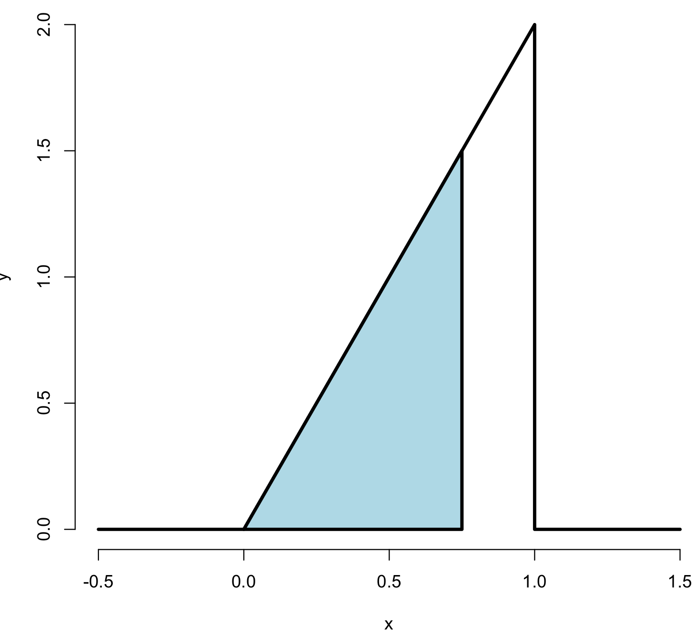
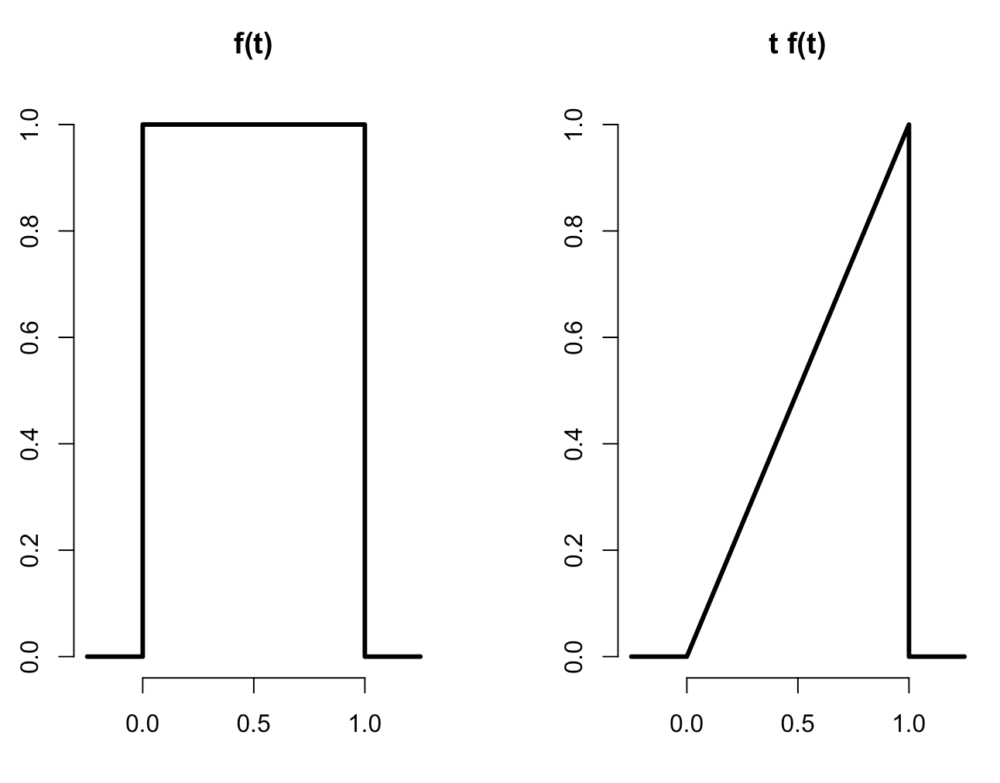

Probability
===

- The **sample space**, $\Omega$, is the collection of possible outcomes of an experiment
  - Example: die roll $\Omega = \{1,2,3,4,5,6\}$
- An **event**, say $E$, is a subset of $\Omega$ 
  - Example: die roll is even $E = \{2,4,6\}$
- An **elementary** or **simple** event is a particular result
  of an experiment
  - Example: die roll is a four, $\omega = 4$
- $\emptyset$ is called the **null event** or the **empty set**

------

#### Interpretation of set operations

Normal set operations have particular interpretations in this setting

1. $\omega \in E$ implies that $E$ occurs when $\omega$ occurs
2. $\omega \not\in E$ implies that $E$ does not occur when $\omega$ occurs
3. $E \subset F$ implies that the occurrence of $E$ implies the occurrence of $F$
4. $E \cap F$  implies the event that both $E$ and $F$ occur
5. $E \cup F$ implies the event that at least one of $E$ or $F$ occur
6. $E \cap F=\emptyset$ means that $E$ and $F$ are **mutually exclusive**, or cannot both occur
7. $E^c$ or $\bar E$ is the event that $E$ does not occur

------

#### Probability Definition

A **probability measure**, $P$, is a function from the collection of possible events so that the following hold

1. For an event $E\subset \Omega$, $0 \leq P(E) \leq 1$
2. $P(\Omega) = 1$
3. If $E_1$ and $E_2$ are mutually exclusive events
   $P(E_1 \cup E_2) = P(E_1) + P(E_2)$.

Part 3 of the definition implies **finite additivity**
$$
P(\cup_{i=1}^n A_i) = \sum_{i=1}^n P(A_i)
$$
where the $\{A_i\}$ are mutually exclusive.

------

**Example**:

- $P(\emptyset) = 0$
- $P(E) = 1 - P(E^c)$
- $P(A \cup B) = P(A) + P(B) - P(A \cap B)$
- if $A \subset B$ then $P(A) \leq P(B)$
- $P\left(A \cup B\right) = 1 - P(A^c \cap B^c)$
- $P(A \cap B^c) = P(A) - P(A \cap B)$
- $P(\cup_{i=1}^n E_i) \leq \sum_{i=1}^n P(E_i)$
- $P(\cup_{i=1}^n E_i) \geq \max_i P(E_i)$

------

#### Random variables

- A **random variable** is a numerical outcome of an experiment.
- The random variables that we study will come in two varieties,
  **discrete** or **continuous**.
- Discrete random variable are random variables that take on only a
  countable number of possibilities.
  - $P(X = k)$
- Continuous random variable can take any value on the real line or some subset of the real line.
  - $P(X \in A)$

------

**Example:**

variables that can be thought of as random variables

- The $(0-1)$ outcome of the flip of a coin
- The outcome from the roll of a die
- The BMI of a subject four years after a baseline measurement
- The hypertension status of a subject randomly drawn from a population

------

#### PMF

A probability mass function evaluated at a value corresponds to the
probability that a random variable takes that value. To be a valid
pmf a function, $p$, must satisfy

1. $p(x) \geq 0$ for all $x$
2. $\sum_{x} p(x) = 1$ (The sum is taken over all of the possible values for $x$.)

------

**Example**:

Let $X$ be the result of a coin flip where $X=0$ represents tails and $X = 1$ represents heads.
$$
p(x) = (1/2)^{x} (1/2)^{1-x} ~~\mbox{ for }~~x = 0,1
$$
Suppose that we do not know whether or not the coin is fair; Let $\theta$ be the probability of a head expressed as a proportion (between 0 and 1).
$$
p(x) = \theta^{x} (1 - \theta)^{1-x} ~~\mbox{ for }~~x = 0,1
$$

------

#### PDF

A probability density function (pdf), is a function associated with a continuous random variable 

**Areas under pdfs correspond to probabilities for that random variable**.

To be a valid pdf, a function $f$ must satisfy

1. $f(x) \geq 0$ for all $x$
2. The area under $f(x)$ is one.

------

**Example**:

Suppose that the proportion of help calls that get addressed in a random day by a help line is given by
$$
f(x) = \left\{\begin{array}{ll}
    2 x & \mbox{ for } 1 > x > 0 \\
    0                 & \mbox{ otherwise} 
\end{array} \right.
$$
Is this a mathematically valid density?

```R
x <- c(-0.5, 0, 1, 1, 1.5); y <- c( 0, 0, 2, 0, 0)
plot(x, y, lwd = 3, frame = FALSE, type = "l")
```

What is the probability that 75% or fewer of calls get addressed?

```R
polygon(c(0, .75, .75, 0), c(0, 0, 1.5, 0), lwd = 3, col = "lightblue")
```

```R
1.5 * .75 / 2
## [1] 0.5625
pbeta(.75, 2, 1)
## pbeta(.75, 2, 1)
```



---

#### CDF and survival function

- The **cumulative distribution function** (CDF) of a random variable $X$ is defined as the function 

$$
F(x) = P(X \leq x)
$$

- This definition applies **<u>regardless</u>** of whether $X$ is discrete or continuous.
- The **survival function** of a random variable $X$ is defined as

$$
S(x) = P(X > x)
$$

- Notice that $S(x) = 1 - F(x)$
- For continuous random variables, the PDF is the **derivative** of the CDF

------

**Example**:

What are the survival function and CDF from the density considered before?

For $1 \geq x \geq 0$
$$
F(x) = P(X \leq x) = \frac{1}{2} Base \times Height = \frac{1}{2} (x) \times (2 x) = x^2
$$


$$
S(x) = 1 - x^2
$$

```R
pbeta(c(0.4, 0.5, 0.6), 2, 1)
## [1] 0.16 0.25 0.36
```

------

#### Quantiles

- The  $\alpha^{th}$ **quantile** of a distribution with distribution function $F$ is the point $x_\alpha$ so that

$$
F(x_\alpha) = \alpha
$$

- A **percentile** is simply a quantile with $\alpha$ expressed as a percent
- The **median** is the $50^{th}$ percentile

------

**Example**:

- We want to solve $0.5 = F(x) = x^2$
- Resulting in the solution 

```R
sqrt(0.5)
## [1] 0.7071068
```

- Therefore, about `r sqrt(0.5)` of calls being answered on a random day is the median.
- R can approximate quantiles for you for common distributions

```R
qbeta(0.5, 2, 1)
## [1] 0.7071068
```

---

Conditional probability
===

- The probability of getting a one when rolling a (standard) die is usually assumed to be one sixth
- Suppose you were given the extra information that the die roll was an odd number (hence 1, 3 or 5)
- *conditional on this new information*, the probability of a one is now one third


- Let $B$ be an event so that $P(B) > 0$

- Then the conditional probability of an event $A$ given that $B$ has occurred is
  $$
  P(A ~|~ B) = \frac{P(A \cap B)}{P(B)}
  $$

- Notice that if $A$ and $B$ are **independent**, then
  $$
  P(A ~|~ B) = \frac{P(A) P(B)}{P(B)} = P(A)
  $$


------

**Example**:

- Consider our die roll example
- $B = \{1, 3, 5\}$
- $A = \{1\}$

$$
\begin{eqnarray*}
P(\mbox{one given that roll is odd})  & = & P(A ~|~ B) \\ \\
  & = & \frac{P(A \cap B)}{P(B)} \\ \\
  & = & \frac{P(A)}{P(B)} \\ \\ 
  & = & \frac{1/6}{3/6} = \frac{1}{3}
  \end{eqnarray*}
$$


------

#### Bayes' rule

$$
P(B ~|~ A) = \frac{P(A ~|~ B) P(B)}{P(A ~|~ B) P(B) + P(A ~|~ B^c)P(B^c)}
$$

------

#### Diagnostic tests

- Let $+$ and $-$ be the events that the result of a diagnostic test is positive or negative respectively
- Let $D$ and $D^c$ be the event that the subject of the test has or does not have the disease respectively 
- The **sensitivity** is the probability that the test is positive given that the subject actually has the disease, $P(+ ~|~ D)$
- The **specificity** is the probability that the test is negative given that the subject does not have the disease, $P(- ~|~ D^c)$


- The **positive predictive value** is the probability that the subject has the disease given that the test is positive, $P(D ~|~ +)$
- The **negative predictive value** is the probability that the subject does not have the disease given that the test is negative, $P(D^c ~|~ -)$
- The **prevalence of the disease** is the marginal probability of disease, $P(D)$


- The **diagnostic likelihood ratio of a positive test**, labeled $DLR_+$, is $\frac {P(+ ~|~ D)}{P(+ ~|~ D^c)}$, which is the $\frac {Sensitivity}{(1 - Specificity)}$


- The **diagnostic likelihood ratio of a negative test**, labeled $DLR_-$, is $\frac {P(- ~|~ D)}{P(- ~|~ D^c)}$, which is the $\frac {(1 - Sensitivity)}{Specificity}$

------

**Example**:

A study comparing the efficacy of HIV tests, reports on an experiment which concluded that HIV antibody tests have a sensitivity of 99.7% and a specificity of 98.5%

Suppose that a subject, from a population with a .1% prevalence of HIV, receives a positive test result. What is the probability that this subject has HIV?

Mathematically, we want $P(D ~|~ +)$ given the sensitivity, $P(+ ~|~ D) = .997$, the specificity, $P(- ~|~ D^c) =.985$, and the prevalence $P(D) = .001$

Using Bayes' formula:
$$
\begin{eqnarray*}
  P(D ~|~ +) & = &\frac{P(+~|~D)P(D)}{P(+~|~D)P(D) + P(+~|~D^c)P(D^c)}\\ \\
 & = & \frac{P(+~|~D)P(D)}{P(+~|~D)P(D) + \{1-P(-~|~D^c)\}\{1 - P(D)\}} \\ \\
 & = & \frac{.997\times .001}{.997 \times .001 + .015 \times .999}\\ \\
 & = & .062
\end{eqnarray*}
$$
In this population a positive test result only suggests a 6% probability that the subject has the disease (The positive predictive value is 6% for this test).

- The low positive predictive value is due to low prevalence of disease and the somewhat modest specificity
- Suppose it was known that the subject was an intravenous drug user and routinely had intercourse with an HIV infected partner.
- Notice that the evidence implied by a positive test result does not change because of the prevalence of disease in the subject's population, only our interpretation of that evidence changes

------

#### Likelihood ratios

- Using Bayes rule, we have
  $$
  P(D ~|~ +) = \frac{P(+~|~D)P(D)}{P(+~|~D)P(D) + P(+~|~D^c)P(D^c)} 
  $$
  and
  $$
  P(D^c ~|~ +) = \frac{P(+~|~D^c)P(D^c)}{P(+~|~D)P(D) + P(+~|~D^c)P(D^c)}.
  $$
  Therefore

$$
\frac{P(D ~|~ +)}{P(D^c ~|~ +)} = \frac{P(+~|~D)}{P(+~|~D^c)}\times \frac{P(D)}{P(D^c)}
$$

ie
$$
\mbox{post-test odds of }D = DLR_+\times\mbox{pre-test odds of }D
$$

- Similarly, $DLR_-$ relates the decrease in the odds of the disease after a negative test result to the odds of disease prior to the test.

------

**Example**:

- Suppose a subject has a positive HIV test
- $DLR_+ = .997 / (1 - .985) \approx 66$
- The result of the positive test is that the odds of disease is now 66 times the pretest odds
- Or, equivalently, the hypothesis of disease is 66 times more supported by the data than the hypothesis of no disease


- Suppose that a subject has a negative test result 
- $DLR_- = (1 - .997) / .985  \approx .003$
- Therefore, the post-test odds of disease is now $.3\%$ of the pretest odds given the  negative test.
- Or, the hypothesis of disease is supported $.003$ times that of the hypothesis of absence of disease given the negative test result


---


Independent events
===

- Two events $A$ and $B$ are **independent** if $$P(A \cap B) = P(A)P(B)$$
- Two random variables, $X$ and $Y$ are independent if for any two sets $A$ and $B$ $$P([X \in A] \cap [Y \in B]) = P(X\in A)P(Y\in B)$$
- If $A$ is independent of $B$ then 
  - $A^c$ is independent of $B$ 
  - $A$ is independent of $B^c$
  - $A^c$ is independent of $B^c$

------

**Example**:

- What is the probability of getting two consecutive heads?

  $A = \{\mbox{Head on flip 1}\}$ ~ $P(A) = .5$

  $B = \{\mbox{Head on flip 2}\}$ ~ $P(B) = .5$

  $A \cap B = \{\mbox{Head on flips 1 and 2}\}$

  $P(A \cap B) = P(A)P(B) = .5 \times .5 = .25$ 


- Volume 309 of Science reports on a physician who was on trial for expert testimony in a criminal trial

  Based on an estimated prevalence of sudden infant death syndrome of $1$ out of $8,543$, Dr Meadow testified that that the probability of a mother having two children with SIDS was $\left(\frac{1}{8,543}\right)^2$

  The mother on trial was convicted of murder

  For the purposes of this class, the principal mistake was to *assume* that the probabilities of having SIDs within a family are independent

  That is, $P(A_1 \cap A_2)$ is not necessarily equal to $P(A_1)P(A_2)$

  Biological processes that have a believed genetic or familiar environmental component, of course, tend to be dependent within families.

---

We will use the following fact extensively:

*If a collection of random variables $X_1, X_2, \ldots, X_n$ are independent, then their joint distribution is the product of their individual densities or mass functions*

*That is, if $f_i$ is the density for random variable $X_i$ we have that*
$$
f(x_1,\ldots, x_n) = \prod_{i=1}^n f_i(x_i)
$$

------

#### IID random variables

- Random variables are said to be iid if they are independent and identically distributed
- iid random variables are the default model for random samples
- Many of the important theories of statistics are founded on assuming that variables are iid

------

**Example**:

- Suppose that we flip a biased coin with success probability p, n times, what is the join density of the collection of outcomes?

- These random variables are iid with densities $p^{x_i} (1 - p)^{1-x_i}$ 

- Therefore
  $$
  f(x_1,\ldots,x_n) = \prod_{i=1}^n p^{x_i} (1 - p)^{1-x_i} = p^{\sum x_i} (1 - p)^{n - \sum x_i}
  $$


---

Expected values
===

The **expected value** or **mean** of a random variable is the center of its distribution.

#### Discrete random variable

- For discrete random variable $X$ with PMF $p(x)$, it is defined as follows
  $$
  E[X] = \sum_x xp(x).
  $$
  where the sum is taken over the possible values of $x$

- $E[X]$ represents the center of mass of a collection of locations and weights, $\{x, p(x)\}$

---

**Example**:

Suppose a coin is flipped and $X$ is declared $0$ or $1$ corresponding to a head or a tail, respectively

What is the expected value of $X$? 
$$
E[X] = .5 \times 0 + .5 \times 1 = .5
$$

- Note, if thought about geometrically, this answer is obvious; if two equal weights are spaced at 0 and 1, the center of mass will be $.5$

  ​


Suppose that a die is rolled and $X$ is the number face up

What is the expected value of $X$?
$$
E[X] = 1 \times \frac{1}{6} + 2 \times \frac{1}{6} +
3 \times \frac{1}{6} + 4 \times \frac{1}{6} +
5 \times \frac{1}{6} + 6 \times \frac{1}{6} = 3.5
$$

---

#### Continuous random variables

- For a continuous random variable, $X$, with density, $f$, the expected value is defined as follows:
  $$
  E[X] = \mbox{the area under the function}~~~ t \times f(t)
  $$

- This definition borrows from the definition of center of mass for a continuous body

---

**Example**:

- Consider a density where $f(x) = 1$ for $x$ between zero and one

  (Is this a valid density?)

  Suppose that $X$ follows this density; what is its expected value?  

```R
par(mfrow = c(1, 2))
plot(c(-0.25, 0, 0, 1, 1, 1.25), c(0, 0, 1, 1, 0, 0), type = "l", lwd = 3, frame = FALSE, xlab="", ylab = ""); title('f(t)')
plot(c(-0.25, 0, 1, 1, 1.25), c(0, 0, 1, 0, 0), type = "l", lwd = 3, frame = FALSE, xlab="", ylab = ""); title('t f(t)')
```



---

#### Rules about expected values

- The expected value is a linear operator 
- If $a$ and $b$ are not random and $X$ and $Y$ are two random variables then
  - $E[aX + b] = a E[X] + b$
  - $E[X + Y] = E[X] + E[Y]$

---

**Example**:

- You flip a coin, $X$ and simulate a uniform random number $Y$, what is the expected value of their sum? 
  $$
  E[X + Y] = E[X] + E[Y] = .5 + .5 = 1
  $$

- Another example, you roll a die twice. What is the expected value of the average? 

- Let $X_1$ and $X_2$ be the results of the two rolls
  $$
  E[(X_1 + X_2) / 2] = \frac{1}{2}(E[X_1] + E[X_2])
  = \frac{1}{2}(3.5 + 3.5) = 3.5
  $$

- Let $X_i$ for $i=1,\ldots,n$ be a collection of random variables, each from a distribution with mean $\mu$

  Calculate the expected value of the sample average of the $X_i$

  ​
  $$
  \begin{eqnarray*}
      E\left[ \frac{1}{n}\sum_{i=1}^n X_i\right]
      & = & \frac{1}{n} E\left[\sum_{i=1}^n X_i\right] \\
      & = & \frac{1}{n} \sum_{i=1}^n E\left[X_i\right] \\
      & = & \frac{1}{n} \sum_{i=1}^n \mu =  \mu.
    \end{eqnarray*}
  $$


---

**Notes**:

- Expected values are properties of distributions. The average, or mean, of random variables is itself a random variable and its associated distribution itself has an expected value. The center of this distribution is the same as that of the original distribution.
- Therefore, the expected value of the **sample mean** is the population mean that it's trying to estimate.
- When the expected value of an estimator is what its trying to estimate, we say that the estimator is **unbiased**.

