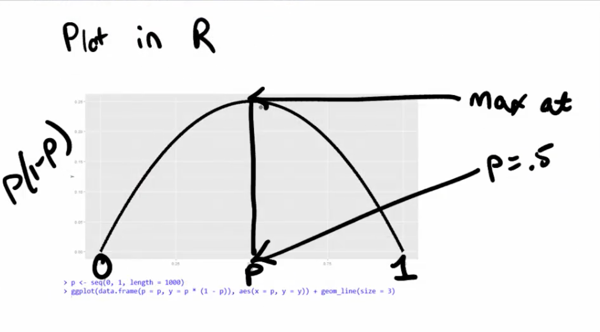

The Variance
===

- The variance of a random variable is a **measure of spread**
- If $X$ is a random variable with mean $\mu$, the variance of $X$ is defined as

$$
Var(X) = E[(X - \mu)^2]
$$

(the expected (squared) distance from the mean)

- Densities with a higher variance are more spread out than densities with a lower variance.
- Convenient computational form:

$$
Var(X) = E[X^2] - E[X]^2
$$

- If $a$ is constant then $Var(aX) = a^2 Var(X)$
- The square root of the variance is called the **standard deviation** or *𝛅*.
- The standard deviation has the same units as $X$


------

**Example:**

- What's the sample variance from the result of a toss of a die? 
  - $E[X] = 3.5$ 
  - $E[X^2] = 1 ^ 2 \times \frac{1}{6} + 2 ^ 2 \times \frac{1}{6} + 3 ^ 2 \\ \times \frac{1}{6} + 4 ^ 2 \times \frac{1}{6} + 5 ^ 2 \times \frac{1}{6} + 6 ^ 2 \times \frac{1}{6} = 15.17$ 
  - $Var(X) = E[X^2] - E[X]^2 \approx 2.92$


- What's the sample variance from the result of the toss of a coin with probability of heads (1) of $p$? 
  - $E[X] = 0 \times (1 - p) + 1 \times p = p$
  - $E[X^2] = E[X] = p$ 
  - $Var(X) = E[X^2] - E[X]^2 = p - p^2 = p(1 - p)$

------


## The Sample Variance

- The sample variance is 

$$
S^2 = \frac{\sum_{i=1} (X_i - \bar X)^2}{n-1}
$$

(almost, but not quite, the average squared deviation from the sample mean)

- The sample variance by itself is a random variable which:
  - Has an associate population distribution.
  - Its expected value (average in simple term) is the population variance.
  - Its distribution gets more concentrated around the population variance with more data.
- Its square root is the **sample standard deviation** or **S**.


Recall the mean:

- Recall that the average of random sample from a population is itself a random variable.
- We know that this distribution is centered around the population mean, $E[\bar X] = \mu$
- We also know what its variance is $Var(\bar X) = \sigma^2 / n$
- This is very useful, since we don't have repeat sample means to get its variance; now we know how it relates to the population variance
- We call the standard deviation of a statistic a **standard error**.

---

To summarize:

- The sample variance, $S^2$, estimates the population variance, $\sigma^2$
- The distribution of the sample variance is centered around $\sigma^2$
- It gets more concentrated around the population variance with larger sample sizes
- The variance of sample mean is $\sigma^2 / n$
  - Its logical estimate is $s^2 / n$
  - The logical estimate of the **standard error** is $s / \sqrt{n}$
- Standard error is equivalent of standard deviation for sample mean.
- $s$, the standard deviation, talks about how variable the population is (which is usually unknown)
- $s/\sqrt{n}$, the standard error, talks about how variable averages of random samples of size $n$ from the population are
- It turns out that we can say a lot about the distribution of averages from random samples, even though we only get one to look at in a given data set.

------

**Example:**

- Standard normals have variance 1; means of $n$ standard normals have standard deviation $:1/\sqrt{n}$

```r
nosim <- 1000
n <- 10
sd(apply(matrix(rnorm(nosim * n), nosim), 1, mean))
[1] 0.3123136
1 / sqrt(n)
[1] 0.3162278
```

- Standard uniforms have variance $1/12$; means of random samples of $n$ uniforms have sd $1/\sqrt{12 \times n}$

```r
nosim <- 1000
n <- 10
sd(apply(matrix(runif(nosim * n), nosim), 1, mean))
[1] 0.09242512
1 / sqrt(12 * n)
[1] 0.09128709
```

- Poisson(4) have variance $4$; means of random samples of $n$ Poisson(4) have sd $2/\sqrt{n}$

```r
nosim <- 1000
n <- 10
sd(apply(matrix(rpois(nosim * n, 4), nosim), 1, mean))
[1] 0.6297378
2 / sqrt(n)
[1] 0.6324555
```

---


Distributions
===

## The Bernoulli distribution

- The **Bernoulli distribution** arises as the result of a binary outcome
- Bernoulli random variables take (only) the values 1 and 0 with probabilities of (say) $p$ and $1-p$ respectively
- The PMF for a Bernoulli random variable $X$ is $$P(X = x) =  p^x (1 - p)^{1 - x}$$
- The mean of a Bernoulli random variable is $p$ and the variance is $p(1 - p)$
- If we let $X$ be a Bernoulli random variable, it is typical to call $X=1$ as a "success" and $X=0$ as a "failure".

---

Binomial distribution
---

- The *binomial random variables* are obtained as the sum of iid Bernoulli trials
- In specific, let $X_1,\ldots,X_n$ be iid Bernoulli$(p)$; then $X = \sum_{i=1}^n X_i$ is a binomial random variable
- The binomial mass function is:

$$
P(X = x) = 
\left(
\begin{array}{c}
  n \\ x
\end{array}
\right)
p^x(1 - p)^{n-x}
$$

for $x=0,\ldots,n$

---

#### Choose

- Recall that the notation $$\left(\begin{array}{c}  n \\ x\end{array}\right) = \frac{n!}{x!(n-x)!} $$ (read "$n$ choose $x$") counts the number of ways of selecting $x$ items out of $n$ without replacement disregarding the order of the items.


- $$\left(\begin{array}{c}  n \\ 0\end{array}\right) = \left(\begin{array}{c}  n \\ n\end{array}\right) = 1 $$

---

**Example:**

- Suppose a friend has $8$ children (oh my!), $7$ of which are girls and none are twins

- If each gender has an independent $50$% probability for each birth, what's the probability of getting $7$ or more girls out of $8$ births? 
  $$
  \left( \begin{array}{c} 8 \\ 7 \end{array} \right) .5^{7}(1-.5)^{1} + \left( \begin{array}{c} 8 \\ 8 \end{array} \right) .5^{8}(1-.5)^{0} \approx 0.04 
  $$


```R
choose(8, 7) * 0.5^8 + choose(8, 8) * 0.5^8
## [1] 0.03516

## Consider the p is desired value -1 (in this case 6 instead of 7)
pbinom(6, size = 8, prob = 0.5, lower.tail = FALSE)
## [1] 0.03516
```

---

The Normal distribution
---

- A random variable is said to follow a **normal** or **Gaussian** distribution with mean $\mu$ and variance $\sigma^2$ if the associated density is $$ (2\pi \sigma^2)^{-1/2}e^{-(x - \mu)^2/2\sigma^2} $$ 

- If $X$ a RV(random variable) with this density then $E[X] = \mu$ and $Var(X) = \sigma^2$
  $$
  X\sim \mbox{N}(\mu, \sigma^2)
  $$

- When $\mu = 0$ and $\sigma = 1$ the resulting distribution is called **the <u>standard</u> normal distribution**

  

- Standard normal random variables are often labeled $Z$

---

Facts about the normal density:

- If $X \sim \mbox{N}(\mu,\sigma^2)$ then $$Z = \frac{X -\mu}{\sigma} \sim N(0, 1)$$


- If $Z$ is standard normal $$X = \mu + \sigma Z \sim \mbox{N}(\mu, \sigma^2)$$


- Approximately **68%**, **95%** and **99%** of the normal density lies within **1**, **2** and **3** standard deviations from the mean, respectively.

  | Percentiles of the standard normal dist | Distance from mean (μ-xσ) |
  | --------------------------------------- | ------------------------- |
  | $-1.28$                                 | $10^{th}$                 |
  | $1.28$                                  | $90^{th}$                 |
  | $-1.645$                                | $5^{th}$                  |
  | $1.645$                                 | $95^{th}$                 |
  | $-1.96$                                 | $2.5^{th}$                |
  | $1.96$                                  | $97.5^{th}$               |
  | $-2.33$                                 | $1^{st}$                  |
  | $2.33$                                  | $99^{th}$                 |

---

**Example:**

- Assume that the number of daily ad clicks for a company is (approximately) normally distributed with a mean of 1020 and a standard deviation of 50. What's the probability of getting more than 1,160 clicks in a day?

It's not very likely, 1,160 is 2.8 standard deviations from the mean.

```R
pnorm(1160, mean = 1020, sd = 50, lower.tail = FALSE)
## [1] 0.002555

pnorm(2.8, lower.tail = FALSE)
## [1] 0.002555
```

- Assume that the number of daily ad clicks for a company is (approximately) normally distributed with a mean of 1020 and a standard deviation of 50. What number of daily ad clicks would represent the one where 75% of days have fewer clicks (assuming days are independent and identically distributed)?

```R
qnorm(0.75, mean = 1020, sd = 50)
## [1] 1054
```

---

The Poisson distribution
---

- Used to model **counts**.

- The Poisson mass function is 
  $$
  P(X = x; \lambda) = \frac{\lambda^x e^{-\lambda}}{x!}  \\ for \ x=0,1,\ldots
  $$

- The mean of this distribution is $\lambda$

- The variance of this distribution is $\lambda$

- Notice that $x$ ranges from $0$ to $\infty$

---

Some uses for the Poisson distribution:

- Modeling count data.
- Modeling event-time or survival data.
- Modeling contingency tables.
- Approximating binomials when $n$ is large and $p$ is small.


Rates and Poisson random variables:

- Poisson random variables are used to model rates.
- $X \sim Poisson(\lambda t)$ where:
  - $\lambda = E[X / t]$ is the expected count per unit of time
  - $t$ is the total monitoring time

---

**Example:**

- The number of people that show up at a bus stop is Poisson with a mean of $2.5$ per hour. 
  If watching the bus stop for 4 hours, what is the probability that $3$ or fewer people show up for the whole time?

```R
ppois(3, lambda = 2.5 * 4)
## [1] 0.01034
```

---

#### Poisson approximation to the binomial:

- When $n$ is large and $p$ is small the Poisson distribution is an accurate approximation to the binomial distribution.

  Notation:

  - $X \sim \mbox{Binomial}(n, p)$
  - $\lambda = n p$
  - $n$ gets large
  - $p$ gets small

---

**Example:**

Poisson approximation to the binomial:

- We flip a coin with success probablity $0.01$ five hundred times.
  What's the probability of 2 or fewer successes?

```R
pbinom(2, size = 500, prob = 0.01)
## [1] 0.1234

ppois(2, lambda = 500 * 0.01)
## [1] 0.1247
```

---


Asymptotics
===

- Asymptotics describes how statistics behave as sample sizes get very large and approach infinity.
- (Asymptopia is my name for the land of asymptotics, where everything works out well and there's no messes. The land of infinite data is nice that way.)
- Asymptotics are incredibly useful for simple statistical inference and approximations.
- Asymptotics often lead to nice understanding of procedures.
- Asymptotics generally give **no assurances** about <u>finite</u> sample performance.
- Asymptotics form the basis for frequency interpretation of probabilities (the long run proportion of times an event occurs)

---

Limits of random variables
---

- Fortunately, for the sample mean there's a set of powerful results.
- These results allow us to talk about the large sample distribution of sample means of a collection of $iid$ observations:
- The first of these results, the **Law of Large Numbers**, we inuitively know:
  - It says that the <u>average</u> limits to what its estimating (the population mean).
    - Example $\bar X_n$ could be the average of the result of $n$ coin flips (i.e. the sample proportion of heads).
    - As we flip a fair coin over and over, it evetually converges to the true probability of a head The LLN forms the basis of frequency style thinking.

---

#### Law of large numbers in action

```R
n <- 10000
means <- cumsum(rnorm(n))/(1:n)
library(ggplot2)
g <- ggplot(data.frame(x = 1:n, y = means), aes(x = x, y = y))
g <- g + geom_hline(yintercept = 0) + geom_line(size = 2)
g <- g + labs(x = "Number of obs", y = "Cumulative mean")
g
```


#### Law of large numbers in action, coin flip

```R
means <- cumsum(sample(0:1, n, replace = TRUE))/(1:n)
g <- ggplot(data.frame(x = 1:n, y = means), aes(x = x, y = y))
g <- g + geom_hline(yintercept = 0.5) + geom_line(size = 2)
g <- g + labs(x = "Number of obs", y = "Cumulative mean")
g
```


Discussion:

- An estimator is **consistent** if it converges to what you want to estimate.
  - The LLN says that the sample mean of iid sample is consistent for the population mean.
  - Typically, good estimators are consistent; it's not too much to ask that if we go to the trouble of collecting an infinite amount of data that we get the right answer.
- The sample variance and the sample standard deviation of iid random variables are consistent as well.

---

The Central Limit Theorem
---

- The **Central Limit Theorem** (CLT) is one of the most important theorems in statistics.

- **CLT** states that the distribution of averages of iid variables (properly normalized) becomes that of a standard normal as the sample size increases.

- The CLT applies in an endless variety of settings.

- The result is that:
  $$
  \frac{\bar X_n - \mu}{\sigma / \sqrt{n}}= \frac{\sqrt n (\bar X_n - \mu)}{\sigma} = \frac{\mbox{Estimate} - \mbox{Mean of estimate}}{\mbox{Std. Err. of estimate}}
  $$
   has a distribution like that of a standard normal for **large n**.

- (Replacing the standard error by its estimated value doesn't change the CLT)

- The useful way to think about the CLT is that $\bar X_n$ is approximately $N(\mu, \sigma^2 / n)$

- Notice that the CLT said nothing about the original population being normally distributed. That's precisely where its usefulness lies! We can assume normality of a sample mean no matter what kind of population we have, as long as our sample size is large enough and our samples are independent.

------

**Example:**

- Simulate a standard normal random variable by rolling $n$ (six sided)
  - Let $X_i$ be the outcome for die $i$
  - Then note that $\mu = E[X_i] = 3.5$
  - $Var(X_i) = 2.92$
  - SE $\sqrt{2.92 / n} = 1.71 / \sqrt{n}$
  - Lets roll $n$ dice, take their mean, subtract off 3.5, and divide by $1.71 / \sqrt{n}$ and repeat this over and over


- Let $X_i$ be the $0$ or $1$ result of the $i^{th}$ flip of a possibly unfair coin
  - The sample proportion, say $\hat p$, is the average of the coin flips
  - $E[X_i] = p$ and $Var(X_i) = p(1-p)$
  - Standard error of the mean is $\sqrt{p(1-p)/n}$
  - Then $$ \frac{\hat p - p}{\sqrt{p(1-p)/n}} $$ will be approximately normally distributed
  - Let's flip a coin $n$ times, take the sample proportion of heads, subtract off .5 and multiply the result by $2 \sqrt{n}$ (divide by $1/(2 \sqrt{n})$)


---

Confidence intervals
===

- According to the CLT, the sample mean, $\bar X$, is approximately normal with mean $\mu$ and sd $\sigma / \sqrt{n}$
- $\mu + 2 \sigma /\sqrt{n}$ is pretty far out in the tail (only **2.5%** of a normal being larger than **2 SDs** in the tail)
- Similarly, $\mu - 2 \sigma /\sqrt{n}$ is pretty far in the left tail (only **2.5%** chance of a normal being smaller than **2 SDs** in the tail)
- So the probability $\bar X$ is bigger than $\mu + 2 \sigma / \sqrt{n}$ or smaller than $\mu - 2 \sigma / \sqrt{n}$ is 5%
  - Or equivalently, the probability of being between these limits is 95%
- The quantity $\bar X \pm 2 \sigma /\sqrt{n}$ is called a **95% interval for $\mu$**
- **The 95% refers to the fact that if one were to repeatly get samples of size $n$, about 95% of the intervals obtained would contain $\mu$**
- The 97.5th quantile is 1.96 (so I rounded to 2 above)
- 90% interval you want (100 - 90) / 2 = 5% in each tail
  - So you want the 95th percentile (1.645)

---

**Example:**

Give a confidence interval for the average height of sons in Galton's data:

```R
library(UsingR)
data(father.son)

x <- father.son$sheight

(mean(x) + c(-1, 1) * qnorm(0.975) * sd(x)/sqrt(length(x)))/12

## The 95% confidence interval of population height is between:
## [1] 5.710 5.738
```

---

Sample proportions
---

In the event that each $X_i$ is $0$ or $1$ with common success probability $\large p$ then $\large \sigma^2 = p(1 - p)$

The interval takes the form:
$$
\hat p \pm z_{(1 - \alpha/2)} \times \sqrt{\frac{p(1 - p)}{n}}
$$


As we can see in graph the maximum amount for p is on p=0.5 then:


- Replacing $p$ by $\hat p$ in the standard error results in what is called a **Wald confidence interval** for $p$
- For 95% intervals $$\huge \hat p \pm \frac{1}{\sqrt{n}}$$ is a quick CI estimate for $p$

---

**Example:**

**Q**: Your campaign advisor told you that in a random sample of 100 likely voters, 56 intent to vote for you.

- Can you relax? Do you have this race in the bag?


- Without access to a computer or calculator, how precise is this estimate?

**A**: $1/sqrt(100)=0.1$ so a back of the envelope calculation gives an approximate 95% interval of $(0.46, 0.66)$ Not enough for you to relax, better go do more campaigning!

**NOTE**: Rough guidelines, 100 for 1 decimal place, 10,000 for 2, 1,000,000 for 3.

```R
round(1/sqrt(10^(1:6)), 3)
## [1] 0.316 0.100 0.032 0.010 0.003 0.001
```

---

Binomial interval
---

```R
0.56 + c(-1, 1) * qnorm(0.975) * sqrt(0.56 * 0.44/100)
## [1] 0.4627 0.6573
```

```R
## This function "performs an exact test of a simple null hypothesis about the probability of success in a Bernoulli experiment." (This means it guarantees the coverages, uses a lot of computation and doesn't rely on the CLT)
binom.test(56, 100)$conf.int
## [1] 0.4572 0.6592
## attr(,"conf.level")
## [1] 0.95
```

---

#### Simulation

```R
n <- 20
pvals <- seq(0.1, 0.9, by = 0.05)
nosim <- 1000
coverage <- sapply(pvals, function(p) {
    phats <- rbinom(nosim, prob = p, size = n)/n
    ll <- phats - qnorm(0.975) * sqrt(phats * (1 - phats)/n)
    ul <- phats + qnorm(0.975) * sqrt(phats * (1 - phats)/n)
    mean(ll < p & ul > p)
})
```


What's happening?

**n** isn't large enough for the CLT to be applicable for many of the values of **p**

- A solution for that would be increasing the sample size:

  ```R
  n <- 100
  pvals <- seq(0.1, 0.9, by = 0.05)
  nosim <- 1000
  coverage2 <- sapply(pvals, function(p) {
      phats <- rbinom(nosim, prob = p, size = n)/n
      ll <- phats - qnorm(0.975) * sqrt(phats * (1 - phats)/n)
      ul <- phats + qnorm(0.975) * sqrt(phats * (1 - phats)/n)
      mean(ll < p & ul > p)
  })
  ```


- Another quick fix called **Agresti/Coull interval**, by adding two successes and failures:

$$
\frac{X + 2}{n + 4}
$$

The result of Coull interval is a little conservative.

Why does this work? Adding 2 successes and 2 failures pulls p' closer to .5 which, as we saw, is the value which maximizes the confidence interval.

```R
n <- 20
pvals <- seq(0.1, 0.9, by = 0.05)
nosim <- 1000
coverage <- sapply(pvals, function(p) {
    phats <- (rbinom(nosim, prob = p, size = n) + 2)/(n + 4)
    ll <- phats - qnorm(0.975) * sqrt(phats * (1 - phats)/n)
    ul <- phats + qnorm(0.975) * sqrt(phats * (1 - phats)/n)
    mean(ll < p & ul > p)
})
```


Poisson interval
---

Recall that Poisson distributions apply to counts or rates. For the latter, we write $X \sim Poisson(lambda*t)$ where lambda is the <u>expected count per unit</u> of time and t is the <u>total monitoring time</u>.

**Q**: A nuclear pump failed 5 times out of 94.32 days, give a 95% confidence interval for the failure rate per day?

- $X \sim Poisson(\lambda t)$.
- Estimate $\hat \lambda = X/t$
- $Var(\hat \lambda) = \lambda / t$
- $\hat \lambda / t$ is our variance estimate

**A**: using R code:

```R
x <- 5
t <- 94.32

lambda <- x/t
round(lambda + c(-1, 1) * qnorm(0.975) * sqrt(lambda/t), 3)

## [1] 0.007 0.099
```

```R
poisson.test(x, T = 94.32)$conf
## [1] 0.01721 0.12371
## attr(,"conf.level")
## [1] 0.95
```

---

Simulation:

Let's see how this interval performs for lambda values near what we're estimating:

```R
lambdavals <- seq(0.005, 0.1, by = 0.01)
nosim <- 1000
t <- 100
coverage <- sapply(lambdavals, function(lambda) {
    lhats <- rpois(nosim, lambda = lambda * t)/t
    ll <- lhats - qnorm(0.975) * sqrt(lhats/t)
    ul <- lhats + qnorm(0.975) * sqrt(lhats/t)
    mean(ll < lambda & ul > lambda)
})
```

Coverage would be like:


So here's the plot of our lambda values by the coverage. So every point in this plot is an instance where we simulated and repeatedly generated Poisson confidence intervals and took the percentage of time that those intervals contained the true lambda value used for the simulation. We can see as the lambda values get larger, the coverage gets closer to 95%. There is of course some monte carlo air because we didn't do an infinite number of simulations, only 1,000. 

So, as brief simulation here is suggesting that, for very small values of lambda, which we have a good sense of if we could have relatively few events for a large amount of monitoring time. **For relatively small values of lambda we shouldn't be using this asymptotic interval**. 

- What if we increase t to 1000?


basically as the monitoring time goes to infinity, the coverage will converge to 95%.

---

Summary:

- The **LLN** states that averages of iid samples converge to the population means that they are estimating.
- The **CLT** states that averages are approximately normal, with distributions:
  - centered at the population mean
  - with standard deviation equal to the standard error of the mean
  - CLT gives no guarantee that $n$ is large enough
- Taking the mean and adding and subtracting the relevant normal quantile times the SE yields a **confidence interval** for the mean:
  - Adding and subtracting 2 SEs works for 95% intervals
- Confidence intervals get wider as the coverage increases.
- Confidence intervals get narrower with less variability or larger sample sizes
- The Poisson and binomial case have exact intervals that don't require the CLT
  - But a quick fix for small sample size binomial calculations is to add 2 successes and failures