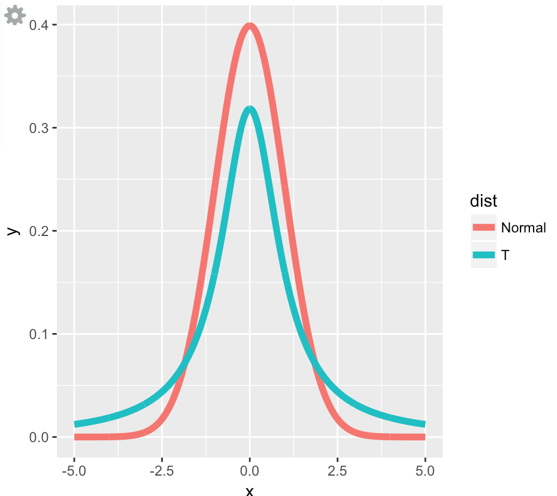
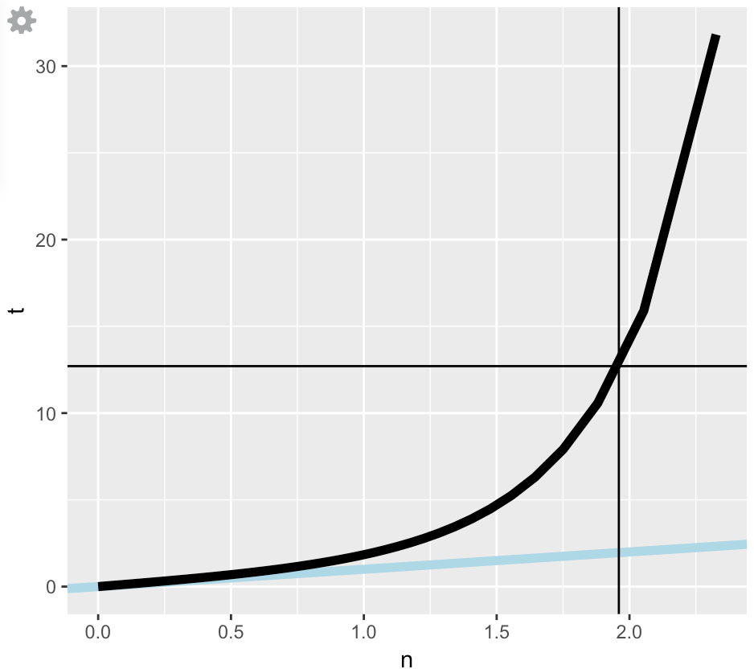
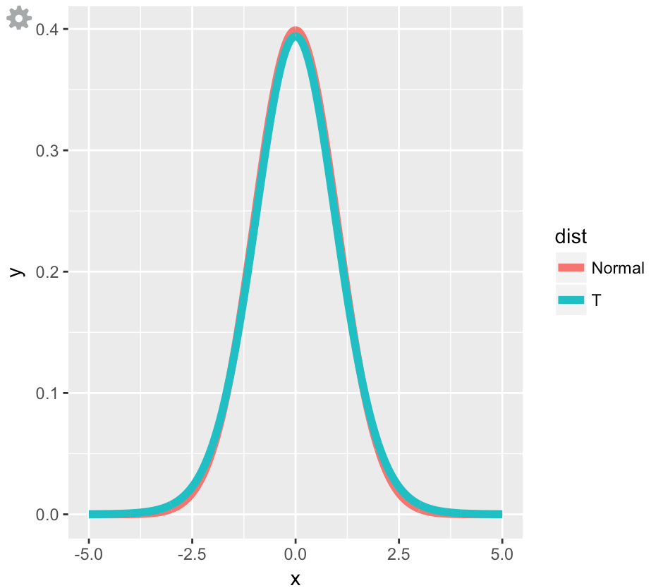
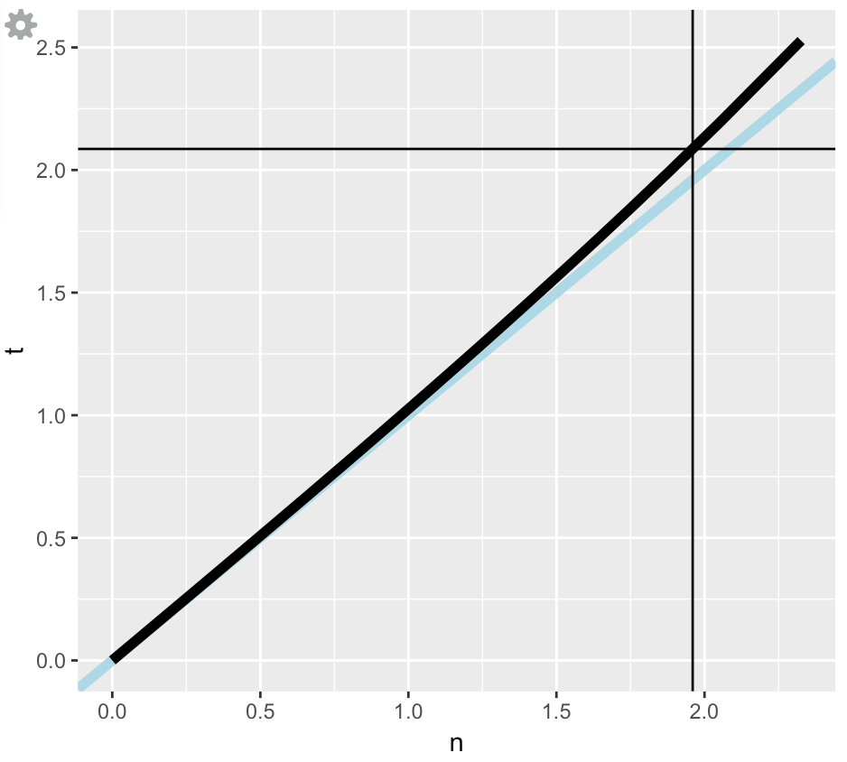
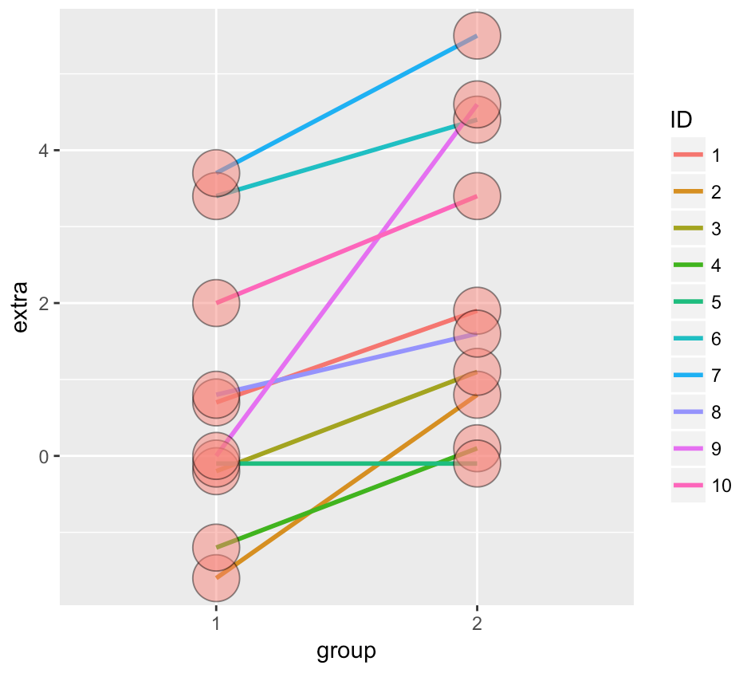
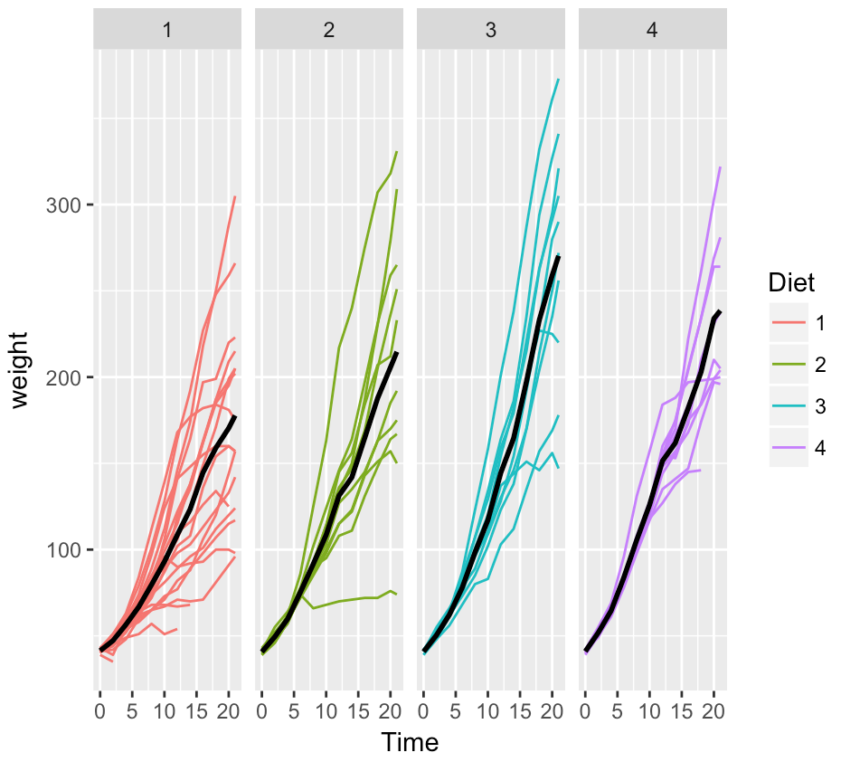
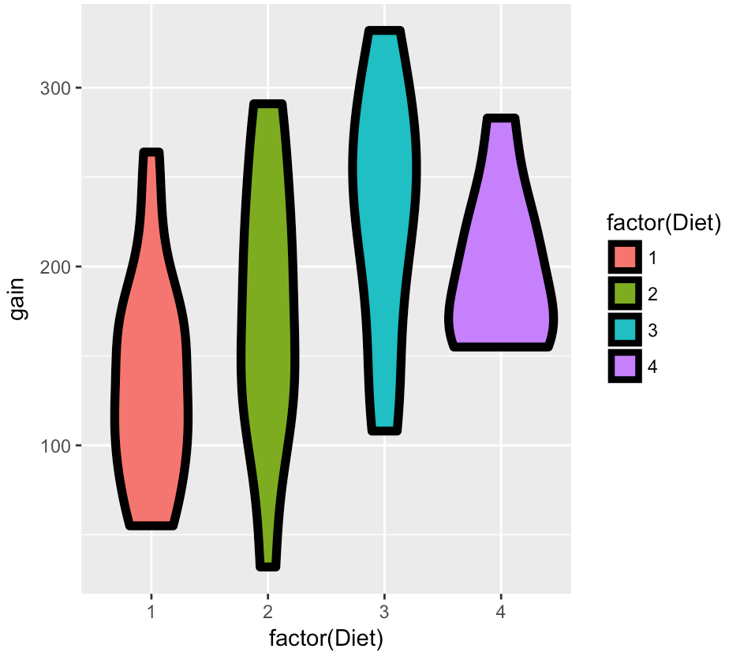
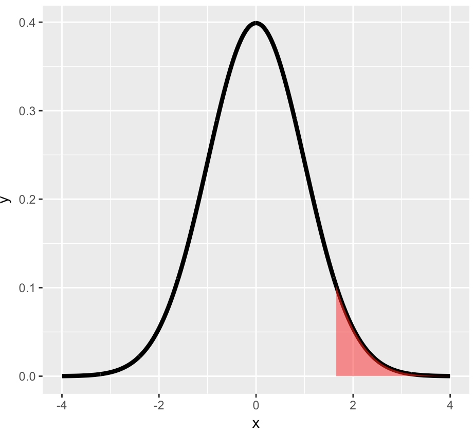

T Confidence intervals
===

- In the previous, we discussed creating a confidence interval using the CLT:
  - They took the form $Est \pm ZQ \times SE_{Est}$
- In this lecture, some statistical methods for dealing with small datasets, specifically the **Student's or Gosset's t distribution** and **t confidence intervals**
  - They are of the form $Est \pm TQ \times SE_{Est}$
- These are some of the handiest of intervals
- If you want a rule between whether to use a $t$ interval or normal interval, <u>just always use the $t$ interval</u>, Because as you collect more data, the t interval will just become more and more like the z interval, anyway.

---

Gosset's t distribution
---

- Invented by William Gosset (under the pseudonym "Student") in 1908

- Has thicker tails than the normal

- Is indexed by a **degrees of freedom**; gets more like a standard normal as <u>df gets larger</u>

- It assumes that the underlying data are iid Gaussian with the result that $$ \frac{\bar X - \mu}{S/\sqrt{n}} $$ follows Gosset's $t$ distribution with $n-1$ degrees of freedom

- The mean and variance of the standardized normal are fixed and known. Now we'll define the t statistic which looks a lot like the Z. It's defined as  $$t=\frac{\bar X - \mu}{S/\sqrt{n}}$$. Like the Z statistic, the t is centered around 0. The only difference between the two is that the population std deviation, $\sigma$, in Z is replaced by the sample standard deviation, $S$, in the t. So the distribution of the **t statistic is independent of the population mean and variance**. Instead it depends on the sample size $n$

- t confidence interval is:
  $$
  \bar X \pm t_{n-1} S/\sqrt{n}
  $$
  where $t_{n-1}$ is the relevant quantile

In order to demostrate differentiate between t and normal distrubition we can consider following graphs: 

- By having degree of freedom = 1 (means only have 2 data points):

  

You can see that the hump of t distribution (in blue) is not as high as the normal's. Consequently, the two tails of the t distribution absorb the extra mass, so they're thicker than the normal's.



The distance between the two thick lines represents the difference in sizes between the quantiles and hence the two sets of intervals. Note the thin horizontal and vertical lines. These represent the .975 quantiles for the t and normal distributions respectively.

- By having bigger degree of freedom, for example df=20 we converge to normal distribution:

  

  

The quantiles are much closer together with the higher degrees of freedom. At the 97.5 percentile, though, the t quantile is still greater than the normal. Student's Rules!

This means the t interval is always wider than the normal. This is because estimating the standard deviation introduces more uncertainty so a wider interval results.

---

#### Note's about the t interval

- The $t$ interval technically <u>assumes</u> that the data are iid normal, though it is <u>robust</u> to this assumption.
- It works well whenever the distribution of the data is roughly **symmetric** and **mound** shaped
- **Paired observations** are often analyzed using the $t$ interval by taking differences
- For large degrees of freedom, $t$ quantiles become the same as standard normal quantiles; therefore this interval converges to the same interval as the CLT yielded
- For skewed distributions, the spirit of the $t$ interval assumptions (being centered around 0) are violated:
  - Also, for skewed distributions, it doesn't make a lot of sense to center the interval at the mean
  - In this case, consider **taking logs** or using a **different summary** like the median
- For highly discrete data, like binary, intervals other than the t are available.
- However, paired observations are often analyzed using the t interval by taking differences between the observations. We'll show you what we mean now.

---

**Example**:

In R typing `data(sleep)` brings up the sleep data originally analyzed in Gosset's Biometrika paper, which shows the increase in hours for 10 patients on two soporific drugs. R treats the data as two groups rather than paired.

```R
data(sleep)
sleep
## Data output
   extra group ID
1    0.7     1  1
2   -1.6     1  2
3   -0.2     1  3
4   -1.2     1  4
5   -0.1     1  5
6    3.4     1  6
7    3.7     1  7
8    0.8     1  8
9    0.0     1  9
10   2.0     1 10
11   1.9     2  1
12   0.8     2  2
13   1.1     2  3
14   0.1     2  4
15  -0.1     2  5
16   4.4     2  6
17   5.5     2  7
18   1.6     2  8
19   4.6     2  9
20   3.4     2 10

```

By plotting the data, we can easily find out the increase for extra value of all data points:

```R
library(ggplot2)
g <- ggplot(sleep, aes(x = group, y = extra, group = factor(ID)))
g <- g + geom_line(size = 1, aes(colour = ID)) + geom_point(size =10, pch = 21, fill = "salmon", alpha = .5)
g
```



As result, we can calculate the t interval in 4 different ways:

```R
g1 <- sleep$extra[1 : 10]; g2 <- sleep$extra[11 : 20]
difference <- g2 - g1
mn <- mean(difference); s <- sd(difference); n <- 10

## Manual method
mn + c(-1, 1) * qt(.975, n-1) * s / sqrt(n)

## Using R in 3 different ways
t.test(difference)
t.test(g2, g1, paired = TRUE)
t.test(extra ~ I(relevel(group, 2)), paired = TRUE, data = sleep)

## all of 4 above method come with same result:
          [,1]     [,2]
[1,] 0.7001142 2.459886
[2,] 0.7001142 2.459886
[3,] 0.7001142 2.459886
[4,] 0.7001142 2.459886
```

This says that with probability .95 the average difference of effects (between the two drugs) for an individual patient is between .7 and 2.46 additional hours of sleep.

---

Independent group t confidence intervals
---

- What we learned so far was in cases which both groups are kind of dependent or paired but for independent groups we need to get following approach:
- Suppose that we want to compare the mean blood pressure between two groups in a randomized trial; those who received the treatment to those who received a placebo
- We cannot use the paired t test because the groups are independent and may have <u>different sample sizes</u>
- We now present methods for comparing independent groups


Therefore a $(1 - \alpha)\times 100%$ confidence interval for $\mu_y - \mu_x$ is:
$$
\bar Y - \bar X \pm t_{n_x + n_y - 2, 1 - \alpha/2}S_p\left(\frac{1}{n_x} + \frac{1}{n_y}\right)^{1/2}
$$
The pooled variance estimator is: 
$$
S_p^2 = {(n_x - 1) S_x^2 + (n_y - 1) S_y^2}/(n_x + n_y - 2)
$$

- Remember this interval is assuming a **constant variance** across the two groups
- If there is some doubt, assume a different variance per group, which we will discuss later

---

**Example**:

**Q**: Comparing SBP for **8** oral contraceptive users versus **21** controls.

- $\bar X_{OC} = 132.86$ mmHg with $s_{OC} = 15.34$ mmHg
- $\bar X_{C} = 127.44$ mmHg with $s_{C} = 18.23$ mmHg

**A**: 

```R
sp <- sqrt((7 * 15.34^2 + 20 * 18.23^2) / (8 + 21 - 2))

132.86 - 127.44 + c(-1, 1) * qt(.975, 27) * sp * (1 / 8 + 1 / 21)^.5

##
[1] -9.521097 20.361097
```

There are some points here:

1. We need to consider to have which one at first for getting difference of means in terms of being meaningfull according to the concept of the question.
2. In this case the result interval contains 0, so we cannot rule out 0 as the possibility for the population difference between the two groups. But why having 0 in the confidence interval is matter: The blood pressure of a contraceptive user is sometimes below that of a control group and sometimes above that of a control group. Hence when we subtract these two values : blood-pressure of contraceptive user - blood pressure of control group, the result would be sometimes be below 0 and sometimes above 0 which would include 0 in the confidence interval and that all mean, *we cannot conclude that there is a difference* in blood pressure between the contraceptive users and the control group.

---

**Q**: Mistakenly treating the sleep data as grouped

```R
n1 <- length(g1) 
n2 <- length(g2)
sp <- sqrt( ((n1 - 1) * sd(x1)^2 + (n2-1) * sd(x2)^2) / (n1 + n2-2))

md <- mean(g2) - mean(g1)

semd <- sp * sqrt(1 / n1 + 1/n2)

rbind(
md + c(-1, 1) * qt(.975, n1 + n2 - 2) * semd,  
t.test(g2, g1, paired = FALSE, var.equal = TRUE)$conf,
t.test(g2, g1, paired = TRUE)$conf
)

##          [,1]   [,2]
## [1,] -14.8873 18.047
## [2,]  -0.2039  3.364
## [3,]   0.7001  2.460
```

We need to consider, **grouped ≠ paired**. A grouped test is for two independent groups. A paired test is for situations where we measure two events for each subject, and want to know the average difference between each pair of observations.

Therefore, according to this description, it is a mistake to treat the sleep data as grouped (i.e. two independent groups). So, first two outcomes aren't right and only the third one (paired=TRUE) is correct. Again, the first two outcomes contains 0 in their confidence intervals which wouldn't be the case since there is a obvisous differences in blood pressure of observations.

---

 **Q**: we're going to analyze the change in weight of chicks in chicks dataset between the 0 and 21 days by having different diets:

```R
library(datasets)
data(ChickWeight)
library(reshape2)

## define weight gain or loss
wideCW <- dcast(ChickWeight, Diet + Chick ~ Time, value.var = "weight")

names(wideCW)[-(1:2)] <- paste("time", names(wideCW)[-(1:2)], sep = "")

library(dplyr)

wideCW <- mutate(wideCW, gain = time21 - time0)
```

**A**: First poltting the raw data:

```R
g <- ggplot(ChickWeight, aes(x = Time, y = weight, colour = Diet, group = Chick))
g <- g + geom_line()
g <- g + stat_summary(aes(group = 1), geom = "line", fun.y = mean, size = 1, col = "black")
g <- g + facet_grid(. ~ Diet)
g
```



So far, at least without any formal statistical test, it does appear that the average weight gain for the first diet does appear to be a little bit slower than the average weight gain for the fourth diet. 

```R
g <- ggplot(wideCW, aes(x = factor(Diet), y = gain, fill = factor(Diet)))
g <- g + geom_violin(col = "black", size = 2)
g
```



Here, we depict the end weight minus the baseline weight by each of the diets, using violin plot.

We're going to look at diets one and four, and so we're going to be comparing the red and purple violins. However, you can decide to check other possible comparisons like comparing diet 1 to 2, 1 to 3, 2 to 3 ...

In order to do the t test notation, where we take an outcome variable like weight gain, we use **~** times the explanatory variable of interest, for the t test function, it needs to only have two levels for the explanatory variable. 

As you can see, we can do that in our dataset by using subset command to take just records for diet one and four (or any other pair). We want paired equals FALSE which in this case paired equal TRUE isn't even an option because the variables are of different and in different length. But what we do compare is assumption that the variances are equal versus the assumptions that the variances are unequal and we get different intervals as confidence interval.

```R
wideCW14 <- subset(wideCW, Diet %in% c(1, 4))
rbind(
t.test(gain ~ Diet, paired = FALSE, var.equal = TRUE, data = wideCW14)$conf,
t.test(gain ~ Diet, paired = FALSE, var.equal = FALSE, data = wideCW14)$conf
) 

          [,1]      [,2]
[1,] -108.1468 -14.81154
[2,] -104.6590 -18.29932
```

Both cases the intervals are entirely below zero, suggesting less weight gain on diet one than diet four. However, the specific interval does change depending on whether or not you have the variances are equal and the variances are false. Now we don't know enough about the specific dataset to ascertain whether that's a substantive change or not. 

But because it might be important, let's also cover the t interval where you assume that the variances are unequal. 

---

#### Unequal variances

- Under unequal variances  
  $$
  \bar Y - \bar X \pm t_{df} \times \left(\frac{s_x^2}{n_x} + \frac{s_y^2}{n_y}\right)^{1/2} 
  $$


where $t_{df}$ is calculated with degrees of freedom  
$$
df= \frac{\left(S_x^2 / n_x + S_y^2/n_y\right)^2} {\left(\frac{S_x^2}{n_x}\right)^2 / (n_x - 1) + \left(\frac{S_y^2}{n_y}\right)^2 / (n_y - 1)}
$$
It turns out that if the x observations and the y observations are IID normal, potentially with <u>different means</u> and potentially with <u>different variances</u>, the relevant normalized statistic does not follow a t distribution. Instead, it can be approximated by a t distribution.

Now no one remembers this degrees of freedom calculation, and it's a, it's a very odd calculation because it just doesn't involve the sample sizes, but actually the estimated standard deviations and variances from the two groups. Nonetheless, if you plug in this potentially fractional degrees of freedom, you get a t calculation that very closely approximates the relevant distribution, which is not actually a t distribution, and it turns out that it works well enough that I can give the statement that **when you're in doubt just use the <u>unequal variance</u> interval**. 

---

**Example**:

Comparing SBP for 8 oral contraceptive users versus 21 controls

- $\bar X_{OC} = 132.86$ mmHg with $s_{OC} = 15.34$ mmHg
- $\bar X_{C} = 127.44$ mmHg with $s_{C} = 18.23$ mmHg
- $df=15.04$, $t_{15.04, .975} = 2.13$ (we already calculate the df by using above formula)
- Interval 

$$
132.86 - 127.44 \pm 2.13 \left(\frac{15.34^2}{8} + \frac{18.23^2}{21} \right)^{1/2} = [-8.91, 19.75]
$$


- In R, `t.test(..., var.equal = FALSE)`

---

**Conclusion**:

When we have single observations or paired observations for which we've taken the difference, we use the **t interval** to create intervals that are highly <u>robust</u> to the underlying assumptions regarding the distribution of the data. 

- For binomial data, there's lots of ways to compare two groups
  - Relative risk, risk difference, odds ratio.
  - Chi-squared tests, normal approximations, exact tests.
- For count data, there's also Chi-squared tests and exact tests.


Hypothesis testing
===

Hypothesis testing is concerned with making decisions about populations using observed data. An important concept in hypothesis testing is the NULL hypothesis, usually denoted as $H_0$. 

This is the hypothesis that represents the **status_quo** and is **assumed true**. It's a baseline against which you're testing alternative hypotheses, usually denoted by $H_a$. Statistical evidence is required to reject $H_0$ in favor of the research or alternative hypothesis.

---

###### ⁉️Example

A respiratory disturbance index of more than $30$ events/hour, say, is considered evidence of severe sleep disordered breathing (SDB).

Suppose that in a sample of $100$ overweight subjects with other risk factors for sleep disordered breathing at a sleep clinic, the mean RDI was $32$ events / hour with a standard deviation of $10$ events / hour.

- We might want to test the hypothesis that
  - $H_0 : \mu = 30$
  - $H_a : \mu > 30$
  - where $\mu$ is the population mean RDI.

---

#### Hypothesis testing

- The alternative hypotheses are typically of the form $<$, $>$ or $\neq$
- Note that there are four possible outcomes of our statistical decision process

| Truth | Decide | Result                             |
| ----- | ------ | ---------------------------------- |
| $H_0$ | $H_0$  | Correctly accept null              |
| $H_0$ | $H_a$  | Wrongly reject null, Type I error  |
| $H_a$ | $H_a$  | Correctly reject null              |
| $H_a$ | $H_0$  | Wrongly accept null, Type II error |

Since there's some element of uncertainty in questions concerning populations, we deal with probabilities. In our hypothesis testing we'll set the probability of making errors small. For now we'll focus on Type I errors, rejecting a correct hypothesis.

The probabilities of making these two kinds of errors are **related**. If you decrease the probability of making a Type I error (rejecting a true hypothesis), you increase the probability of making a Type II error (accepting a false one) and vice versa.

---

#### Discussion

- Consider a court of law; the null hypothesis is that the defendant is innocent
- We require a standard on the available evidence to reject the null hypothesis (convict)
- If we set a low standard, then we would increase the percentage of innocent people convicted (type I errors); however we would also increase the percentage of guilty people convicted (correctly rejecting the null)
- If we set a high standard, then we increase the the percentage of innocent people let free (correctly accepting the null) while we would also increase the percentage of guilty people let free (type II errors)

---

###### ⁉️Example

Consider our sleep example again

A reasonable strategy would reject the null hypothesis if $\bar X$ was larger than some constant, say $C$

Typically, $C$ is chosen so that the probability of a Type I error, $\alpha$, is $.05$ (or some other relevant constant)

$\alpha$ = Type I error rate = Probability of rejecting the null hypothesis when, in fact, the null hypothesis is correct

- Standard error of the mean in sleep example: $10 / \sqrt{100} = 1$

- Under $H_0$ $\bar X \sim N(30, 1)$

- We want to choose the constant C so that the probability that X is greater than C given $H_0$ is 5%. That is, $P(X > C| H_0)$ is 5%

  

Here's a plot to show what we mean. The shaded portion represents 5% of the area under the curve and those X values in it are those for which the probability that X>C is 5%.

In other words, The shaded portion represents 5% of the area under the curve and those X values in it are those which are at least 1.64 standard deviations greater than the mean. The probability of this is 5%. This means that if our observed mean fell in this area we would reject a true null hypothesis, that $\mu=\mu_0$, with probability 5%.

- The 95th percentile of a normal distribution is 1.645 standard deviations from the mean
- If $C = 30 + 1 \times 1.645 = 31.645$
  - Then the probability that a $N(30, 1)$ is larger than it is 5%
  - So the rule "Reject $H_0$ when $\bar X \geq 31.645$" has the property that the probability of rejection is 5% when $H_0$ is true (for the $\mu_0$, $\sigma$ and $n$ given)

---

#### Discussion

- In general we don't convert $C$ back to the original scale

Instead of computing a constant C as a cutpoint for accepting or rejecting the null hypothesis, we can simply compute a Z score, the number of standard deviations the sample mean is from the hypothesized mean. We can then compare it to quantile determined by alpha.

How do we do this? Compute the distance between the two means (32-30 in this example) and divide by the standard error of the mean, that is (s/sqrt(n)).

- We would just reject because the Z-score; which is how many standard errors the sample mean is above the hypothesized mean $$ \frac{32 - 30}{10 / \sqrt{100}} = 2 $$ is greater than $1.645$

---

#### General rules

- The $Z$ test for $H_0:\mu = \mu_0$ versus
  - $H_1: \mu < \mu_0$
  - $H_2: \mu \neq \mu_0$
  - $H_3: \mu > \mu_0$
- Test statistic $ TS = \frac{\bar{X} - \mu_0}{S / \sqrt{n}} $
- Reject the null hypothesis when
  - $TS \leq Z_{\alpha} = -Z_{1 - \alpha}$
  - $|TS| \geq Z_{1 - \alpha / 2}$
  - $TS \geq Z_{1 - \alpha}$

---

#### Notes

- Since our tests were based on alpha, the probability of a Type I error, we say that we **fail to reject $H_0$** rather than we "accept $H_0$". If we fail to reject $H_0$, then $H_0$ could be true OR we just might not have enough data to reject it.
- We have fixed $\alpha$ to be low, so if we reject $H_0$ (either our model is wrong) or there is a low probability that we have made an error
- We have not fixed the probability of a type II error (accepting $H_0$ when it is false), which we call beta. The term **POWER** refers to the quantity **1-beta** and it represents the probability of rejecting $H_0$ when it's false. This is used to determine appropriate sample sizes in experiments.
- Statistical significance is no the same as scientific significance
- The region of TS values for which you reject $H_0$ is called the **rejection region**
- The $Z$ test requires the assumptions of the CLT and for $n$ to be large enough for it to apply
- If $n$ is small, then a Gossett's $T$ test is performed exactly in the same way, with the normal quantiles replaced by the appropriate Student's $T$ quantiles and $n-1$ df
- The probability of rejecting the null hypothesis when it is false is called **power**
- Power is a used a lot to calculate sample sizes for experiments

---

###### ⁉️Example reconsidered

Consider our example again. Suppose that $n= 16$ (rather than $100$)

- The statistic $$ \frac{\bar X - 30}{s / \sqrt{16}} $$ follows a $T$ distribution with 15 df under $H_0$
- Under $H_0$, the probability that it is larger that the 95th percentile of the $T$ distribution is 5%
- The 95th percentile of the T distribution with 15 df is 1.7531 (obtained via `qt(.95, 15)`)
- So that our test statistic is now $\sqrt{16}(32 - 30) / 10 = 0.8 $
- We now fail to reject.

---

#### Two sided tests

- Suppose that we would reject the null hypothesis if in fact the mean was too large or too small
- That is, we want to test the alternative $H_a : \mu \neq 30$
- We will reject if the test statistic, $0.8$, is either too large or too small
- Then we want the probability of rejecting under the null to be 5%, split equally as 2.5% in the upper tail and 2.5% in the lower tail
- Thus we reject if our test statistic is larger than **qt(.975, 15)** or smaller than **qt(.025, 15)**
  - This is the same as saying: reject if the absolute value of our statistic is larger than `qt(0.975, 15)` = 2.1314
  - So we fail to reject the two sided test as well
  - **If you fail to reject the one sided test, you know that you will fail to reject the two sided**

---

Now we usually don't have to do all this computation ourselves because R provides the function **t.test** which happily does all the work! To prove this, we've provided a csv file with the father_son height data from UsingR
and read it into a data structure fs for you. We'll do a t.test on this paired data to see if **fathers and sons have similar heights** (our <u>null hypothesis</u>).

```R
library(UsingR) 
data(father.son)

t.test(father.son$sheight - father.son$fheight)

> 
> 	One Sample t-test
> 
> data:  father.son$sheight - father.son$fheight
> t = 11.79, df = 1077, p-value < 2.2e-16
> alternative hypothesis: true mean is not equal to 0
> 95 percent confidence interval:
>  0.831 1.163
> sample estimates:
> mean of x 
>     0.997
```

So the test statistic is 11.79 which is quite large so we <u>REJECT the null hypothesis</u> that the true mean of the difference was 0 (if you ran the test on the difference sheight-fheight) or that the true difference in means was 0 (if you ran the test on the two separate but paired columns).


**test statistic tell us**: the number of estimated std errors between the sample and hypothesized means.


Note the 95% confidence interval, 0.8310296 1.1629160, returned by t.test. It does not contain the hypothesized population mean 0 so we're pretty confident we can safely reject the hypothesis. This tells us that either our hypothesis is wrong or we're making a mistake (Type 1) in rejecting it.

---

#### Connections with confidence intervals

- Consider testing $H_0: \mu = \mu_0$ versus $H_a: \mu \neq \mu_0$
- Take the set of all possible values for which you fail to reject $H_0$, this set is a $(1-\alpha)100%$ confidence interval for $\mu$
- The same works in reverse; if a $(1-\alpha)100%$ interval contains $\mu_0$, then we *fail to* reject $H_0$

---

#### Two group intervals

- First, now you know how to do two group T tests since we already covered indepedent group T intervals
- Rejection rules are the same
- Test $H_0 : \mu_1 = \mu_2$
- Let's just go through an example

------

###### `chickWeight` data

Recall that we reformatted this data

```R
library(datasets); data(ChickWeight); library(reshape2)
##define weight gain or loss
wideCW <- dcast(ChickWeight, Diet + Chick ~ Time, value.var = "weight")
names(wideCW)[-(1 : 2)] <- paste("time", names(wideCW)[-(1 : 2)], sep = "")
library(dplyr)
wideCW <- mutate(wideCW,
  gain = time21 - time0
)
```

Unequal variance T test comparing diets 1 and 4

```R
wideCW14 <- subset(wideCW, Diet %in% c(1, 4))
t.test(gain ~ Diet, paired = FALSE, 
       var.equal = TRUE, data = wideCW14)
>  
>  	Two Sample t-test
>  
>  data:  gain by Diet
>  t = -2.725, df = 23, p-value = 0.01207
>  alternative hypothesis: true difference in means is not equal to 0
>  95 percent confidence interval:
>   -108.15  -14.81
>  sample estimates:
>  mean in group 1 mean in group 4 
>            136.2           197.7
```

#### Exact binomial test

- Recall this problem, *Suppose a friend has $8$ children, $7$ of which are girls and none are twins*
- Let the null hypothesis be that either gender is equally likely, like an iid coin flip: $H_0 : p = 0.5$ $H_a : p > 0.5$
- So our $H_0$ is that $p=.5$, where p is the probability of a girl. We want to see if we should reject $H_0$ based on this sample of size 8. Our $H_a$ is that $p>.5$, so we'll do a one-sided test, i.e., look at only the right tail of the distribution. What is the relevant rejection region so that the probability of rejecting is (less than) 5%?

| Rejection region | Type I error rate |
| ---------------- | ----------------- |
| [0 : 8]          | 1                 |
| [1 : 8]          | 0.9961            |
| [2 : 8]          | 0.9648            |
| [3 : 8]          | 0.8555            |
| [4 : 8]          | 0.6367            |
| [5 : 8]          | 0.3633            |
| [6 : 8]          | 0.1445            |
| [7 : 8]          | 0.0352            |
| [8 : 8]          | 0.0039            |

- It's impossible to get an exact 5% level test for this case due to the discreteness of the binomial.
  - The closest is the rejection region [7 : 8]
  - Any alpha level lower than 0.0039 is not attainable.
- For larger sample sizes, we could do a normal approximation, but you already knew this.
- Two sided test isn't obvious.
  - Given a way to do two sided tests, we could take the set of values of $p_0$ for which we fail to reject to get an exact binomial confidence interval (called the Clopper/Pearson interval, BTW)
- For these problems, people always create a P-value (next lecture) rather than computing the rejection region.

---

P-values
===

#### What is a P-value?

**Idea**: Suppose nothing is going on - how unusual is it to see the estimate we got?

**Approach**:

1. Define the hypothetical distribution of a data summary (statistic) when "nothing is going on" (*null hypothesis*)
2. Calculate the summary/statistic with the data we have (*test statistic*)
3. Compare what we calculated to our hypothetical distribution and see if the value is "extreme" (*p-value*)

------

#### P-values

- **The P-value is the probability under the null hypothesis of obtaining evidence as extreme or more extreme than that obtained**
- If the P-value is small, then either $H_0$ is true and we have observed a rare event or $H_0$ is false
  - Suppos that you get a $T$ statistic of $2.5$ for 15 df testing $H_0:\mu = \mu_0$ versus $H_a : \mu > \mu_0$.
  - What's the probability of getting a $T$ statistic as large as $2.5$?

```R
pt(2.5, 15, lower.tail = FALSE)
## [1] 0.01225
```

- Therefore, the probability of seeing evidence as extreme or more extreme than that actually obtained under $H_0$ is 0.0123

------

#### The attained significance level

- Our test statistic was $2$ for $H_0 : \mu_0 = 30$ versus $H_a:\mu > 30$.
- Notice that we rejected the one sided test when $\alpha = 0.05$, would we reject if $\alpha = 0.01$, how about $0.001$?
- The <u>smallest value for alpha</u> that you still reject the null hypothesis is called the **attained significance level**
- This is equivalent, but philosophically a little different from, the *P-value*

------

#### Notes

- By reporting a P-value the reader can perform the hypothesis test at whatever $\alpha$ level he or she choses
- **P**
- For two sided hypothesis test, double the smaller of the two one sided hypothesis test Pvalues

---

###### ⁉️Revisiting an earlier example

Suppose a friend has $8$ children, $7$ of which are girls and none are twins

If each gender has an independent $50$% probability for each birth, what's the probability of getting $7$ or more girls out of $8$ births?

```R
choose(8, 7) * 0.5^8 + choose(8, 8) * 0.5^8
## [1] 0.03516
```

```R
pbinom(6, size = 8, prob = 0.5, lower.tail = FALSE)
## [1] 0.03516
```

------

###### ⁉️Poisson example

Suppose that a hospital has an infection rate of 10 infections per 100 person/days at risk (rate of 0.1) during the last monitoring period.

- Assume that an infection rate of 0.05 is an important benchmark.
- Given the model, could the observed rate being larger than 0.05 be attributed to chance?
- Under $H_0: \lambda = 0.05$ so that $\lambda_0 100 = 5$
- Consider $H_a: \lambda > 0.05$.

```R
ppois(9, 5, lower.tail = FALSE)
## [1] 0.03183
```