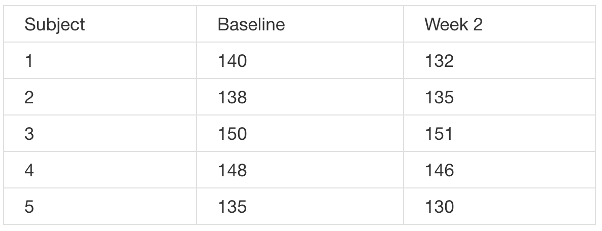

**Q**: 

A pharmaceutical company is interested in testing a potential blood pressure lowering medication. Their first examination considers only subjects that received the medication at baseline then two weeks later. The data are as follows (SBP in mmHg).



Consider testing the hypothesis that there was a mean reduction in blood pressure? Give the P-value for the associated two sided T test. (Hint, consider that the observations are paired.)

**A**: 

$H0:μd=0$ versus $H0:μd≠0$ where μd is the mean difference between followup and baseline.

```R
bl <- c(140, 138, 150, 148, 135)
fu <- c(132, 135, 151, 146, 130)
t.test(fu, bl, alternative = "two.sided", paired = TRUE)

## Paired t-test
data: fu and bl
t = -2.262, df = 4, p-value = 0.08652
alternative hypothesis: true difference in means is not equal to 0
95 percent confidence interval:
-7.5739 0.7739
sample estimates:
mean of the differences
-3.4
```

Note the equivalence with this:

```R
t.test(fu - bl, alternative = "two.sided")

##One Sample t-test
data: fu - bl
t = -2.262, df = 4, p-value = 0.08652
alternative hypothesis: true mean is not equal to 0
95 percent confidence interval:
-7.5739 0.7739
sample estimates:
mean of x
-3.4
```

Note the difference if the test were one sided:

```R
-t.test(fu, bl, alternative = "less", paired = TRUE)

##Paired t-test
data: fu and bl
t = -2.262, df = 4, p-value = 0.04326
alternative hypothesis: true difference in means is less than 0
95 percent confidence interval:-Inf -0.1951
sample estimates:
mean of the differences
-3.4
```

---

**Q**: A sample of 9 men yielded a sample average brain volume of 1,100cc and a standard deviation of 30cc. What is the complete set of values of μ0 that a test of $H0:μ=μ0$ would fail to reject the null hypothesis in a two sided 5% Students t-test?

**A**:

This is the 95% student's T confidence interval.

```R
1100 + c(-1, 1) * qt(0.975, 8) * 30/sqrt(9)
## [1] 1077 1123
```

---

**Q**: 

Researchers conducted a blind taste test of Coke versus Pepsi. Each of four people was asked which of two blinded drinks given in random order that they preferred. The data was such that 3 of the 4 people chose Coke. Assuming that this sample is representative, report a P-value for a test of the hypothesis that Coke is preferred to Pepsi using a one sided exact test.

**A**:

Let p be the proportion of people who prefer Coke. Then, we want to test

$H0:p=.5$ versus $Ha:p>.5$. Let X be the number out of 4 that prefer

Coke; assume $X∼Binomial(p,.5)$.

$Pvalue=P(X≥3)=choose(4,3)0.5^30.5^1+choose(4,4)0.5^40.5^0$

```R
pbinom(2, size = 4, prob = 0.5, lower.tail = FALSE)
## [1] 0.3125

choose(4, 3) * 0.5^4 + choose(4, 4) * 0.5^4
## [1] 0.3125
```

---

**Q**:

Infection rates at a hospital above 1 infection per 100 person days at risk are believed to be too high and are used as a benchmark. A hospital that had previously been above the benchmark recently had 10 infections over the last 1,787 person days at risk. About what is the one sided P-value for the relevant test of whether the hospital is *below* the standard?

**A**:

$H_0:λ=0.01$ versus $H_a:λ<0.01$. 

X=11, t=1,787 and assume $X∼H_0Poisson(0.01×t)$

```R
ppois(10, lambda = 0.01 * 1787)
##[1] 0.03237
```

---

**Q**:

Suppose that 18 obese subjects were randomized, 9 each, to a new diet pill and a placebo. Subjects’ body mass indices (BMIs) were measured at a baseline and again after having received the treatment or placebo for four weeks. The average difference from follow-up to the baseline (followup - baseline) was −3 kg/m2 for the treated group and 1 kg/m2 for the placebo group. The corresponding standard deviations of the differences was 1.5 kg/m2 for the treatment group and 1.8 kg/m2 for the placebo group. Does the change in BMI appear to differ between the treated and placebo groups? Assuming normality of the underlying data and a common population variance, give a pvalue for a two sided t test.

**A**:

$H_0: \mu_{difference,treated} = \mu_{difference,placebo}$

```R
n1 <- n2 <- 9
x1 <- -3 ##treated
x2 <- 1 ##placebo
s1 <- 1.5 ##treated
s2 <- 1.8 ##placebo
s <- sqrt(((n1 - 1) * s1^2 + (n2 - 1) * s2^2)/(n1 + n2 - 2))
ts <- (x1 - x2)/(s * sqrt(1/n1 + 1/n2))
2 * pt(ts, n1 + n2 - 2)
##[1] 0.0001025
```

---

**Q**:

Brain volumes for 9 men yielded a 90% confidence interval of 1,077 cc to 1,123 cc. Would you reject in a two sided 5% hypothesis test of

**A**:

No, you would fail to reject. The 95% interval would be wider than the 90% interval. Since 1,078 is in the narrower 90% interval, it would also be in the wider 95% interval. Thus, in either case it's in the interval and so you would fail to reject.

---

**Q**:

Researchers would like to conduct a study of 100 healthy adults to detect a four year mean brain volume loss of .01mm3. Assume that the standard deviation of four year volume loss in this population is .04 mm3. About what would be the power of the study for a 5% one sided test versus a null hypothesis of no volume loss?

**A**:

The hypothesis is $H_0:μ_Δ=0$ versus $H_a:μ_Δ>0$ where $μ_Δ$ is volume loss (change defined as Baseline - Four Weeks). The test statistics is $10 \times \frac{\bar X_Δ}{.04}$ which is rejected if it is larger than $Z_.95=1.645$.

We want to calculate:

$P \left( \frac {\bar X_Δ}{σ_Δ/10} > 1.645 | μΔ=.01 \right) = P \left( \frac {\bar X_Δ − .01}{.004}>1.645 − \frac {.01}{.004} |  μ_Δ=.01 \right) = P \left(Z>−.855 \right)=.80$

Or note that $\bar X_Δ$ is $N(.01,.004)$ under the alternative and we want the $P( \bar X_Δ > 1.645∗.004)$ under $H_a$.

```R
pnorm(1.645 * 0.004, mean = 0.01, sd = 0.004, lower.tail = FALSE)
##[1] 0.8037
```

---

**Q**:

Researchers would like to conduct a study of n healthy adults to detect a four year mean brain volume loss of .01 mm3. Assume that the standard deviation of four year volume loss in this population is .04 mm3. About what would be the value of n needed for 90%power of type one error rate of 5% one sided test versus a null hypothesis of no volume loss?

**A**:

The hypothesis is $H_0:μ_Δ=0$ versus $H_a:μ_Δ>0$ where $μ_Δ$ is volume loss (change defined as Baseline - Four Weeks). The test statistics is $\frac {\bar X_Δ}{.04/\sqrt(n)}$ which is rejected if it is larger than $Z_.95=1.645$.

We want to calculate:

$P \left( \frac{\bar X_Δ}{σ_Δ/\sqrt(n)}>1.645 | μ_Δ=.01 \right) = P \left(\frac{\bar X_Δ−.01}{.04}/{\sqrt n}>1.645 − \frac{.01}{.04/\sqrt(n)} | μ_Δ=.01 \right) = P(Z>1.645− \sqrt(n) /4) = .90$

So we need $1.645 − \sqrt(n)/4=Z_.10=−1.282$ and thus:

$n=(4∗(1.645+1.282))^2$.

```R
ceiling((4 * (qnorm(0.95) - qnorm(0.1)))^2)
## [1] 138
```

---

**Q**:

As you increase the type one error rate, α, what happens to power?

**A**:

As you require less evidence to reject, i.e. your α rate goes up, you will have larger power.

---

