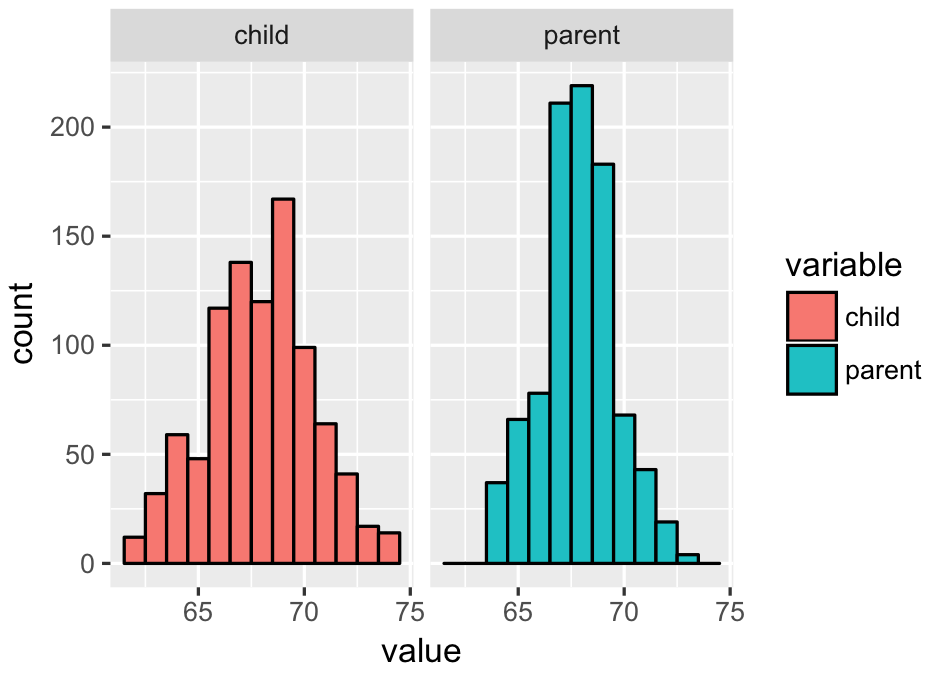
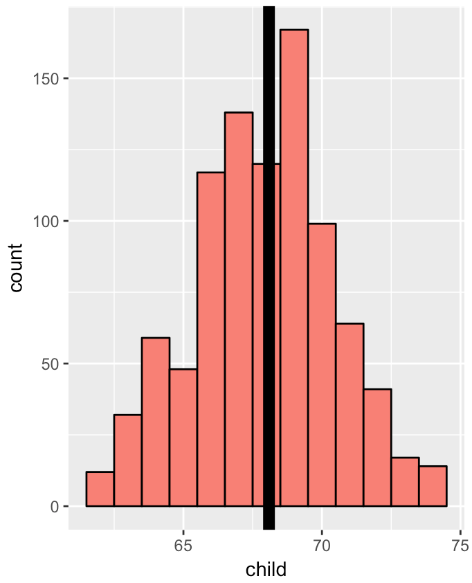
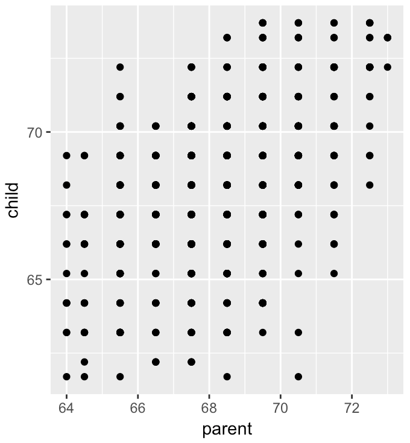
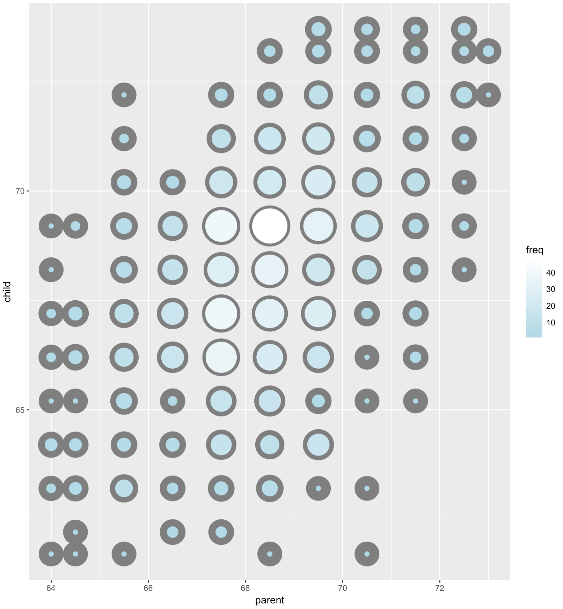
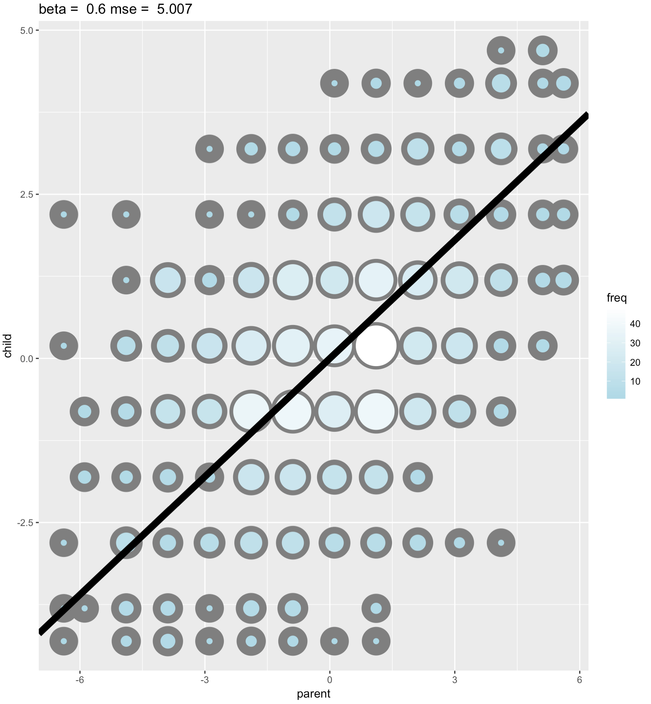
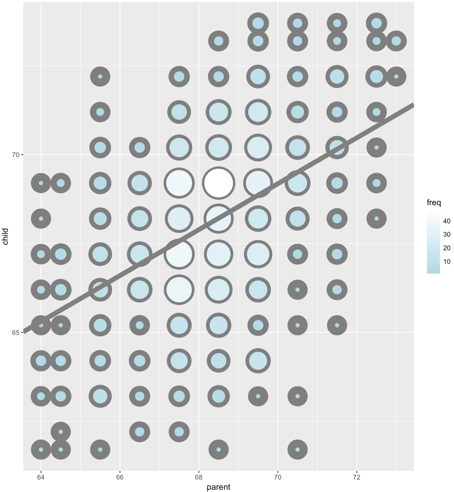
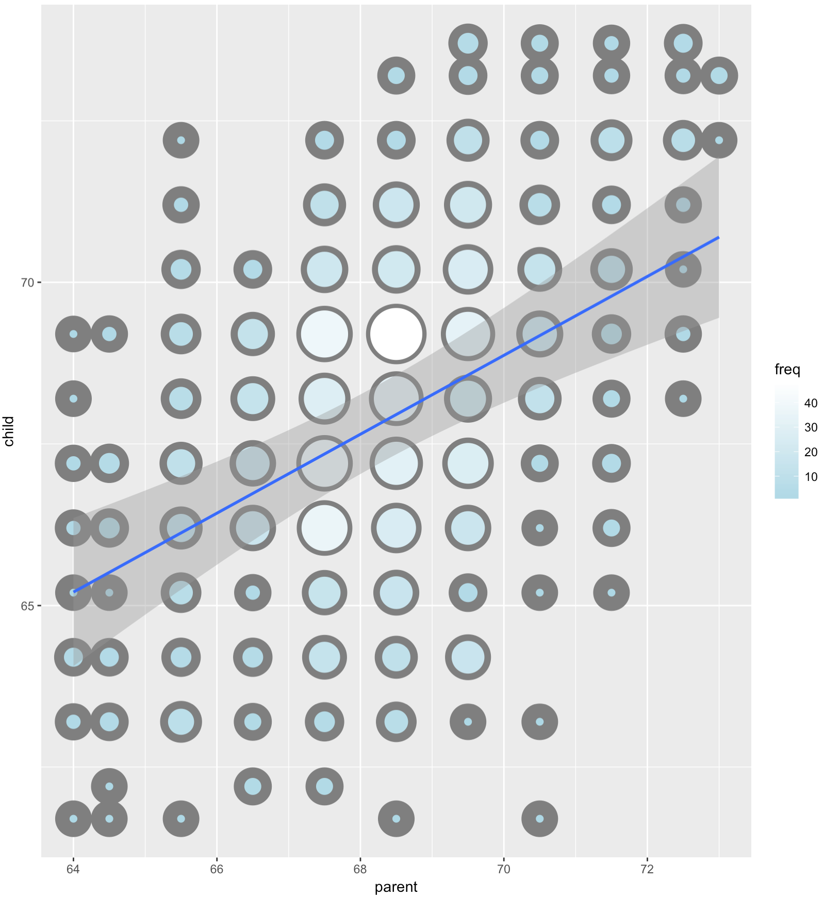

#### Galton's Data

- Let's look at the data first, used by Francis Galton in 1885.
- You may need to run `install.packages("UsingR")` if the `UsingR` library is not installed.
- Let's look at the marginal (parents disregarding children and children disregarding parents) distributions first.
  - Parent distribution is all heterosexual couples.
  - Correction for gender via multiplying female heights by 1.08.
  - Overplotting is an issue from discretization.

```R
library(UsingR) 
data(galton) 
library(reshape) 

long <- melt(galton)
g <- ggplot(long, aes(x = value, 
                      fill = variable))
g <- g + geom_histogram(colour = "black",
                        binwidth=1) 
g <- g + facet_grid(. ~ variable)
g
```



**Finding the middle via least squares**:

- Consider only the children's heights.
  - How could one describe the "middle"?
  - One definition, let $Y_i$ be the height of child $i$ for $i = 1, \ldots, n = 928$, then define the middle as the value of $\mu$ that minimizes $$\sum_{i=1}^n (Y_i - \mu)^2$$
- This is physical center of mass of the histrogram.
- You might have guessed that the answer $\mu = \bar Y$.

Using manipulate to demostrate the case:

```R
library(manipulate)
myHist <- function(mu){
    mse <- mean((galton$child - mu)^2)
    g <- ggplot(galton, aes(x = child)) + geom_histogram(fill = "salmon", colour = "black", binwidth=1)
    g <- g + geom_vline(xintercept = mu, size = 3)
    g <- g + ggtitle(paste("mu = ", mu, ", MSE = ", round(mse, 2), sep = ""))
    g
}
manipulate(myHist(mu), mu = slider(62, 74, step = 0.5))
```

**The least squares est. is the empirical mean**:

```R
g <- ggplot(galton, aes(x = child)) + geom_histogram(fill = "salmon", colour = "black", binwidth=1)
g <- g + geom_vline(xintercept = mean(galton$child), size = 3)
g
```



**Comparing childrens' heights and their parents' heights**:

```R
ggplot(galton, aes(x = parent, y = child)) + geom_point()
```



---

Size of point represents number of points at that (X, Y) combination:

```R
library(dplyr)
freqData <- as.data.frame(table(galton$child, galton$parent))
names(freqData) <- c("child", "parent", "freq")
freqData$child <- as.numeric(as.character(freqData$child))
freqData$parent <- as.numeric(as.character(freqData$parent))
g <- ggplot(filter(freqData, freq > 0), aes(x = parent, y = child))
g <- g  + scale_size(range = c(2, 20), guide = "none" )
g <- g + geom_point(colour="grey50", aes(size = freq+20, show_guide = FALSE))
g <- g + geom_point(aes(colour=freq, size = freq))
g <- g + scale_colour_gradient(low = "lightblue", high="white")                    
g
```



---

#### Regression through the origin

- Suppose that $X_i$ are the parents' heights.
- Consider picking the slope $\beta$ that minimizes $$\sum_{i=1}^n (Y_i - X_i \beta)^2$$
- This is exactly using the origin as a pivot point picking the line that minimizes the sum of the squared vertical distances of the points to the line
- Subtract the means so that the origin is the mean of the parent and children's heights

------

```R
y <- galton$child - mean(galton$child)
x <- galton$parent - mean(galton$parent)
freqData <- as.data.frame(table(x, y))
names(freqData) <- c("child", "parent", "freq")
freqData$child <- as.numeric(as.character(freqData$child))
freqData$parent <- as.numeric(as.character(freqData$parent))
myPlot <- function(beta){
    g <- ggplot(filter(freqData, freq > 0), aes(x = parent, y = child))
    g <- g  + scale_size(range = c(2, 20), guide = "none" )
    g <- g + geom_point(colour="grey50", aes(size = freq+20, show_guide = FALSE))
    g <- g + geom_point(aes(colour=freq, size = freq))
    g <- g + scale_colour_gradient(low = "lightblue", high="white")                     
    g <- g + geom_abline(intercept = 0, slope = beta, size = 3)
    mse <- mean( (y - beta * x) ^2 )
    g <- g + ggtitle(paste("beta = ", beta, "mse = ", round(mse, 3)))
    g
}
manipulate(myPlot(beta), beta = slider(0.6, 1.2, step = 0.02))
```



------

**The solution**:

Later we'll talk about why this is the solution:

```R
lm(I(child - mean(child))~ I(parent - mean(parent)) - 1, data = galton)
Call:
lm(formula = I(child - mean(child)) ~ I(parent - mean(parent)) - 
    1, data = galton)

Coefficients:
I(parent - mean(parent))  
                   0.646  
```



---

Linear least squares
===

Notation:

- We write $X_1, X_2, \ldots, X_n$ to describe $n$ data points.
- As an example, consider the data set ${1, 2, 5}$ then
  - $X_1 = 1$, $X_2 = 2$, $X_3 = 5$ and $n = 3$.
- We often use a different letter than $X$, such as $Y_1, \ldots , Y_n$.
- We will typically use Greek letters for things we don't know. Such as, $\mu$ is a mean that we'd like to estimate.

------

The empirical mean
---

- Define the empirical mean as $$ \bar X = \frac{1}{n}\sum_{i=1}^n X_i. $$
- Notice if we subtract the mean from data points, we get data that has mean 0. That is, if we define $$ \tilde X_i = X_i - \bar X. $$ The mean of the $\tilde X_i$ is 0.
- This process is called "**centering**" the random variables.
- Recall from past notes that the mean is the least squares solution for minimizing $$ \sum_{i=1}^n (X_i - \mu)^2 $$

------

The emprical standard deviation and variance
---

- Define the empirical variance as $$ S^2 = \frac{1}{n-1} \sum_{i=1}^n (X_i - \bar X)^2 = \frac{1}{n-1} \left( \sum_{i=1}^n X_i^2 - n \bar X ^ 2 \right) $$
- The empirical standard deviation is defined as $S = \sqrt{S^2}$. Notice that the standard deviation has the same units as the data.
- The data defined by $X_i / s$ have empirical standard deviation 1. This is called "**scaling**" the data.

------

Normalization
---

- The data defined by $$ Z_i = \frac{X_i - \bar X}{s} $$ have empirical **mean zero** and empirical **standard deviation 1**.
- The process of centering then scaling the data is called "**normalizing**" the data.
- Normalized data are centered at **0** and have units equal to standard deviations of the original data.
- Example, a value of 2 from normalized data means that data point was two standard deviations larger than the mean.

------

The empirical covariance
---

- Consider having pairs of data instead of a single data, $(X_i, Y_i)$.

- Their empirical covariance is 
  $$
  Cov(X, Y) = \frac{1}{n-1}\sum_{i=1}^n (X_i - \bar X) (Y_i - \bar Y) = \frac{1}{n-1}\left( \sum_{i=1}^n X_i Y_i - n \bar X \bar Y\right)
  $$
  ​

- The correlation is defined is: 
  $$
  Cor(X, Y) = \frac{Cov(X, Y)}{S_x S_y}
  $$
  where $S_x$ and $S_y$ are the estimates of standard deviations for the $X$ observations and $Y$ observations, respectively.

------

Some facts about correlation
---

- $Cor(X, Y) = Cor(Y, X)$
- $-1 \leq Cor(X, Y) \leq 1$
- $Cor(X,Y) = 1$ and $Cor(X, Y) = -1$ only when the $X$ or $Y$ observations fall perfectly on a positive or negative sloped line, respectively.
- $Cor(X, Y)$ measures the strength of the linear relationship between the $X$ and $Y$ data, with stronger relationships as $Cor(X,Y)$ heads towards -1 or 1.
- $Cor(X, Y) = 0$ implies no linear relationship.

---

General least squares for linear equations
---

Consider again the parent and child height data from Galton


------

**Fitting the best line**:

- Let $Y_i$ be the $i^{th}$ child's height and $X_i$ be the $i^{th}$ (average over the pair of) parents' heights.
- Consider finding the best line
  - Child's Height = $\beta_0$ + Parent's Height $\beta_1$
- Use least squares $$ \sum_{i=1}^n {Y_i - (\beta_0 + \beta_1 X_i)}^2 $$

------

**Results**:

- The least squares model fit to the line $Y = \beta_0 + \beta_1 X$ through the data pairs $(X_i, Y_i)$ with $Y_i$ as the outcome obtains the line $Y = \hat \beta_0 + \hat \beta_1 X$ where 
  $$
  \hat \beta_1 = Cor(Y, X) \frac{Sd(Y)}{Sd(X)} ~~~~~~ \hat \beta_0 = \bar Y - \hat \beta_1 \bar X
  $$

- $\hat \beta_1$ has the units of $Y / X$, $\hat \beta_0$ has the units of $Y$.

- The line passes through the point $(\bar X, \bar Y$)

- Conversely, The slope of the regression line with $X$ as the outcome and $Y$ as the predictor is 
  $$
  Cor(Y, X) \frac{Sd(X)}{Sd(Y)}
  $$

- The slope is the same one you would get if you centered the data, $(X_i - \bar X, Y_i - \bar Y)$, and did regression through the origin.

- If you normalized the data, ${ \frac{X_i - \bar X}{Sd(X)}, \frac{Y_i - \bar Y}{Sd(Y)}}$, the slope is $Cor(Y, X)$.

------

**Revisiting Galton's data**:

Double check our calculations using R:

```R
y <- galton$child
x <- galton$parent
beta1 <- cor(y, x) *  sd(y) / sd(x)
beta0 <- mean(y) - beta1 * mean(x)
rbind(c(beta0, beta1), coef(lm(y ~ x)))

     (Intercept)      x
[1,]       23.94 0.6463
[2,]       23.94 0.6463
```

Reversing the outcome/predictor relationship:

```R
beta1 <- cor(y, x) *  sd(x) / sd(y)
beta0 <- mean(x) - beta1 * mean(y)
rbind(c(beta0, beta1), coef(lm(x ~ y)))
     (Intercept)      y
[1,]       46.14 0.3256
[2,]       46.14 0.3256
```

Regression through the origin yields an equivalent slope if you center the data first:

```R
yc <- y - mean(y)
xc <- x - mean(x)
beta1 <- sum(yc * xc) / sum(xc ^ 2)
c(beta1, coef(lm(y ~ x))[2])
            x 
0.6463 0.6463 
```

Normalizing variables results in the slope being the correlation:

```R
yn <- (y - mean(y))/sd(y)
xn <- (x - mean(x))/sd(x)
c(cor(y, x), cor(yn, xn), coef(lm(yn ~ xn))[2])
                  xn 
0.4588 0.4588 0.4588 
```

```R
g <- ggplot(filter(freqData, freq > 0), aes(x = parent, y = child))
g <- g  + scale_size(range = c(2, 20), guide = "none" )
g <- g + geom_point(colour="grey50", aes(size = freq+20, show_guide = FALSE))
g <- g + geom_point(aes(colour=freq, size = freq))
g <- g + scale_colour_gradient(low = "lightblue", high="white")  
g <- g + geom_smooth(method="lm", formula=y~x)
g
```



---

Residuals
===

Here will focus on the residuals, **the distances between the actual children's heights and the estimates given by the regression line**. Since all lines are characterized by two parameters, a slope and an intercept, we'll use the least squares criteria to provide two equations in two unknowns so we can solve for these parameters, the slope and intercept.

The first equation says that the "**errors**" in our estimates, the residuals, have **mean zero**. In other words, the residuals are "**balanced**" among the data points; they're just as likely to be positive as negative. 

The second equation says that our residuals must be uncorrelated with our predictors, the parents’ height. This makes sense - if the residuals and predictors were correlated then you could make a better prediction and reduce the distances (residuals) between the actual outcomes and the predictions.

We'll demonstrate these concepts now:

```R
fit <- lm(child~parent, galton)
```

Now we'll examine fit to see its slope and intercept. The residuals we're interested in are stored in the 928-long vector.

```R
> summary(fit)

Call:
lm(formula = child ~ parent, data = galton)

Residuals:
    Min      1Q  Median      3Q     Max 
-7.8050 -1.3661  0.0487  1.6339  5.9264 

Coefficients:
            Estimate Std. Error t value Pr(>|t|)    
(Intercept) 23.94153    2.81088   8.517   <2e-16 ***
parent       0.64629    0.04114  15.711   <2e-16 ***
---
Signif. codes:  0 ‘***’ 0.001 ‘**’ 0.01 ‘*’ 0.05 ‘.’ 0.1 ‘ ’ 1

Residual standard error: 2.239 on 926 degrees of freedom
Multiple R-squared:  0.2105,	Adjusted R-squared:  0.2096 
F-statistic: 246.8 on 1 and 926 DF,  p-value: < 2.2e-16
```

First check the mean of fit$residuals to see if it's close to 0.

```R
mean(fit$residuals)
[1] -2.359884e-15
```

Now check the correlation between the residuals and the predictors to see if it's close to 0:

```R
cov(fit$residuals, galton$parent)
[1] -1.790153e-13
```

